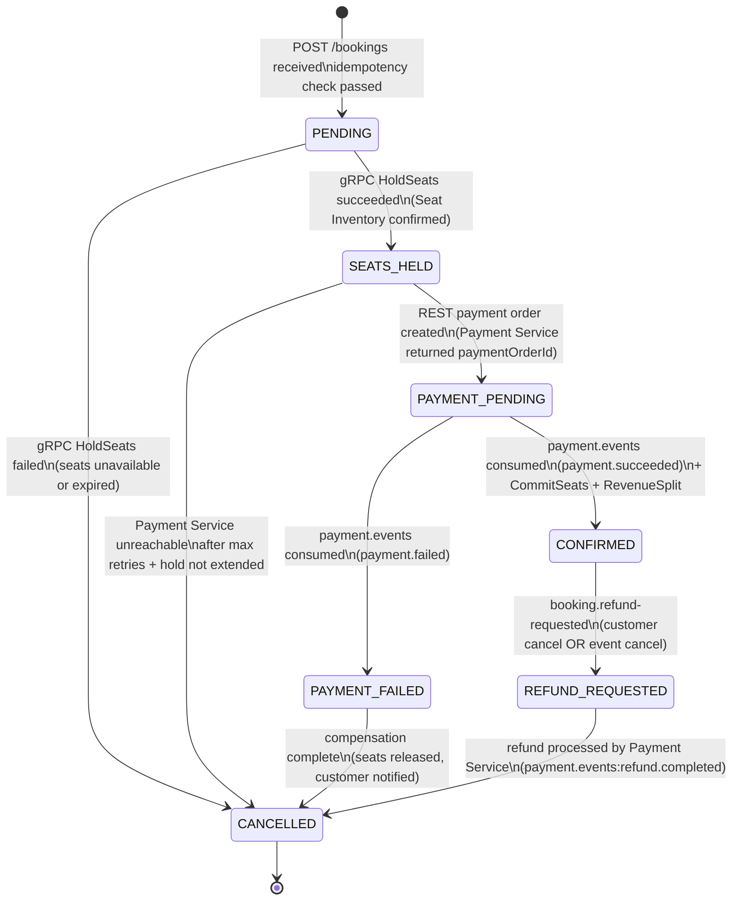
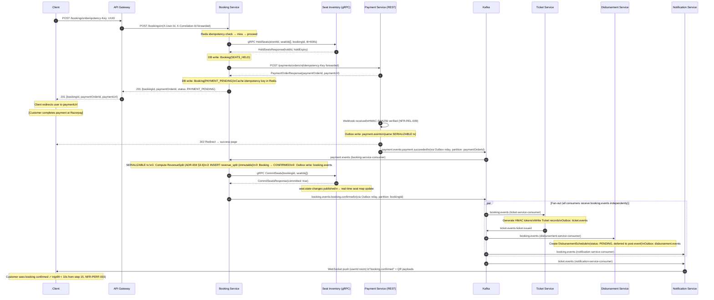
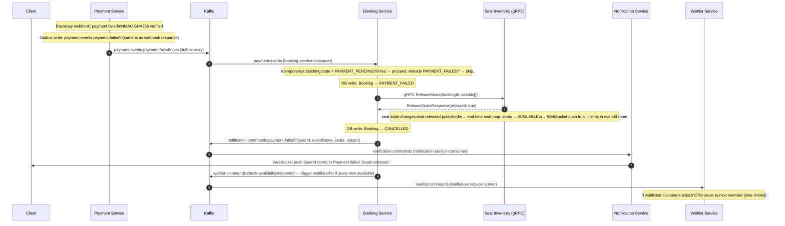
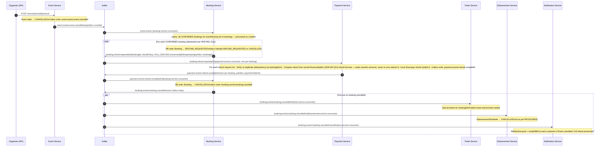

# ADR-005 — Booking Saga Pattern

| Field             | Value                                                                                                        |
|-------------------|--------------------------------------------------------------------------------------------------------------|
| **ID**            | ADR-005                                                                                                      |
| **Title**         | Booking Saga Pattern                                                                                         |
| **Status**        | Accepted                                                                                                     |
| **Date**          | 2025-05-15                                                                                                   |
| **Author**        | StagePass Architecture                                                                                       |
| **Version**       | 1.0.0                                                                                                        |
| **Repo**          | stagepass-docs                                                                                               |
| **Path**          | /docs/adr/ADR-005-booking-saga-pattern.md                                                                   |
| **Traces To**     | PRD §8.1, PRD §7.3, PRD §8.6 FR-P-001, NFR-REL-001, NFR-REL-002, NFR-REL-003, NFR-REL-005, NFR-REL-006, NFR-REL-008, NFR-REL-011, NFR-AVAIL-001, NFR-AVAIL-002, NFR-AVAIL-003, NFR-PERF-002, NFR-PERF-003 |
| **Supersedes**    | —                                                                                                            |
| **Superseded By** | —                                                                                                            |
| **Depends On**    | ADR-003 (communication patterns), ADR-004 (money type, revenue split)                                       |
| **Informs**       | ADR-006 (seat inventory concurrency), ADR-007 (flash sale queue), ADR-008 (disbursement model)              |

---

## Change Log

| Version | Date       | Author                  | Summary            |
|---------|------------|-------------------------|--------------------|
| 1.0.0   | 2025-05-15 | StagePass Architecture  | Initial acceptance |

---

## Table of Contents

1. [Status](#1-status)
2. [Context](#2-context)
3. [Decision](#3-decision)
   - 3.1 [Saga style: orchestrated hybrid](#31-saga-style-orchestrated-hybrid)
   - 3.2 [Booking state machine](#32-booking-state-machine)
   - 3.3 [Saga step table — forward path and compensation](#33-saga-step-table--forward-path-and-compensation)
   - 3.4 [Step details](#34-step-details)
   - 3.5 [Outbox pattern specification](#35-outbox-pattern-specification)
   - 3.6 [Idempotency key flow](#36-idempotency-key-flow-end-to-end)
   - 3.7 [Payment failure: seat hold extension (NFR-AVAIL-003)](#37-payment-failure-seat-hold-extension-nfr-avail-003)
   - 3.8 [Revenue split placement (ADR-004 §3.6 integration)](#38-revenue-split-placement)
   - 3.9 [Kafka topics consumed and produced](#39-kafka-topics-consumed-and-produced)
   - 3.10 [gRPC contract extensions for the saga](#310-grpc-contract-extensions-for-the-saga)
4. [Sequence Diagrams](#4-sequence-diagrams)
5. [Consequences](#5-consequences)
6. [Alternatives Considered](#6-alternatives-considered)
7. [References](#7-references)
8. [Quick Self-Check](#8-quick-self-check)

---

## 1. Status

**Accepted.** This ADR governs the booking saga implementation. Any deviation — including changes to the step sequence, saga style, compensation strategy, or Outbox placement — requires an amendment to this ADR reviewed and merged before the implementation PR is opened.

---

## 2. Context

### 2.1 The core problem: distributed atomicity without a distributed transaction

A confirmed ticket booking requires coordinated writes across four independent services: **Seat Inventory** (seats must be committed from HELD to BOOKED), **Payment** (funds must be captured), **Booking** (the booking record must reach CONFIRMED state), and **Ticket** (signed tokens must be generated and issued). Downstream: **Disbursement** (a future payment schedule must be created) and **Notification** (the customer must be informed).

These services own their own databases. There is no shared transaction boundary. If we attempt to sequence these writes with REST calls and one step fails midway, some writes have committed and others have not. The system is in an inconsistent state with no mechanism to recover it.

The classical solution to this problem is the **Two-Phase Commit (2PC)** protocol. 2PC is rejected here (see §6.2) because it requires all participants to be synchronously available, introduces a distributed lock that blocks progress on coordinator failure, and is incompatible with polyglot databases (PostgreSQL + MongoDB + Redis across services). The alternative is the **Saga pattern** (Richardson, *Microservices Patterns*, Ch. 4), which replaces one distributed transaction with a sequence of local transactions, each with a defined **compensation** that reverses its effect if a downstream step fails.

### 2.2 Why the booking saga is harder than a typical saga

Most saga examples involve commodity inventory (decrement stock count N by 1). StagePass's booking saga has three properties that make it substantially more complex:

**Non-fungible inventory.** Seat 14C is not interchangeable with Seat 14D. Every booking decision is a contention event: two customers may attempt to book the same seat simultaneously. Compensation is not "increment stock back" — it is "release a specific seat identified by a UUID back to AVAILABLE state on the specific event instance." The seat inventory's concurrency model determines how many sagas can race and how conflicts are detected; this is ADR-006's concern. ADR-005 documents what the saga orchestrator does when a seat hold fails, without prescribing the internal mechanism.

**Money-involving state with an immutable ledger.** The revenue split computation must happen exactly once, stored immutably, and used as the sole input to all future refund computations (NFR-REL-012, ADR-004 §3.6). Compensation does not delete the RevenueSplit record — it creates a compensating refund record derived from the original split. This is a financial audit trail requirement, not a preference.

**Multi-level cancellation cascades.** An event cancellation fans out to N booking refunds. A Venue suspension fans out to all upcoming events at that Venue, each of which triggers the event cancellation fan-out. The booking saga's compensation path participates in multi-level sagas that ADR-005 does not orchestrate end-to-end — it documents the booking-level compensation that fires when an upstream saga (event cancellation) demands it.

### 2.3 Performance constraints on the saga

The booking saga operates under two hard performance targets that shape its structure:

- **NFR-PERF-002:** The synchronous portion of booking submission (the response the client receives immediately) must complete in p99 < 2 s. This defines a hard boundary between the synchronous saga path and the async continuation.
- **NFR-PERF-003:** The full saga (checkout submit to WebSocket booking confirmation delivered to the customer's browser) must complete in p99 < 10 s. This constrains total Kafka round-trip budget across all async steps.

### 2.4 Failure availability constraints

Three availability NFRs directly shape saga design decisions:

- **NFR-AVAIL-001:** Notification Service being unavailable must not block a booking from completing. The saga does not await notification delivery.
- **NFR-AVAIL-002:** Seat Inventory being unavailable fails the booking fast (< 2 s) and preserves client-side seat selection state for retry.
- **NFR-AVAIL-003:** Payment Service being unavailable returns a 503 with Retry-After, and the Booking Service must automatically extend the customer's seat hold by 5 minutes to prevent hold expiry during the retry window.

---

## 3. Decision

### 3.1 Saga style: orchestrated hybrid

**Decision: The Booking Service is the saga orchestrator. The saga uses synchronous orchestration for the critical path (Steps 1–3) and event-driven fan-out for async downstream effects (Steps 4–8).**

This is not pure orchestration, and it is not choreography. It is a deliberate hybrid justified by the performance split (NFR-PERF-002 vs NFR-PERF-003) and the failure characteristics of each step.

#### Why orchestration over choreography for the critical path

In a **choreography-based** saga, each service listens to domain events and decides its own next action. No central coordinator exists. The sequence emerges from the event contracts between services.

Choreography's advantages are real: lower coupling (no orchestrator knows all participants), simpler individual services, and trivially scalable event fan-out. We use event-driven fan-out for Steps 5–8 precisely for these reasons.

Choreography's disadvantage is equally real: **the saga's state is implicit in which events have been produced, not in a single queryable record**. When a booking fails midway through a choreographed saga, determining which steps have completed and which compensations are needed requires aggregating events from multiple topics across multiple services. This is a debugging and operational nightmare for a saga that touches six services. Richardson (*Microservices Patterns*, §4.3) identifies this as choreography's primary weakness for complex business transactions.

The booking saga has a specific complicating factor: **the compensation must know whether a payment was captured before deciding whether to trigger a refund**. In a pure choreography model, the service discovering the failure has no authoritative source for this state — it must infer it from events. In an orchestrated model, the Booking Service record carries an explicit state (`PAYMENT_PENDING`, `CONFIRMED`, etc.) that makes this determination O(1) and reliable.

**The orchestrated critical path** (Steps 1–3, synchronous) gives us:
- A single authoritative source of booking state: the Booking Service's PostgreSQL record
- Observable saga progress: one query against the Booking Service shows exactly where the saga is
- Deterministic compensation: the saga's current state directly maps to its compensation set

**The event-driven fan-out** (Steps 5–8) gives us:
- Zero coupling between Booking Service and the downstream consumers (Ticket, Disbursement, Notification, Analytics)
- Each downstream service processes at its own pace under back-pressure
- New downstream participants (e.g., a future Loyalty Service) subscribe without Booking Service changes
- NFR-AVAIL-001 is naturally satisfied: Notification Service failure affects only the notification consumer group, not the Booking state machine

#### Why not pure choreography end-to-end

Beyond the debugging argument: the synchronous path (gRPC seat hold + REST payment initiation) has latency requirements (NFR-PERF-001, NFR-PERF-002) that cannot be satisfied by a choreography where the Booking Service would need to await an event round-trip through Kafka before returning to the client. An event-choreography loop for seat holding would add 50–200ms of Kafka broker round-trip latency to the synchronous path — acceptable in isolation, unacceptable when added to the 2 s synchronous budget that also includes gRPC, DB write, and REST to Payment.

### 3.2 Booking state machine

The following states are the authoritative set. No state transitions are permitted that are not shown in this diagram. Any implementation that transitions a booking to a state not shown here fails CI (state machine enforcement via sealed-type pattern in Java or discriminated union in TypeScript).



**Terminal states:** `CANCELLED`. A booking in `CANCELLED` is never re-activated. A customer who wants to book the same seats must start a new booking.

**Key invariants:**
1. A booking in `CONFIRMED` state always has a corresponding immutable `RevenueSplit` record. No exceptions.
2. A booking in `PAYMENT_PENDING` state always has a corresponding payment order in the Payment Service.
3. A booking in `SEATS_HELD` or later state always has corresponding HELD or BOOKED seats in Seat Inventory (Redis + PostgreSQL). The hold TTL is 10 minutes (NFR-REL-004), enforced by Redis — not application logic.
4. The transition `PAYMENT_PENDING → CONFIRMED` is always atomic with the `RevenueSplit` write (same `SERIALIZABLE` transaction, NFR-REL-008).

---

### 3.3 Saga step table — forward path and compensation

Each forward step has exactly one compensation. Compensation is **always idempotent**: executing a compensation on an already-compensated step returns success without side effects (NFR-REL-011).

| Step | Name | Trigger | Executor | Transport | Booking State After | Outbox? | Compensation | Compensation Idempotency Mechanism |
|------|------|---------|---------|-----------|--------------------|---------|--------------|------------------------------------|
| 1 | VALIDATE_AND_HOLD_SEATS | POST /bookings | Booking Service (calls Seat Inventory) | gRPC `HoldSeats` | `SEATS_HELD` | No | `RELEASE_SEATS` via gRPC `ReleaseSeats(bookingId)` | Seat Inventory checks if hold exists before releasing; if already AVAILABLE, returns success |
| 2 | INITIATE_PAYMENT | Step 1 success (sync, same request) | Booking Service (calls Payment Service) | REST POST `/payments/orders` | `PAYMENT_PENDING` | No | `CANCEL_PAYMENT_ORDER` via REST DELETE `/payments/orders/{paymentOrderId}` + `RELEASE_SEATS` | Payment Service checks order state; if already cancelled, returns success |
| — | **Sync boundary** | Return to client | — | HTTP response | `PAYMENT_PENDING` returned to client | — | — | — |
| 3 | CAPTURE_PAYMENT | Razorpay payment gateway webhook | Payment Service (receives webhook) | Inbound webhook (HMAC-SHA256 verified) | No Booking state change yet | Yes (payment.events) | `INITIATE_REFUND` via Kafka `booking.refund-requested` | Payment Service checks if refund already initiated for this paymentOrderId; deduplicates |
| 4 | COMMIT_AND_CONFIRM | `payment.events:payment.succeeded` | Booking Service (Kafka consumer) | Kafka → local DB (SERIALIZABLE tx) + gRPC `CommitSeats` | `CONFIRMED` | Yes (booking.events) | `REFUND_PAYMENT` (Kafka `booking.refund-requested`) + `VOID_TICKETS` (Kafka `ticket.commands`) + `CANCEL_DISBURSEMENT` | Booking state check: if already `CONFIRMED` with refund in progress, skip re-confirmation |
| 5a | ISSUE_TICKETS | `booking.events:booking.confirmed` | Ticket Service (Kafka consumer) | Kafka → local DB + HMAC generation | No Booking change | Yes (ticket.events) | `VOID_TICKETS`: mark all tickets for `bookingId` as `VOIDED` in Ticket DB | Idempotency key: `bookingId`; if ticket already issued for this booking, return existing; if VOIDED, return VOIDED |
| 5b | SCHEDULE_DISBURSEMENT | `booking.events:booking.confirmed` | Disbursement Service (Kafka consumer) | Kafka → local DB | No Booking change | Yes (disbursement.events) | `CANCEL_DISBURSEMENT_SCHEDULE`: mark `DisbursementSchedule` as `CANCELLED` | Check: if schedule already `CANCELLED`, return success |
| 5c | NOTIFY_CUSTOMER | `booking.events:booking.confirmed` + `ticket.events:ticket.issued` | Notification Service (Kafka consumer) | Kafka → WebSocket push + email/SMS | No Booking change | No (fire-and-forget per NFR-AVAIL-001) | None. Notification failure never blocks or compensates the saga | Notification Service is stateless for delivery; duplicate sends are acceptable edge cases |
| 5d | PUBLISH_FRAUD_REQUEST | Step 1 (in-line, async, fire-and-forget) | Booking Service (immediate Kafka publish) | Kafka `fraud.score-requests` | No state change | No | None (fail-open per NFR-AVAIL-005) | Fraud Detection Service deduplicates by `bookingId` |

**Compensation execution order on full saga failure (CONFIRMED → CANCELLED):**
When Step 4 must be compensated (e.g., Ticket Service fails on all retries and DLQ alert fires):

```
1. CANCEL_DISBURSEMENT_SCHEDULE  (no money moved yet)
2. VOID_TICKETS                  (prevent fraudulent check-in against a cancelled booking)
3. REFUND_PAYMENT                (money back to customer)
4. Booking → REFUND_REQUESTED → CANCELLED
```

Compensation runs in **reverse step order**. The Disbursement schedule is cheapest to cancel (no money moved). Payment refund is last because it is the most durable external action and requires the most verification before triggering.

---

### 3.4 Step details

#### Step 1: VALIDATE_AND_HOLD_SEATS

**Trigger:** `POST /bookings` received by Booking Service (after Gateway JWT validation and identity header injection).

**Pre-condition check (idempotency, NFR-REL-001):**
Before any forward action, Booking Service checks Redis for an existing response keyed by `booking:idem:<Idempotency-Key>`. If a cached response exists, it is returned immediately with `HTTP 200` (or the original status code). No re-execution. TTL: 24 hours.

**Forward action:**
1. Validate request: `eventId`, `seatIds[]` (1–8 seats), `customerId` (from `X-User-Id` header). Reject with `422` if invalid.
2. **gRPC `HoldSeats`** call to Seat Inventory Service (`stagepass.seat_inventory.v1`). This call atomically marks the requested seats as `HELD` in Redis with a TTL of 600 seconds (10 minutes, NFR-REL-004) and updates the PostgreSQL seat state. The exact atomicity mechanism is per ADR-006. From the saga's perspective: either all requested seats are held (success), or none are (failure — atomic; no partial holds).
   - gRPC deadline: 400 ms (leaves budget for DB write and payment initiation within NFR-PERF-002).
   - Failure response: `HoldSeatsResponse.status = UNAVAILABLE` with `unavailable_seats[]`. Booking Service returns `HTTP 409 Conflict` with Problem Details listing which seats are unavailable.
3. On gRPC success: write `Booking` record to PostgreSQL with state `SEATS_HELD`. Fields: `bookingId` (UUID), `customerId`, `eventId`, `seatIds[]`, `holdId` (from gRPC response), `holdExpiry`, `totalAmount` (Money, per ADR-004), `idempotencyKey`, `correlationId`, `createdAt`. State: `SEATS_HELD`.
4. Publish `fraud.score-requests` message to Kafka (fire-and-forget; does not affect saga progress).

**NFR-AVAIL-002 (Seat Inventory down):** If the gRPC call fails (service unavailable, deadline exceeded), the circuit breaker (ADR-003 §3.5.2) opens after 5 consecutive failures. In circuit-open state, Booking Service returns `HTTP 503` within 2 s with body `{ "detail": "seat inventory temporarily unavailable — your seat selection has been preserved" }`. The client-side seat selection state is preserved in the browser (no hold was acquired, so no release is needed).

**Compensation (`RELEASE_SEATS`):**
- gRPC `ReleaseSeats(bookingId, seatIds[])` to Seat Inventory.
- Seat Inventory marks seats `AVAILABLE` in Redis and PostgreSQL.
- Publishes `seat.state-changes` to update the real-time seat map for all connected clients.
- Idempotent: if seats are already `AVAILABLE`, returns success.

---

#### Step 2: INITIATE_PAYMENT

**Trigger:** Step 1 success (within the same synchronous request, before returning to the client).

**Forward action:**
1. REST `POST /payments/orders` to Payment Service. Body: `{ bookingId, customerId, amount: Money, eventId, idempotencyKey }`. The **same `Idempotency-Key`** from the client request is forwarded to the Payment Service (see §3.6). Retry policy: ADR-003 §3.5 (max 3 attempts, exponential backoff with jitter).
2. Payment Service creates a payment order with the Razorpay stub and returns `{ paymentOrderId, paymentUrl, expiresAt }`.
3. Booking state updated: `PAYMENT_PENDING`. `paymentOrderId` stored on the Booking record.
4. Return to client: `HTTP 201 Created` with `{ bookingId, status: "PAYMENT_PENDING", paymentOrderId, paymentUrl }`.

> **Synchronous saga boundary:** The client response is returned at this point. Everything that follows is asynchronous. The client uses `paymentUrl` to redirect to the Razorpay payment page (or renders an embedded payment form). The client tracks saga progress via WebSocket (room: `userId`) or by polling `GET /bookings/{bookingId}`.

**NFR-AVAIL-003 (Payment Service down):**
If Payment Service is unreachable after all retries (circuit breaker open or 3 failed attempts):
1. Booking Service calls gRPC `ExtendHold(bookingId, additionalTtl=300s)` on Seat Inventory — extending the customer's seat hold by 5 additional minutes.
2. Returns `HTTP 503` to the client with `{ "detail": "payment service temporarily unavailable", "retryAfter": 60, "bookingId": "...", "status": "SEATS_HELD", "message": "Your seats are reserved. Please retry payment in 60 seconds." }`.
3. The `Retry-After: 60` header instructs the client when to re-submit. The client re-submits with the same `Idempotency-Key`; the Booking Service skips seat re-validation (booking is already `SEATS_HELD`) and re-attempts payment initiation only.

**Compensation (`CANCEL_PAYMENT_ORDER` + `RELEASE_SEATS`):**
- REST `DELETE /payments/orders/{paymentOrderId}` (if payment order was created before failure).
- Then gRPC `ReleaseSeats(bookingId)` (Step 1 compensation).
- Order matters: cancel the payment order first (to prevent the customer from later completing a payment against a booking being cancelled).

---

#### Step 3: CAPTURE_PAYMENT

**Trigger:** Inbound Razorpay webhook `POST /payments/webhooks/razorpay` received by Payment Service.

**Forward action:**
1. **HMAC-SHA256 webhook signature verification** (NFR-REL-009). Reject unverified webhooks with `HTTP 401`. Log as a security event with correlation ID.
2. Parse webhook event type: `payment.captured` (success) or `payment.failed`.
3. Look up payment order by `paymentOrderId` from webhook payload. Verify `bookingId` and `customerId` match stored order.
4. **Outbox write** (same DB transaction): insert into `payment_outbox` table: `{ eventType: "payment.succeeded" | "payment.failed", topic: "payment.events", partitionKey: paymentOrderId, payload: { bookingId, paymentOrderId, customerId, amount, currency, capturedAt, gatewayTransactionId }, status: "PENDING" }`.
5. Commit transaction. Return `HTTP 200` to Razorpay.
6. Outbox relay publishes to `payment.events` Kafka topic (partition key: `paymentOrderId`, per ADR-003 §3.4.2).

**Compensation (`INITIATE_REFUND`):**
- Triggered only if Step 4 (COMMIT_AND_CONFIRM) fails after payment has been captured.
- Booking Service publishes `booking.refund-requested` to Kafka.
- Payment Service consumes and issues a full refund via Razorpay.
- Idempotency: Payment Service deduplicates refund requests by `bookingId`; duplicate refund requests return the original refund record.

---

#### Step 4: COMMIT_AND_CONFIRM

**Trigger:** `payment.events:payment.succeeded` consumed by Booking Service (`booking-service-consumer` group).

**Idempotency guard (NFR-REL-002):** Before processing, check if Booking is already `CONFIRMED`. If yes, this is a duplicate Kafka delivery — log and commit offset. Do not re-execute.

**Forward action (on `payment.succeeded`):**

The following is a single **`SERIALIZABLE` PostgreSQL transaction** (NFR-REL-008):

```
BEGIN TRANSACTION ISOLATION LEVEL SERIALIZABLE;

1. Verify Booking state is PAYMENT_PENDING. If not PAYMENT_PENDING: abort transaction,
   log anomaly, commit Kafka offset (defensive deduplication).

2. Read salePrice, gstRate (snapshot at booking time), platformFeeRate (snapshot),
   venueShareRate (from VenueBooking record, locked at ACCEPTED).

3. Revenue split computation per ADR-004 §3.6:
   basePrice      = salePrice / (1 + gstRate)              [HALF_UP, 4dp]
   gstAmount      = salePrice - basePrice                   [exact subtraction]
   platformFee    = basePrice × platformFeeRate             [HALF_UP, 4dp]
   venueShare     = basePrice × venueShareRate              [HALF_UP, 4dp]
   organiserShare = basePrice - platformFee - venueShare    [remainder — no rounding]

4. INSERT INTO revenue_split:
   { bookingId, salePriceAmount, salePriceCurrency,
     basePriceAmount, gstAmount, gstRate (snapshot),
     platformFeeAmount, platformFeeRate (snapshot),
     venueShareAmount, venueShareRate (snapshot),
     organiserShareAmount, createdAt }
   -- organiserShareAmount is the mathematical remainder (ADR-004 §3.6, §3.9).
   -- This record is NEVER updated after insertion (NFR-REL-012).

5. UPDATE booking SET state = 'CONFIRMED', confirmedAt = NOW() WHERE bookingId = ?
   AND state = 'PAYMENT_PENDING';  -- optimistic guard against double-confirmation

6. INSERT INTO booking_outbox:
   { eventType: "booking.confirmed", topic: "booking.events",
     partitionKey: bookingId, payload: { full booking snapshot + revenueSplit snapshot },
     status: "PENDING" }

COMMIT;
```

After the transaction commits:

7. **gRPC `CommitSeats(bookingId, seatIds[])`** to Seat Inventory: transitions seats from `HELD` → `BOOKED`. This call is outside the DB transaction to avoid holding a DB lock during a network call. It is retried per ADR-003 §3.5. If all retries fail: the Booking record is `CONFIRMED` (payment captured) but seats remain `HELD`. A reconciliation job (scheduled every 5 minutes) finds `CONFIRMED` bookings with un-committed seats and retries `CommitSeats`. This is a known eventual-consistency window; the business impact is minimal because seats at `HELD` state are not available to other customers — the customer holds them, payment is captured, and the only risk is a Redis TTL expiring before the reconciliation job runs. The reconciliation job resets the TTL before re-attempting.

8. Seat Inventory publishes `seat.state-changes` (HELD → BOOKED for each seat). WebSocket fan-out via Notification Service updates the real-time seat map (NFR-PERF-005).

**Forward action (on `payment.failed`):**
1. Read Booking state. Verify `PAYMENT_PENDING`.
2. Update Booking: `PAYMENT_FAILED`.
3. Trigger Step 1 compensation: gRPC `ReleaseSeats(bookingId)`.
4. Seat Inventory publishes `seat.state-changes` (HELD → AVAILABLE).
5. Update Booking: `CANCELLED`.
6. Notify customer via Kafka `notification.commands` (fire-and-forget): "Payment failed. Your seats have been released."
7. Check waitlist: if this event has waitlisted customers, publish `waitlist.commands:notify-next` (Waitlist Service will offer the released seats to the next waitlist member).

**Compensation (`REFUND_PAYMENT` — only triggered if `CONFIRMED` booking must be cancelled):**
- Triggered by: event cancellation, Venue suspension cascade, or admin-initiated cancellation.
- Booking Service publishes `booking.refund-requested` with `{ bookingId, refundAmount, refundPolicy }`.
- Payment Service computes refund amounts from stored `RevenueSplit` values (per ADR-004 §3.6 refund formula, not from current rates).
- Idempotency: `bookingId` is the deduplication key. If a refund has already been initiated for this booking, return the original refund record.

---

#### Step 5a: ISSUE_TICKETS

**Trigger:** `booking.events:booking.confirmed` consumed by Ticket Service (`ticket-service-consumer` group).

**Forward action:**
1. Idempotency guard: check if tickets already exist for `bookingId`. If yes, commit offset and return (duplicate delivery).
2. For each seat in the booking, generate an HMAC-SHA256 signed token (NFR-SEC-005):
   - Payload: `{ ticketId, eventId, seatId, customerId, issuedAt }`.
   - Key: per-event HMAC secret (retrieved from Vault, cached in Ticket Service memory for the event duration). Rotating the secret per event ensures a token for Event A cannot be used for Event B.
3. Write Ticket records to PostgreSQL (one per seat): `{ ticketId, bookingId, eventId, seatId, customerId, hmacToken, status: VALID, issuedAt }`.
4. Generate QR code payload (base64 of signed token).
5. **Outbox write**: `{ eventType: "ticket.issued", topic: "ticket.events", partitionKey: ticketId, payload: { ticketId, bookingId, eventId, seatId, customerId, qrPayload } }`.

**Compensation (`VOID_TICKETS`):**
- Update all Ticket records for `bookingId`: `status → VOIDED`.
- Publish `ticket.events:ticket.voided` for each ticket (consumed by Check-in Service to invalidate its local key cache for that ticket).
- Idempotent: if tickets are already VOIDED, return success.

---

#### Step 5b: SCHEDULE_DISBURSEMENT

**Trigger:** `booking.events:booking.confirmed` consumed by Disbursement Service (`disbursement-service-consumer` group).

**Forward action:**
1. Read `RevenueSplit` from the booking event payload (snapshotted in the `booking.events` Kafka message at Step 4).
2. Create `DisbursementSchedule` records (two: one for Venue, one for Organiser — Platform fee is retained in-platform and disbursed via a separate admin process per ADR-008):
   - `{ disbursementId, bookingId, eventId, recipientType, recipientId, amount, currency, status: PENDING, triggerAfter: event.endDateTime + 48h }`.
3. **Outbox write**: `{ eventType: "disbursement.scheduled", topic: "disbursement.events", partitionKey: disbursementId }`.

The actual disbursement (fund transfer via Razorpay payouts) fires when `triggerAfter` is reached, conditioned on no pending refunds against the booking. This is ADR-008's concern.

**Compensation (`CANCEL_DISBURSEMENT_SCHEDULE`):**
- Update `DisbursementSchedule` records for `bookingId`: `status → CANCELLED`.
- If disbursement has already been `PROCESSED` (funds transferred): this is a post-disbursement cancellation, which requires a clawback — a complex case handled by ADR-008 and admin intervention. ADR-005 documents that pre-disbursement cancellation is handled automatically; post-disbursement is escalated.

---

#### Step 5c: NOTIFY_CUSTOMER (fire-and-forget)

**Trigger:** `booking.events:booking.confirmed` and `ticket.events:ticket.issued` consumed by Notification Service (`notification-service-consumer` group).

**Forward action:** Emit booking confirmation via email, SMS, and WebSocket push to `userId` room (Socket.IO). WebSocket push carries: `{ type: "booking.confirmed", bookingId, seats[], eventName, qrPayloads[] }`.

**NFR-AVAIL-001:** The saga does not await this step. If Notification Service fails, messages accumulate in `notification.commands.dlq`. The DLQ alert fires after 5 minutes (NFR-REL-007). Booking is already `CONFIRMED` — the customer can always retrieve their tickets via `GET /bookings/{bookingId}/tickets`. Notification failure is an operational inconvenience, not a saga failure.

**No compensation.** Duplicate notifications are an acceptable edge case (better to over-notify than to miss notifying).

---

### 3.5 Outbox pattern specification

**Every Kafka publication that must not be lost uses the Outbox pattern (NFR-REL-005).** This prevents the dual-write problem where a service writes to its database and publishes to Kafka, and one of these operations succeeds while the other fails.

#### 3.5.1 Services using the Outbox

| Service | Language/Framework | Outbox Table | Topics Published Via Outbox |
|---------|-------------------|--------------|----------------------------|
| Booking Service | Java / Spring Boot 3 | `booking_outbox` | `booking.events` |
| Payment Service | Java / Quarkus | `payment_outbox` | `payment.events` |
| Ticket Service | TypeScript / Fastify | `ticket_outbox` | `ticket.events` |
| Disbursement Service | Java / Spring Boot 3 | `disbursement_outbox` | `disbursement.events` |

#### 3.5.2 Outbox table schema (PostgreSQL)

```sql
CREATE TABLE booking_outbox (
    id              UUID PRIMARY KEY DEFAULT gen_random_uuid(),
    event_type      VARCHAR(128) NOT NULL,   -- e.g. "booking.confirmed"
    topic           VARCHAR(128) NOT NULL,   -- Kafka topic name
    partition_key   VARCHAR(128) NOT NULL,   -- bookingId (determines Kafka partition)
    payload         JSONB        NOT NULL,   -- full event body
    schema_version  VARCHAR(16)  NOT NULL DEFAULT '1.0.0',
    status          VARCHAR(16)  NOT NULL DEFAULT 'PENDING', -- PENDING | PUBLISHED | FAILED
    correlation_id  UUID,                    -- W3C traceparent correlation
    created_at      TIMESTAMPTZ  NOT NULL DEFAULT NOW(),
    published_at    TIMESTAMPTZ
);

CREATE INDEX idx_booking_outbox_pending ON booking_outbox(status, created_at)
    WHERE status = 'PENDING';
```

The same schema (table name varies per service) is used in all four services. For TypeScript services, this is a raw PostgreSQL table accessed via the service's DB client (pg/node-postgres).

#### 3.5.3 Outbox relay

Each service runs an **Outbox Relay**: a scheduled component that polls for `PENDING` entries and publishes them to Kafka.

```
Relay poll interval: 100 ms (configurable via environment variable)
Batch size per poll: 50 messages
On publish success: UPDATE outbox SET status = 'PUBLISHED', published_at = NOW()
On publish failure: retry per ADR-003 §3.5; after max retries: status = 'FAILED'
Failed entries: Prometheus alert fires when FAILED count > 0 in past 5 min
```

**Java (Spring Boot):** `@Scheduled(fixedDelay = 100)` method in a `@Component` class. Uses `KafkaTemplate` for publishing.

**Java (Quarkus / Payment):** `@Scheduled(every = "100ms")` with Quarkus Reactive Messaging or raw KafkaProducer.

**TypeScript (Fastify / Ticket):** `node-cron` scheduled job (`* * * * * *` for every second; offset by internal counter for 100ms approximation) or `setInterval(relay, 100)` in a dedicated async loop started at server initialization.

**Why not Debezium CDC?** Debezium (database change data capture, publishing the PostgreSQL WAL directly to Kafka) would eliminate the relay poller entirely and provide guaranteed, low-latency delivery. It is the production-grade evolution of this Outbox pattern. It is deferred to Phase 9 (Cloud deployment) where Kafka MSK and RDS are available and Debezium can be run as a managed connector. In local development and Phases 2–8, the polling relay is simpler to operate, requires no additional infrastructure component, and is sufficient for the target load (NFR-PERF-030: 100 RPS sustained). This deferral is explicitly documented here so it is not forgotten.

#### 3.5.4 Kafka message envelope

All Outbox-published messages carry the standard headers per ADR-003 §3.4.1:

```
x-event-type:     booking.confirmed
x-correlation-id: <UUID from X-Correlation-Id header of originating request>
x-traceparent:    <W3C traceparent — OTel context propagated from originating request>
x-tracestate:     <W3C tracestate>
x-produced-at:    <ISO-8601 UTC>
x-schema-version: 1.0.0
```

The `x-traceparent` in the Kafka message is set at Outbox write time (not relay time), so the trace context is the one from the originating HTTP or Kafka consumer span, not the relay's span. This maintains the unbroken trace from the initial `POST /bookings` through every Kafka hop to the WebSocket push (NFR-OBS-003, NFR-OBS-004).

---

### 3.6 Idempotency key flow end-to-end

**Rule (NFR-REL-001):** All write endpoints accept an `Idempotency-Key: <UUID v4>` header. The client generates this key and must retain it for safe retries.

```
Client (browser/mobile)
│
│  Generates: idempotencyKey = UUID v4
│  Stores: in session state or local storage
│  Sends:  Idempotency-Key: <idempotencyKey> on POST /bookings
│
▼
API Gateway
│  Forwards: Idempotency-Key header unchanged
│  Also adds: X-Correlation-Id: <same UUID or new trace UUID>
│             X-User-Id: <from JWT sub claim>
│             X-User-Role: <from JWT role claim>
│
▼
Booking Service  (stagepass-booking-service)
│  Check: Redis key "booking:idem:<idempotencyKey>"
│  Hit:   return cached response (HTTP 200 or original status)
│  Miss:  process request, cache response at end
│         Redis key TTL: 24 hours
│         Cache key format: "booking:idem:<idempotencyKey>"
│         Cache value: { statusCode, responseBody, bookingId }
│
│  Forwards to Payment Service:
│  Idempotency-Key: <SAME idempotencyKey from client>
│  (same key means Payment Service deduplicates on the same identifier)
│
▼
Payment Service  (stagepass-payment-service)
│  Check: Redis key "payment:idem:<idempotencyKey>"
│  Hit:   return cached payment order response
│  Miss:  create payment order, cache response
│         Redis key TTL: 24 hours
│
│  Forwards to Razorpay stub:
│  X-Idempotency-Key: <idempotencyKey>
│  (Razorpay's idempotency header — deduplicates at gateway level)
│
▼
Razorpay (stub in Phase 1–8)
    Deduplicates payment order creation by X-Idempotency-Key
```

**Retry safety for the client:**
If the client's `POST /bookings` times out (network failure after the server processed the request), the client retries with the same `Idempotency-Key`. Booking Service returns the cached response: `{ bookingId, paymentOrderId, status: PAYMENT_PENDING }`. No new seat hold is acquired, no new payment order is created. The customer's original booking is intact.

**Idempotency key scope:** One `Idempotency-Key` covers the entire booking initiation (Steps 1–2). It does not cover the payment completion webhook (Step 3) — that is idempotent via `paymentOrderId` at the Payment Service, not via the client's key.

---

### 3.7 Payment failure: seat hold extension (NFR-AVAIL-003)

The complete decision logic when Payment Service is unreachable during Step 2:

```
Booking Service detects Payment Service failure:
  (circuit breaker open, OR 3 REST call attempts all failed)

↓

gRPC ExtendHold(bookingId, additionalTtl = 300 seconds)
  → Seat Inventory resets Redis TTL: new expiry = max(current_expiry, now + 600s)
  → Seat Inventory updates hold_expiry in PostgreSQL
  → Returns ExtendHoldResponse(newExpiry)

↓

Booking state remains SEATS_HELD (not advanced to PAYMENT_PENDING)

↓

Response to client:
  HTTP 503
  Retry-After: 60
  {
    "type": "https://stagepass.in/errors/payment-service-unavailable",
    "title": "Payment Service Temporarily Unavailable",
    "status": 503,
    "detail": "Your seats are reserved until {newExpiry ISO-8601}. Please retry payment in 60 seconds.",
    "bookingId": "{bookingId}",
    "holdExpiry": "{newExpiry ISO-8601}",
    "retryAfter": 60
  }

↓

Client retries after 60 seconds with same Idempotency-Key:
  Booking Service checks idempotency cache → MISS (response was not cached — we only
  cache successful responses to avoid caching transient failure states)
  Booking Service checks Booking state → SEATS_HELD
  Booking Service skips gRPC HoldSeats (seats already held)
  Booking Service re-attempts Step 2 (INITIATE_PAYMENT) only
```

**Why extend by 5 minutes, not reset to 10 minutes?** Adding 5 minutes to the current expiry (rather than resetting to a full 10-minute hold) limits the maximum time a seat can be tied up to approximately 15 minutes in the worst case (one extension). This prevents a misbehaving client from holding seats indefinitely by retrying with the same key. The circuit breaker at ADR-003 §3.5.2 limits how many extensions can occur in the `OPEN` state (30-second open window means at most one extension request can pass through per 30-second window).

---

### 3.8 Revenue split placement

The revenue split computation is placed at the `PAYMENT_CONFIRMED → CONFIRMED` transition (Step 4, inside the `SERIALIZABLE` transaction). This is mandated by ADR-004 §3.6 and NFR-REL-012. The decision is repeated here for implementors who read ADR-005 without cross-referencing ADR-004.

**Why at payment confirmation, not at booking initiation?**

The split inputs include `platformFeeRate` (Admin-configurable) and `venueShareRate` (locked in the `VenueBooking` record at ACCEPTED state). If the split were computed at booking initiation but payment completed later, the `platformFeeRate` could change between the two events — making the stored rate a prediction, not an actuality. Computing at payment confirmation means the split reflects the rates exactly in effect when money moved.

**The organiserShare is always the remainder (ADR-004 §3.6, Step 9):**

```
organiserShare = basePrice - platformFee - venueShare
```

This is a subtraction, not a rate multiplication. It absorbs the rounding residual. The three components therefore always sum exactly to `basePrice`. The Organiser bears the residual — at most ₹0.0001 per ticket — which is explicitly documented here as an accepted and justified choice.

**At refund time:**

The stored `RevenueSplit` record is read directly. The current rates are never re-queried. The refund amounts are computed as:

```
refundRatio       = refundableAmount / originalSalePrice   [Decimal, 4dp]
refundPlatformFee    = stored.platformFeeAmount × refundRatio
refundVenueShare     = stored.venueShareAmount  × refundRatio
refundOrganiserShare = refundableAmount - refundPlatformFee - refundVenueShare
```

Again, organiserShare is the remainder. This is the enforcement of NFR-REL-012 at the implementation level.

---

### 3.9 Kafka topics consumed and produced

The following is the complete Kafka topic interaction of the booking saga. All topic names and consumer groups are per ADR-003 §3.4.2.

| Service | Produces To | Consumes From | Consumer Group |
|---------|------------|---------------|----------------|
| Booking Service | `booking.events` (via Outbox) | `payment.events` | `booking-service-consumer` |
| Booking Service | `fraud.score-requests` (direct, fire-and-forget) | `event.events` (for cancellation cascade) | `booking-service-consumer` |
| Booking Service | `booking.refund-requested` (compensation) | `seat.state-changes` (for seat map sync) | `booking-service-consumer` |
| Booking Service | `notification.commands` (payment failed path) | — | — |
| Payment Service | `payment.events` (via Outbox) | `booking.refund-requested` | `payment-service-consumer` |
| Ticket Service | `ticket.events` (via Outbox) | `booking.events` | `ticket-service-consumer` |
| Disbursement Service | `disbursement.events` (via Outbox) | `booking.events` | `disbursement-service-consumer` |
| Notification Service | — | `booking.events`, `ticket.events`, `notification.commands` | `notification-service-consumer` |
| Seat Inventory | `seat.state-changes` | `seat.commands` | `seat-inventory-service-consumer` |

**DLQ monitoring (NFR-REL-007):** Every topic above has a `.dlq` variant. The Prometheus alert `KafkaDLQDepthNonZero` fires when any DLQ has depth > 0 for more than 5 continuous minutes. The linked runbook is `/docs/runbooks/kafka-dlq-depth.md` (to be created in Phase 2).

---

### 3.10 gRPC contract extensions for the saga

ADR-003 §3.3.2 provides a proto sketch for `CheckSeatAvailability`. The booking saga requires three additional RPC methods on the `SeatInventoryService`. These extend — but do not replace — the ADR-003 proto sketch. The authoritative `.proto` file lives in `stagepass-shared-contracts/proto/stagepass/seat_inventory/v1/seat_inventory.proto`. ADR-005 documents the required RPC set; the full Protobuf spec (field numbers, validation constraints, error codes) is in `stagepass-shared-contracts`.

```protobuf
syntax = "proto3";
package stagepass.seat_inventory.v1;

service SeatInventoryService {

  // Guard check only. Does NOT hold seats.
  // Used for fast availability display (not in booking saga critical path directly).
  rpc CheckSeatAvailability(CheckSeatAvailabilityRequest)
      returns (CheckSeatAvailabilityResponse);

  // Atomically hold seats for a booking. All-or-nothing: either all seats are held,
  // or none are (returns UNAVAILABLE). The hold TTL is set to 600 seconds.
  // Idempotent: if seats are already HELD for this bookingId, returns the existing
  // hold without resetting TTL.
  rpc HoldSeats(HoldSeatsRequest) returns (HoldSeatsResponse);

  // Extend an existing hold by additionalTtlSeconds. Used by NFR-AVAIL-003
  // when Payment Service is unavailable.
  rpc ExtendHold(ExtendHoldRequest) returns (ExtendHoldResponse);

  // Transition held seats from HELD → BOOKED. Called after payment confirmation.
  // Idempotent: if seats are already BOOKED for this bookingId, returns success.
  rpc CommitSeats(CommitSeatsRequest) returns (CommitSeatsResponse);

  // Release held seats back to AVAILABLE. Compensation for Steps 1 and 2.
  // Idempotent: if seats are already AVAILABLE, returns success.
  rpc ReleaseSeats(ReleaseSeatsRequest) returns (ReleaseSeatsResponse);
}
```

**Schema evolution:** Field numbers in the `.proto` file are permanent once assigned. New optional fields may be added. Existing fields and their numbers may never be removed or changed. This is per ADR-003 §4.1 and the Protobuf backward-compatibility contract.

---

## 4. Sequence Diagrams

### 4.1 Happy path



---

### 4.2 Compensation path 1: Payment failure

This path executes when the Razorpay webhook delivers `payment.failed` (e.g., card declined, insufficient funds). The customer's seats are released back to AVAILABLE and the waitlist is notified.



---

### 4.3 Compensation path 2: Event cancellation cascade

This path executes when an Organiser cancels an event. The Booking Service receives the cancellation via `event.events:event.cancelled`, then fans out a refund saga across all `CONFIRMED` bookings for that event.



**Multi-level cascade note (Venue suspension):** If a Venue is suspended by Admin, `venue.events:venue.suspended` is consumed by Event Service, which marks all upcoming events at that Venue as `CANCELLED` and publishes `event.events:event.cancelled` for each. Each `event.cancelled` independently triggers this compensation path (4.3). The Booking Service's `booking-service-consumer` group processes each event's cancellations as a separate stream (partitioned by `eventId`). This is the multi-level saga described in PRD §8.6. ADR-005 documents the per-event compensation; the Venue suspension orchestration is Event Service's responsibility.

---

## 5. Consequences

### 5.1 Positive

**Single source of booking truth.** The Booking Service's PostgreSQL record is the authoritative booking state. Any service can query it to determine what compensations are needed. There is no ambiguity about whether the saga is at Step 3 or Step 4 — the booking state machine is explicit and queryable.

**Observable saga progress (NFR-OBS-004).** Because the Booking Service is the orchestrator, every saga transition produces a structured log entry and a span. Given a `bookingId`, a developer can trace the entire saga across all services in Grafana + Jaeger within 2 minutes by filtering on `bookingId` as a log field and span attribute. This satisfies NFR-OBS-004.

**Deterministic compensation.** The compensation set for each booking state is fixed and documented in §3.3. An on-call engineer can determine what to do for any stuck saga by reading the Booking state. There is no need to infer saga progress from multiple event streams.

**Idempotent consumer group fan-out.** The event-driven portion (Steps 5a–5c) uses independent Kafka consumer groups. A new downstream consumer (e.g., a Loyalty Service in Phase 5) subscribes to `booking.events` without any change to Booking Service. The Outbox-to-Kafka pattern ensures every consumer gets every message, even if it was temporarily offline when the message was produced.

### 5.2 Negative / trade-offs

**Booking Service is a coordination bottleneck.** The Booking Service mediates Steps 1–4 of every booking. Under sustained high load, the Booking Service database (PostgreSQL) is the contention point for saga state transitions. Mitigation: the flash sale queue pattern (ADR-007) ensures the Booking Service is not directly hit by 10× RPS spikes — queuing absorbs the burst before it reaches saga initiation.

**Reconciliation job required for CommitSeats failures.** As documented in §3.4 (Step 4), the gRPC `CommitSeats` call happens outside the SERIALIZABLE transaction. A `CONFIRMED` booking with HELD (not BOOKED) seats is a valid temporary state that the reconciliation job must resolve. This adds operational complexity. The alternative — making `CommitSeats` part of the DB transaction — would block the DB transaction on a network call, increasing lock duration and reducing throughput. The current design favours throughput.

**Outbox relay adds latency.** The polling relay introduces up to 100ms additional latency before a Kafka message is published (the poll interval). For the booking confirmation flow, this is acceptable: the saga already has a 10 s end-to-end budget (NFR-PERF-003), and 100ms is a small fraction of that budget. For time-critical flows (fraud scoring at NFR-PERF-011: 10 s), the relay poll interval is tunable downward.

**N × booking.refund-requested messages on event cancellation.** If an event with 10,000 confirmed bookings is cancelled, the Booking Service publishes 10,000 Kafka messages. Payment Service must process all of them. Mitigation: the `booking.refund-requested` topic has 12 partitions; Payment Service scales horizontally with one consumer per partition. At 100 RPS sustained (NFR-PERF-030), 10,000 refunds complete in approximately 100 seconds. This is within business-acceptable bounds for an event cancellation refund window. Faster options (batch refund API) are deferred to Phase 9.

### 5.3 Risks and mitigations

| Risk | Likelihood | Impact | Mitigation |
|------|-----------|--------|------------|
| Booking Service DB becomes bottleneck under flash sale | Medium | High | Flash sale queue pattern (ADR-007) gates entry to the saga; not all 10x RPS reaches Booking Service simultaneously |
| `CommitSeats` retries fail; booking CONFIRMED but seats not BOOKED | Low | Medium | Reconciliation job (5-min interval) finds and retries; Redis hold TTL keeps seats reserved during retry window |
| DLQ depth grows silently (consumer bug) | Low | High | Prometheus alert: DLQ depth > 0 for > 5 min; runbook linked per NFR-REL-007 |
| Event cancellation cascade overwhelms Payment Service | Low | Medium | 12 partitions, horizontal scaling; Payment Service circuit breaker prevents retry storms |
| Duplicate booking confirmation (Kafka at-least-once) | Low | Medium | Idempotency guard at Step 4: Booking state check before processing; `bookingId` deduplication in Ticket Service |

---

## 6. Alternatives Considered

### 6.1 Pure choreography (rejected)

**What it is:** Every service listens to domain events and independently decides its next action. No Booking Service orchestrator. The saga sequence emerges from event contracts.

**Why considered:** Lower coupling between services. Each service is self-contained. Adding a new downstream consumer requires no change to any existing service.

**Why rejected:** For the booking saga's critical path, the TOCTOU window between seat availability check and seat hold would be non-deterministic without an orchestrator managing the sequence. Compensation is implicit in choreography — a Ticket Service that receives a `booking.cancelled` event must infer from its own state whether it has already issued tickets, without a central authority to consult. At a whiteboard: "Which service is responsible for ensuring the refund is triggered?" has no clean answer in pure choreography. In an orchestrated model, the answer is always "the Booking Service — look at its state machine."

**The anti-pattern being avoided:** "Choreography works until you add a compensation step." Simple forward choreography is clean. Compensation choreography — where the question "has payment been captured yet?" must be answered by emitting a query event and awaiting a reply — produces event-driven request-response, which is the worst of both models. Richardson (*Microservices Patterns*, §4.3.2) calls this the "saga with compensating transactions" problem in choreography: each service must undo its action when it hears a failure event from downstream, but it doesn't know how far downstream got before failing.

**Retained for fan-out:** Steps 5a–5c (Ticket, Disbursement, Notification) use event-driven fan-out. These steps have no compensation dependency on each other (voiding a ticket does not depend on the disbursement schedule status). Fan-out without dependencies is the case where choreography excels.

---

### 6.2 Two-Phase Commit (2PC) (rejected)

**What it is:** A coordinator asks all participants to "prepare" (write to a tentative state), waits for all ACKs, then asks all to "commit" simultaneously.

**Why considered:** 2PC provides genuine atomicity — all participants commit or none do. No compensating transactions required. For a saga involving only two PostgreSQL databases (same DB engine), XA transactions could implement this.

**Why rejected:** StagePass's booking saga involves PostgreSQL (Booking, Seat Inventory), Redis (seat hold TTL), a REST call to Payment Service, and Kafka publication. There is no transaction coordinator that spans PostgreSQL + Redis + REST + Kafka. Redis does not support XA. Kafka producers are not XA resources. The Payment Service (a separate process) would need to implement the XA `prepare` protocol, which Razorpay's stub does not support. Even if technically feasible, 2PC introduces a distributed lock that blocks all participants during the commit phase — a catastrophic availability problem under the flash sale load (NFR-PERF-013). If the coordinator fails after sending `prepare` but before sending `commit`, all participants are blocked indefinitely (the "in-doubt transaction" problem). For a financial platform, an in-doubt transaction holds a seat HELD and a payment order pending with no resolution path — exactly the kind of data corruption the saga is designed to prevent, not introduce.

**Reference:** Kleppmann *DDIA*, Chapter 9, "Distributed Transactions and Consensus" — 2PC's blocking failure mode and why most distributed systems avoid it.

---

### 6.3 Saga with event sourcing (considered, partially deferred)

**What it is:** Rather than storing the current booking state in a relational record, store the sequence of domain events that produced that state. The booking's state is derived by replaying its event log. Compensation is a new event appended to the log, not an update to the record.

**Why considered:** Event sourcing gives a complete, immutable audit trail of every state transition. It simplifies the Outbox pattern (the event store IS the outbox). It makes "replay from any point" trivial. This maps well to the `RevenueSplit` immutability requirement — the split is itself an event.

**Why partially deferred:** Event sourcing adds operational complexity to every query: to answer "what is this booking's current state?", you must replay N events. For a real-time booking platform, this replay overhead is acceptable with snapshotting (store the latest state snapshot alongside the event log to avoid full replay). But implementing event sourcing correctly — aggregate reconstruction, snapshot strategy, event versioning — is a significant Phase 3/4 scope increase. The learning objective for event sourcing (PRD §11.5) is satisfied by applying it to one aggregate in Phase 4 (Booking or Seat). ADR-005 uses a standard saga with an explicit state machine for the primary booking aggregate; event sourcing is applied as an enhancement in a Phase 4 implementation step, not as a prerequisite.

**Anti-pattern being avoided:** "Event sourcing everything." Event sourcing suits aggregates where the event history is business-valuable (audit, replay, projection). Not every aggregate needs it. The `RevenueSplit` immutability (ADR-004 §3.6) achieves the most important audit requirement without full event sourcing. Using event sourcing on the Booking aggregate as a stretch goal is correct; mandating it as a prerequisite to the booking saga would block Phase 4 implementation.

---

## 7. References

| Source | Relevance |
|--------|-----------|
| Richardson, C. *Microservices Patterns*, Ch. 4 | Saga pattern, orchestration vs choreography, compensation design |
| Richardson, C. *Microservices Patterns*, §4.3.2 | Choreography limitations for complex compensations |
| Kleppmann, M. *DDIA*, Ch. 9 | 2PC blocking failure mode, distributed transaction trade-offs |
| Fowler, M. "Saga" — martinfowler.com | Pattern definition and orchestration vs choreography decision framework |
| Fowler, M. "TransactionalOutbox" — martinfowler.com | Outbox pattern specification, relay vs CDC options |
| PRD.md §7.3 | Revenue split model, three-party distribution |
| PRD.md §8.1 | Customer booking requirements (FR-C-006 through FR-C-011) |
| PRD.md §8.6 FR-P-001 | Real-time seat map requirements (drives seat.state-changes publication) |
| NFR.md NFR-REL-001 | Idempotency-Key header requirement |
| NFR.md NFR-REL-003 | Compensation defined and tested for every forward step |
| NFR.md NFR-REL-005 | Outbox pattern for all events that must not be lost |
| NFR.md NFR-REL-008 | SERIALIZABLE isolation for money operations |
| NFR.md NFR-REL-011 | Event cancellation cascade idempotency |
| NFR.md NFR-REL-012 | Revenue split immutability |
| NFR.md NFR-AVAIL-001 | Notification Service down must not block booking |
| NFR.md NFR-AVAIL-003 | Payment down: hold extension + 503 |
| NFR.md NFR-PERF-002 | Synchronous booking submit p99 < 2 s |
| NFR.md NFR-PERF-003 | Saga end-to-end p99 < 10 s |
| ADR-003 §3.3.2 | gRPC pair 1 (Booking → Seat Inventory), proto sketch, OTel propagation |
| ADR-003 §3.4.2 | Kafka topic catalogue, consumer groups, DLQ naming |
| ADR-003 §3.5 | Retry policy and circuit breaker specification |
| ADR-004 §3.6 | Revenue split computation algorithm and remainder assignment |
| ADR-004 §3.6 (refund) | Refund computation from stored RevenueSplit — never from current rates |

---

## 8. Quick Self-Check

Answer these without looking at this document. If you cannot answer them, re-read the relevant section before writing implementation code.

**Q1:** The Booking Service processes a `payment.events:payment.succeeded` Kafka message and reaches Step 4. It opens a SERIALIZABLE transaction and writes the RevenueSplit. The `CommitSeats` gRPC call then fails on all three retry attempts. The Booking record is now `CONFIRMED` but seats are still `HELD` in Seat Inventory. What happens next? What prevents the customer's seats from being released before the reconciliation job runs? What would happen if you had placed the gRPC call inside the SERIALIZABLE transaction instead?

> **Expected answer:**
> The reconciliation job (scheduled every 5 minutes) finds `CONFIRMED` bookings where `CommitSeats` has not succeeded (detectable via a flag set after successful `CommitSeats`, or via a gRPC check at reconciliation time) and retries `CommitSeats`. The Redis TTL on the hold keeps the seats in `HELD` state — unavailable to other customers — until the reconciliation job runs. Even if the TTL expires before the reconciliation job runs (unlikely at 5-min intervals with a 10-min TTL), the booking is `CONFIRMED` and payment captured; the Seat Inventory would need to be corrected manually or via a compensating admin action.
>
> If the gRPC call were inside the SERIALIZABLE transaction: the DB transaction would hold locks on the `revenue_split` and `booking` rows for the duration of the gRPC call (potentially 400ms+ under load). Other transactions that need to read or write these rows (e.g., a concurrent booking for the same customer) would be blocked. This reduces throughput significantly — especially under flash sale load. The SERIALIZABLE isolation requirement (NFR-REL-008) applies to the DB write, not to the network call; the correct design keeps external network calls outside the transaction boundary.

**Q2:** An Organiser cancels an event with 500 confirmed bookings. Walk through the exact sequence of Kafka messages that the Booking Service produces. How does the saga ensure that a booking that is already `CANCELLED` (e.g., from an earlier customer self-cancellation) does not get a duplicate refund? Which NFR specifically covers this requirement?

> **Expected answer:**
> The Booking Service consumes `event.events:event.cancelled` and iterates over all bookings for the event. For each `CONFIRMED` booking: updates state to `REFUND_REQUESTED` and publishes `booking.refund-requested`. For bookings already in `CANCELLED` or `REFUND_REQUESTED` state: the idempotency check (read booking state before updating) returns early — no message published. This means `booking.refund-requested` is published at most once per booking per cancellation event.
>
> At the Payment Service: the `bookingId` is the idempotency key for refund processing. If a `booking.refund-requested` message arrives for a `bookingId` that already has a refund record (perhaps from an earlier customer self-cancellation), the Payment Service detects the duplicate and returns the original refund record without issuing a second refund.
>
> NFR-REL-011: "Fan-out cancellation saga is idempotent: cancelling an already-cancelled booking returns success; no duplicate refund is processed."

**Q3:** A junior developer proposes removing the Outbox pattern from the Booking Service's `CONFIRMED` transition and instead publishing directly to Kafka inside the SERIALIZABLE transaction. They argue this simplifies the code and eliminates the relay poller. Name the specific failure mode this introduces and explain precisely when data loss occurs.

> **Expected answer:**
> The failure mode is the **dual-write problem** (also called the "dual-write anti-pattern"). The specific failure scenario: the Booking Service writes the `RevenueSplit` and `Booking → CONFIRMED` to PostgreSQL and commits the transaction. It then attempts to publish to Kafka. Between the DB commit and the Kafka publish, the Booking Service process crashes (JVM kill, OOM, network partition). The DB transaction is committed — the booking is `CONFIRMED` and the revenue split is stored. But the Kafka message is never published. No downstream service (Ticket, Disbursement, Notification) ever receives `booking.confirmed`. The customer has a confirmed booking in the database but no tickets, no email, and no disbursement schedule. The data is inconsistent with no mechanism to recover it automatically.
>
> Publishing Kafka inside the DB transaction (as the alternative) does not solve this: Kafka producers are not XA resources — the Kafka publish is not part of the PostgreSQL transaction. Even if the publish is called inside the `BEGIN/COMMIT` block, it executes outside the DB's ACID guarantees. The Outbox pattern solves this by writing the event to a DB table (inside the same transaction), guaranteeing that if the DB commits, the event exists in the Outbox. The relay publishes from the Outbox — even after a crash, the relay finds the `PENDING` entry and publishes it. This is NFR-REL-005: "Outbox pattern for all events that must not be lost."
