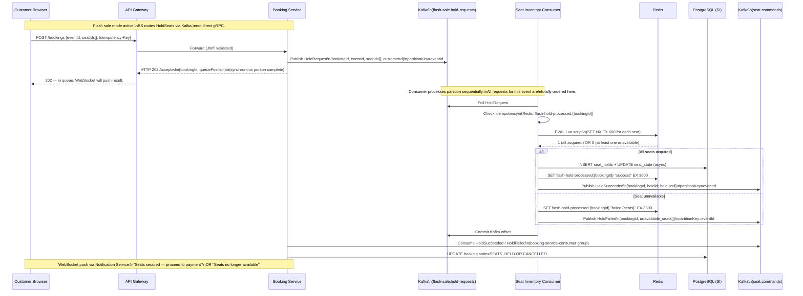

# ADR-006 — Seat Inventory Concurrency Strategy

| Field             | Value                                                                                                        |
|-------------------|--------------------------------------------------------------------------------------------------------------|
| **ID**            | ADR-006                                                                                                      |
| **Title**         | Seat Inventory Concurrency Strategy                                                                          |
| **Status**        | Accepted                                                                                                     |
| **Date**          | 2025-05-16                                                                                                   |
| **Author**        | StagePass Architecture                                                                                       |
| **Version**       | 1.0.0                                                                                                        |
| **Repo**          | stagepass-docs                                                                                               |
| **Path**          | /docs/adr/ADR-006-seat-inventory-concurrency-strategy.md                                                     |
| **Traces To**     | PRD §8.1 FR-P-001, PRD §8.1 FR-P-003, NFR-PERF-001, NFR-PERF-013, NFR-REL-004, NFR-REL-008, NFR-AVAIL-002 |
| **Supersedes**    | —                                                                                                            |
| **Superseded By** | —                                                                                                            |
| **Depends On**    | ADR-003 (communication patterns, gRPC pair 1, seat topics), ADR-005 (booking saga, HoldSeats contract)      |
| **Informs**       | ADR-007 (flash sale queue internals), ADR-008 (disbursement — CommitSeats precedes disbursement trigger)     |

---

## Change Log

| Version | Date       | Author                 | Summary            |
|---------|------------|------------------------|--------------------|
| 1.0.0   | 2025-05-16 | StagePass Architecture | Initial acceptance |

---

## Table of Contents

1. [Status](#1-status)
2. [Context](#2-context)
   - 2.1 [Why seat inventory is the hardest concurrency problem in this platform](#21-why-seat-inventory-is-the-hardest-concurrency-problem-in-this-platform)
   - 2.2 [Scope](#22-scope)
   - 2.3 [Forces at play](#23-forces-at-play)
   - 2.4 [Locked constraints from prior ADRs and NFRs](#24-locked-constraints-from-prior-adrs-and-nfrs)
3. [Decision](#3-decision)
   - 3.1 [The two-store architecture](#31-the-two-store-architecture)
   - 3.2 [Strategy for normal booking — gRPC HoldSeats with Redis Lua atomic SETNX](#32-strategy-for-normal-booking--grpc-holdseats-with-redis-lua-atomic-setnx)
   - 3.3 [Strategy for flash sale — Kafka queue funnel into Redis Lua atomic SETNX](#33-strategy-for-flash-sale--kafka-queue-funnel-into-redis-lua-atomic-setnx)
   - 3.4 [TOCTOU race analysis and resolution](#34-toctou-race-analysis-and-resolution)
   - 3.5 [Oversell prevention proof](#35-oversell-prevention-proof)
   - 3.6 [Redis TTL enforcement — NFR-REL-004](#36-redis-ttl-enforcement--nfr-rel-004)
   - 3.7 [SERIALIZABLE isolation — scope and placement — NFR-REL-008](#37-serializable-isolation--scope-and-placement--nfr-rel-008)
   - 3.8 [Multi-seat all-or-nothing atomicity](#38-multi-seat-all-or-nothing-atomicity)
   - 3.9 [Seat state machine and transitions](#39-seat-state-machine-and-transitions)
   - 3.10 [Redis key schema and data layout](#310-redis-key-schema-and-data-layout)
   - 3.11 [Failure modes and recovery](#311-failure-modes-and-recovery)
4. [Sequence Diagrams](#4-sequence-diagrams)
   - 4.1 [Normal booking path — gRPC HoldSeats](#41-normal-booking-path--grpc-holdseats)
   - 4.2 [Flash sale path — Kafka queue funnel](#42-flash-sale-path--kafka-queue-funnel)
5. [Consequences](#5-consequences)
6. [Alternatives Considered](#6-alternatives-considered)
   - 6.1 [Pessimistic locking (PostgreSQL SELECT FOR UPDATE)](#61-pessimistic-locking-postgresql-select-for-update)
   - 6.2 [Optimistic locking (JPA @Version + CAS retry)](#62-optimistic-locking-jpa-version--cas-retry)
   - 6.3 [Redis atomic SETNX standalone (no PostgreSQL in hold path)](#63-redis-atomic-setnx-standalone-no-postgresql-in-hold-path)
   - 6.4 [Queue-based funnel for all bookings](#64-queue-based-funnel-for-all-bookings)
7. [References](#7-references)
8. [Quick Self-Check](#8-quick-self-check)

---

## 1. Status

**Accepted.** This ADR governs the concurrency mechanism for all seat state transitions in
the Seat Inventory Service. Any change to the hold strategy, the Redis key schema, the
SERIALIZABLE isolation scope, or the flash sale processing path requires an amendment
reviewed and merged before the implementation PR opens.

---

## 2. Context

### 2.1 Why seat inventory is the hardest concurrency problem in this platform

Every other inventory problem in software is, at some level, a stock decrement: N items
exist; one sale reduces N by 1; any unit of N is equivalent to any other. A database row
lock on the stock table, or a `compare-and-swap` on an integer, is sufficient to prevent
overselling.

Seat inventory is structurally different in two ways that change the concurrency model
entirely:

**Non-fungibility.** Seat 12B is not interchangeable with 12C. A customer who selected 12B
cannot be silently given 12C. This means the unit of contention is not a stock count — it
is a specific, named resource. Two concurrent bookings that both want seat 12B are not
ordering from the same pool; they are competing for exactly one indivisible item. Every
booking decision is a *contention event*, not a decrement.

**Flash sale load.** For a high-demand event, thousands of concurrent requests arrive in
seconds, all attempting to hold some subset of a finite, named seat set. Under these
conditions, database-level concurrency controls that work correctly at 1× load produce
lock contention cascades, retry storms, and latency collapse at 10× load. The mechanism
that prevents overselling at 1× must also sustain zero oversells at 10× RPS (NFR-PERF-013).

These two properties together rule out most standard approaches and require a two-level
strategy: one mechanism for normal load (fast, synchronous, low-latency) and a distinct
mechanism for flash sale load (serialised, queue-based, load-levelled). This ADR defines
both.

### 2.2 Scope

This ADR decides:

- Which concurrency mechanism enforces mutual exclusion on seat hold creation
- Which mechanism is used under flash sale load, and where the boundary between normal and
  flash sale mode is drawn
- Where SERIALIZABLE isolation applies and where it does not
- How multi-seat all-or-nothing atomicity is implemented
- How the 10-minute auto-release TTL (NFR-REL-004) is enforced mechanically
- How TOCTOU races between `CheckSeatAvailability` and `HoldSeats` are resolved
- The Redis key schema and data layout for seat hold state

This ADR does **not** decide:

- The flash sale queue trigger threshold, queue depth monitoring, or consumer rate limiting
  (→ ADR-007)
- The booking saga step sequence or compensation order (→ ADR-005)
- The communication transport between Booking and Seat Inventory (→ ADR-003; locked: gRPC)
- The revenue split computation that follows `CommitSeats` (→ ADR-004, ADR-008)

### 2.3 Forces at play

**The hold latency budget is extremely tight.** NFR-PERF-001 requires seat hold p99 < 500 ms,
and the NFR notes explicitly state: *"Pessimistic or optimistic DB locking must not be in this
path. Any design that requires a PostgreSQL row lock to create a hold violates this NFR."* This
is not a preference. It is a hard architectural constraint derived from the latency budget. At
300 RPS, a PostgreSQL row lock on a seat row under contention adds 20–200 ms per request just
in lock wait time, which immediately breaks the p99 budget before any other work is accounted
for.

**Flash sale load is the adversarial case.** At 1,000 RPS (10× normal per NFR-PERF-013), with
all requests targeting the same event's seats, any mechanism that requires cross-request
coordination at the database layer — pessimistic locks, optimistic retry loops, CAS on a shared
row — produces a contention storm. The number of retries grows superlinearly with request rate,
and throughput collapses exactly when it is most needed.

**All-or-nothing is required.** ADR-005 §3.4 Step 1 mandates that `HoldSeats` is atomic:
either all requested seats are held, or none are. Partial holds — where seats 12B and 12C are
held but 12D is not — are unacceptable because the customer selected those three seats as a
group, and releasing 12D back to AVAILABLE while 12B and 12C are HELD leaves the customer with
a broken booking state. No partial commit.

**Hold expiry must be mechanical, not polling.** NFR-REL-004 requires that hold auto-release
happens after 600 seconds, enforced by Redis TTL — not by application polling or a scheduler
job. A polling design has a window of time after TTL where the seat appears HELD in Redis but
the poll has not yet run; a concurrent booking that checks the seat in this window will be
incorrectly rejected. Redis TTL expiry is atomic and immediate.

**SERIALIZABLE isolation applies to commit, not hold.** NFR-REL-008 requires SERIALIZABLE
isolation for seat state writes. The scope of "seat state write" determines how expensive this
isolation is. If it applies to hold creation, SERIALIZABLE serialises all concurrent hold
attempts on overlapping seat sets, which is equivalent to pessimistic locking in its throughput
impact. If it applies only to `CommitSeats` (HELD → BOOKED, after payment), SERIALIZABLE is
applied to a much lower-frequency, non-time-critical path. The ADR must be explicit about
where the isolation boundary sits.

**The system must be observable.** Under flash sale load, the number of active holds, hold
expirations, and queue depth are business-critical metrics. The mechanism must expose them
without requiring a full table scan.

### 2.4 Locked constraints from prior ADRs and NFRs

These constraints are not re-opened by this ADR. They are stated here so the decision context
is complete.

| Source | Constraint |
|--------|-----------|
| ADR-003 §3.3.2 | `CheckSeatAvailability` gRPC call is **read-only**. It does not acquire a hold. |
| ADR-003 §3.3.2 | `HoldSeats` gRPC call is the mutating operation that atomically transitions seats to HELD. |
| ADR-003 §3.4.2 | `flash-sale.hold-requests` is a dedicated Kafka topic, separate from `seat.commands`, for flash sale hold serialisation. |
| ADR-003 §3.4.2 | `seat.commands` uses `eventId` as partition key with 24 partitions. |
| ADR-005 §3.4 Step 1 | `HoldSeats` gRPC call has a deadline of 400 ms (to stay within the 2 s synchronous checkout budget). |
| ADR-005 §3.4 Step 1 | `HoldSeats` must be idempotent: if seats are already HELD for this `bookingId`, return the existing hold without resetting TTL. |
| ADR-005 §3.10 | gRPC service contract includes: `CheckSeatAvailability`, `HoldSeats`, `ExtendHold`, `CommitSeats`, `ReleaseSeats`. |
| ADR-005 §3.7 | On Payment Service failure, `ExtendHold` is called to extend the hold by 5 minutes (300 s). |
| NFR-PERF-001 | Seat hold p99 < 500 ms. DB locking must not be in the hold creation path. |
| NFR-PERF-013 | 10× normal RPS (1,000 RPS), 0 oversells, HTTP error rate < 0.5% for 60 s. |
| NFR-REL-004 | Hold TTL = 600 s, enforced by Redis TTL — not application logic. |
| NFR-REL-008 | SERIALIZABLE isolation for seat state writes (interpreted in §3.7 as the PostgreSQL commit path). |
| NFR-AVAIL-002 | Seat Inventory down → checkout fails fast within 2 s; customer's seat selection preserved. |

---

## 3. Decision

### 3.1 The two-store architecture

The Seat Inventory Service maintains seat state in **two stores simultaneously**, each playing
a distinct and complementary role:

```
┌─────────────────────────────────────────────────────────────┐
│                  Seat Inventory Service                       │
│                                                               │
│   Redis                            PostgreSQL                 │
│   ──────────────────────           ──────────────────────     │
│   Purpose: Atomic mutual           Purpose: Durable source    │
│   exclusion on holds.              of truth for all seat      │
│   Fast path for hold               states. Queried for        │
│   creation and TTL expiry.         seat map initial load,     │
│                                    reporting, analytics.      │
│                                                               │
│   Enforces:                        Enforces:                  │
│   • NFR-PERF-001 (< 500ms)         • NFR-REL-008 (SERIALIZ.) │
│   • NFR-REL-004 (600s TTL)         • Durability on restart    │
│   • Multi-seat atomicity           • CommitSeats (HELD→BOOKED)│
│     (Lua script)                   • ReleaseSeats (→AVAILABLE)│
└─────────────────────────────────────────────────────────────┘
```

**The critical design principle:** Redis is the *authority* for whether a hold may be created
(is the seat free right now?). PostgreSQL is the *authority* for durable seat state (what is
the committed state of this seat that will survive a Redis restart?).

**Why Redis alone is insufficient:** Redis without persistence loses all hold state on restart.
During the Redis startup window, a new booking attempt could hold seats that were previously
held by another in-progress booking — with no durable record to detect the conflict. Even with
Redis AOF + RDB, a crash between a Redis SET and the PostgreSQL row update leaves the two stores
inconsistent with no reconciliation path. PostgreSQL is the ground truth that recovery jobs read.

**Why PostgreSQL alone is insufficient:** PostgreSQL row locking at 300 RPS under contention on
a single seat row produces lock queues. At 1,000 RPS flash sale load on a popular event's seats,
the lock wait time dominates the response time, breaking NFR-PERF-001. PostgreSQL also cannot
natively enforce a TTL on a row — the application would need a scheduled job to release expired
holds, introducing a window where a seat appears HELD after its expiry but before the job runs.

**Why both together is correct:** Redis handles the sub-millisecond atomic lock; PostgreSQL
handles durability and the durable commit. The combination is the architectural pattern that
makes NFR-PERF-001 and NFR-REL-008 simultaneously achievable.

> **Pattern name:** This is the *two-store pattern* for high-concurrency inventory management.
> The canonical reference is Kleppmann (DDIA, Ch. 7): using a fast, single-threaded data
> structure (Redis) for the lock and a durable store (PostgreSQL) for the source of truth,
> connected by an async reconciliation path. The anti-pattern this replaces is placing the
> lock and the durable record in the same store (PostgreSQL), which serialises all concurrency
> through the database's lock manager.

---

### 3.2 Strategy for normal booking — gRPC HoldSeats with Redis Lua atomic SETNX

**Selected mechanism: Redis Lua script with `SET NX EX` per seat, all-or-nothing**

Under normal load (≤ 300 RPS), `HoldSeats` is called directly via gRPC from the Booking
Service. The Seat Inventory Service executes the following sequence:

**Phase 1 — Redis Lua atomic hold (synchronous, in gRPC handler)**

A single Lua script (executed atomically by the Redis server) attempts to acquire a hold on
all requested seats. If any seat is already held or booked, the script releases all seats it
successfully claimed and returns failure.

```lua
-- KEYS: one Redis key per requested seat
--   e.g. KEYS[1] = "seat:{eventId}:{seatId1}", KEYS[2] = "seat:{eventId}:{seatId2}", ...
-- ARGV[1]: bookingId (the value stored as the hold token)
-- ARGV[2]: TTL in seconds (600)
-- Returns: 1 = all seats held, 0 = at least one seat unavailable (all released)

local bookingId = ARGV[1]
local ttl       = tonumber(ARGV[2])
local acquired  = {}

for i = 1, #KEYS do
  -- SET key bookingId NX EX ttl
  -- NX: only set if key does NOT exist (i.e., seat is not held by anyone else)
  -- EX: set the TTL atomically with the set
  local ok = redis.call('SET', KEYS[i], bookingId, 'NX', 'EX', ttl)
  if ok then
    table.insert(acquired, KEYS[i])
  else
    -- This seat is already held. Roll back everything we acquired.
    for _, key in ipairs(acquired) do
      -- Only delete if WE hold it (the value matches our bookingId).
      -- This prevents deleting a hold placed by a concurrent booking that won the race
      -- for one of the seats we thought we'd acquired.
      local current = redis.call('GET', key)
      if current == bookingId then
        redis.call('DEL', key)
      end
    end
    return 0  -- failure; caller returns UNAVAILABLE
  end
end

return 1  -- success; all seats now HELD under bookingId
```

**Why a Lua script, not individual Redis commands?** Redis Lua scripts execute atomically
on the Redis server — no other command can be interleaved between the `SET` calls for
different seats within the script. If this were implemented as individual `SET NX` commands
issued from the Seat Inventory Service's Java code, a concurrent request could observe a
partial hold state: seats 12B and 12C acquired but 12D not yet attempted, allowing a second
booking to acquire 12D between our attempts. The Lua script eliminates this interleaving
entirely.

**Phase 2 — PostgreSQL async write (after gRPC response)**

After the Lua script succeeds and `HoldSeats` returns success to the Booking Service, the
Seat Inventory Service writes the hold record to PostgreSQL **asynchronously** — after the
gRPC response has been sent. This keeps the gRPC call within the 400 ms deadline (ADR-005
§3.4) without waiting for a PostgreSQL write acknowledgement.

```sql
-- Written async after gRPC response; uses READ COMMITTED isolation (not SERIALIZABLE)
-- because this is an INSERT of a new hold record, not a contested UPDATE.
INSERT INTO seat_holds (
  hold_id, booking_id, event_id, seat_ids,
  held_at, expires_at, status
) VALUES (
  :holdId, :bookingId, :eventId, :seatIds,
  NOW(), NOW() + INTERVAL '600 seconds', 'HELD'
);

-- Also update the seat_state table for each seatId
UPDATE seat_state
SET    state = 'HELD', booking_id = :bookingId, updated_at = NOW()
WHERE  event_id = :eventId AND seat_id = ANY(:seatIds)
AND    state = 'AVAILABLE';  -- conditional guard; logged as anomaly if rowcount < expected
```

If this PostgreSQL write fails (transient), a local retry loop (3 attempts, exponential
backoff per NFR-REL-006) is attempted. If all retries fail, the hold exists in Redis (seats
are unavailable to other bookings) but not in PostgreSQL. A **reconciliation job** (scheduled
every 5 minutes) detects Redis keys whose `bookingId` has no corresponding `seat_holds` row
and re-applies the PostgreSQL write or logs for manual review. This is acceptable: a seat
that is temporarily unavailable to others but not durably recorded is a safety error on the
conservative side — it will not oversell.

---

### 3.3 Strategy for flash sale — Kafka queue funnel into Redis Lua atomic SETNX

**Selected mechanism: `flash-sale.hold-requests` Kafka topic → Seat Inventory consumer → Redis Lua**

Under flash sale load, the gRPC HoldSeats path is closed to direct calls. The Booking Service
instead publishes a `HoldRequest` message to the `flash-sale.hold-requests` Kafka topic
(partitioned by `eventId`). The Seat Inventory Service runs a single-threaded consumer per
partition, which processes hold requests one at a time and executes the same Redis Lua script.

**Why the gRPC path cannot handle flash sale load directly:**

At 1,000 RPS, with multiple Booking Service instances each calling Seat Inventory's gRPC
endpoint concurrently, the Seat Inventory Service sees thousands of concurrent gRPC handler
invocations, each executing the Redis Lua script in parallel. Although individual Redis
operations are atomic, the Seat Inventory Service's own JVM thread pool becomes saturated.
More critically, the gRPC connection pool between Booking and Seat Inventory — sized for
normal load — becomes the bottleneck, and gRPC deadline breaches cascade into 503s at the
gateway.

The Kafka funnel solves this by converting the concurrency problem into a throughput problem:
instead of 1,000 concurrent gRPC calls, there is a Kafka partition queue that the Seat
Inventory consumer processes at a controlled, sustainable rate. Load is levelled without
dropping requests.

**Flash sale mode detection and switching:**

The decision of when to enter flash sale mode and route Booking Service requests to the Kafka
path instead of the direct gRPC path is defined in ADR-007. From this ADR's perspective, the
Seat Inventory Service must:

1. Support both the gRPC `HoldSeats` path and the Kafka consumer path concurrently (the switch
   is in the Booking Service, not the Seat Inventory Service).
2. Process Kafka `HoldRequest` messages using the same Redis Lua script as the gRPC path.
3. Publish the hold result (success or failure, with `unavailable_seats[]`) to the
   `seat.commands` topic (partitioned by `eventId`) for the Booking Service to consume.
4. Provide a `HoldSeats` gRPC stub that, when called during flash sale mode, returns
   `FLASH_SALE_MODE` status, signalling the Booking Service to use the Kafka path instead.

**Consumer thread model:**

```
flash-sale.hold-requests topic
  Partition 0 (eventId hash 0..N/24)  →  SeatInventory Consumer Thread 0
  Partition 1 (eventId hash N/24..N/12) →  SeatInventory Consumer Thread 1
  ...
  Partition 23                           →  SeatInventory Consumer Thread 23
```

Because the partition key is `eventId` (locked in ADR-003), all hold requests for a given
event land on the same partition and are processed by the same consumer thread. This is
significant: within a single event, hold requests are **totally ordered** — the consumer
processes them one at a time, eliminating all intra-event concurrency. The Redis Lua script
still runs (because other events share Redis keyspace and their consumers run concurrently),
but within a single event's partition, the consumer provides an additional serialisation
guarantee above Redis atomicity.

**Consumer processing loop:**

```
for each HoldRequest message from flash-sale.hold-requests:
  1. Check idempotency: if bookingId already processed (Redis: flash-hold-processed:{bookingId}),
     re-publish the original result and commit offset. Skip re-execution.
  2. Execute Redis Lua script (same as §3.2 Phase 1).
  3. If Lua returns 1 (success):
     a. Write to PostgreSQL (async, same as §3.2 Phase 2).
     b. Publish HoldSucceeded to seat.commands (bookingId, holdId, heldUntil).
     c. Mark idempotency key: SET flash-hold-processed:{bookingId} "success" EX 3600
  4. If Lua returns 0 (unavailable):
     a. Publish HoldFailed to seat.commands (bookingId, unavailable_seats[]).
     b. Mark idempotency key: SET flash-hold-processed:{bookingId} "failed:{seats}" EX 3600
  5. Commit Kafka offset.
```

The Booking Service, which published the HoldRequest, listens on `seat.commands` for the
result message keyed to its `bookingId`. It applies a timeout equal to the gRPC deadline
(400 ms, per ADR-005). If no result is received within the timeout, it treats the request
as failed (gRPC timeout semantics preserved via Kafka consumer-side timeout).

---

### 3.4 TOCTOU race analysis and resolution

TOCTOU (Time-Of-Check-To-Time-Of-Use) is the race between reading a resource's state and
acting on that reading. In this system, the race window is:

```
CheckSeatAvailability → [Booking created, PENDING] → HoldSeats
        ↑                                                 ↑
    Read: seat                                    Write: seat
    is AVAILABLE                                  via Lua SETNX
```

Between the `CheckSeatAvailability` gRPC response and the `HoldSeats` gRPC call, another
booking can hold the same seat. `CheckSeatAvailability` confirming AVAILABLE provides **zero
correctness guarantee** about the seat state at the time `HoldSeats` runs.

**This is intentional and correct.** `CheckSeatAvailability` is an **optimisation**, not a
correctness control. Its purpose is to fail fast — return `HTTP 409 Conflict` before the
Booking record is even written, saving a database write and giving the customer early
feedback. It reduces the probability of wasted `HoldSeats` calls, but it does not prevent them.

**The correctness guarantee is provided entirely by the Redis Lua SETNX in `HoldSeats`.** The
`SET key value NX EX ttl` operation is atomic at the Redis server: if the key exists (someone
else holds this seat), the command returns nil and the Lua script rolls back. This is the
*only* correctness boundary. No other mechanism is needed for the hold path.

**Implications for implementation:**

1. `CheckSeatAvailability` **must not** be used to make a hold decision. It answers "was this
   seat available when I checked?" — not "is it available now?"
2. `HoldSeats` returning `UNAVAILABLE` is a normal, expected outcome, not an error. Monitoring
   must not page on `UNAVAILABLE` responses; only on elevated error rates (5xx, timeouts).
3. The customer-facing UI must be designed to handle `409 Conflict` from checkout gracefully —
   the customer will be shown which specific seats became unavailable and invited to select
   alternatives.

> **Anti-pattern named:** "Optimistic availability read as a hold" — treating `CheckSeatAvailability`
> as if it held the seat. This is the database analogy of a dirty read being used as a commit
> decision. The Lua SETNX is the commit decision. The availability check is a read hint only.

---

### 3.5 Oversell prevention proof

**Claim:** Under the chosen mechanism, it is impossible for the same seat to be held by two
different bookings simultaneously, even at 10× normal RPS.

**Proof:**

Let S = a specific seat, represented as Redis key `seat:{eventId}:{seatId}`.

At any given moment, S is in one of three Redis states:
- **Key does not exist** → seat is AVAILABLE (no current hold)
- **Key exists, value = bookingId B1** → seat is HELD by booking B1
- **Key exists, value = "BOOKED"** (set during CommitSeats) → seat is BOOKED

**Invariant:** Redis `SET S bookingId NX` (the core of the Lua SETNX) has the property that
it sets the value **only if the key does not exist**. This is an atomic operation at the Redis
server, which is single-threaded for command execution. Two concurrent `SET S v NX` commands
are *serialised* by the Redis server — one executes first and sets the key; the second executes
next, sees the key exists, and returns nil. There is no interleaving. This is guaranteed by
the Redis specification for all atomic commands.

**Extension to multi-seat Lua script:** A Lua script in Redis executes atomically — no other
Redis command can execute between any two commands within the script. The Lua script for
`HoldSeats` (§3.2) issues `SET KEYS[i] bookingId NX EX ttl` for each seat in sequence. Because
no interleaving is possible within the Lua script, no concurrent booking can acquire any of the
keys between the script's individual SET operations. Two concurrent HoldSeats calls for
overlapping seat sets will be serialised; one will succeed for all its seats, and the other will
encounter at least one SET returning nil, triggering the rollback loop.

**Extension to flash sale load (10× RPS):** Under the Kafka queue funnel (§3.3), all hold
requests for a given event (partition key = `eventId`) are consumed sequentially by the same
consumer thread. This provides an additional serialisation layer *above* Redis atomicity: within
a single event, at most one Lua script is executing in Redis at a time. The Redis atomicity
guarantee is therefore sufficient; the Kafka serialisation makes it redundant (belt and
suspenders). The result: with 1,000 concurrent requests for the same event's seats, the
effective concurrency at the Redis layer is exactly 1. Zero oversells are possible because
the queue itself imposes a total order.

**No double-booking under node failure:**

If the Seat Inventory Service instance crashes after the Redis Lua script succeeds but before
the gRPC response is sent (or before the Kafka result is published):
- The seats are HELD in Redis for 600 seconds.
- The Booking Service receives a timeout (gRPC deadline exceeded or Kafka result timeout).
- The Booking Service treats this as a `HoldSeats` failure and transitions the booking to
  `CANCELLED`.
- The seats remain HELD in Redis for up to 600 seconds (TTL), then auto-expire to AVAILABLE.
- The Booking Service can optionally call `ReleaseSeats(bookingId)` explicitly on failure
  (idempotent: if seats are not HELD for this bookingId, returns success).
- In no case is a second booking able to acquire these seats until the TTL expires or
  `ReleaseSeats` is called.

**Conclusion:** Oversell requires exactly one condition: two successful `SET NX` operations on
the same Redis key. Redis's single-threaded command execution and the Lua script's atomicity
make this condition impossible. No amount of concurrent load, no number of Booking Service
instances, and no race between `CheckSeatAvailability` and `HoldSeats` can produce oversell.

---

### 3.6 Redis TTL enforcement — NFR-REL-004

NFR-REL-004: hold TTL = 600 seconds, enforced by Redis TTL — not application logic.

**Mechanism:** The `SET key value NX EX 600` command sets the TTL atomically with the hold
value. When the TTL expires, Redis atomically deletes the key. The seat transitions from
HELD back to AVAILABLE (key-does-not-exist state) without any application action.

**Why Redis TTL, not a scheduler job?**

A scheduler job (e.g., `@Scheduled` in Spring, a cron) runs periodically. If the interval
is every 60 seconds, a hold that expires at T+600 may not be released until T+660 in the
worst case. During the T+600 to T+660 window, the key still exists in Redis, and any
concurrent `SET NX` for that seat will fail — the customer cannot book a seat that should
be available. Redis TTL expiry happens at precisely the configured time (within Redis's TTL
precision of ~1 second), with no polling window.

**ExtendHold (NFR-AVAIL-003):** When the Payment Service is unavailable and the Booking
Service calls `ExtendHold(bookingId, additionalTtlSeconds=300)`, the Seat Inventory Service
executes:

```lua
-- Lua for ExtendHold: only extend if WE still hold the seat (value matches bookingId)
-- KEYS: seat keys
-- ARGV[1]: bookingId
-- ARGV[2]: additional TTL seconds

for i = 1, #KEYS do
  local current = redis.call('GET', KEYS[i])
  if current == ARGV[1] then
    redis.call('EXPIRE', KEYS[i], tonumber(ARGV[2]))
  end
  -- If current != ARGV[1], the hold has been released or taken by another booking.
  -- ExtendHold is idempotent: if no hold exists for this bookingId, return success.
end
return 1
```

**PostgreSQL synchronisation on TTL expiry:** Redis TTL expiry does not automatically update
the `seat_holds` or `seat_state` PostgreSQL tables. The reconciliation job (scheduled every
5 minutes) queries for `seat_holds` rows with `status = 'HELD'` and `expires_at < NOW()`
and updates them to `status = 'AVAILABLE'` in PostgreSQL. This is acceptable because
PostgreSQL is not consulted in the hold creation path — only Redis is. The reconciliation job
updates the durable state so that `CheckSeatAvailability` (which may read PostgreSQL for the
initial seat map load) reflects reality.

---

### 3.7 SERIALIZABLE isolation — scope and placement — NFR-REL-008

NFR-REL-008: SERIALIZABLE isolation for seat state writes.

**Interpretation:** The "seat state writes" that require SERIALIZABLE isolation are the
**commit operations** (`CommitSeats`: HELD → BOOKED; `ReleaseSeats`: HELD → AVAILABLE), not
the hold creation. This interpretation is required by NFR-PERF-001: if SERIALIZABLE were
applied to hold creation, it would serialise all concurrent hold attempts through the
PostgreSQL lock manager, destroying the throughput advantage of the Redis hold path.

**SERIALIZABLE is applied to `CommitSeats` only, for the following reason:**

`CommitSeats` is called by the Booking Service after `payment.events:payment.succeeded` is
consumed (ADR-005 Step 4). At this point, real money has moved. The transition HELD → BOOKED
must be:
1. **Durable** — a crash after this write must not lose the BOOKED state.
2. **Isolated** — two concurrent `CommitSeats` calls for the same seat (which should never
   happen, but must be handled defensively) must not both succeed.
3. **Atomic with the RevenueSplit** — ADR-005 §3.4 Step 4 places `CommitSeats` and the
   `revenue_split` INSERT in the same SERIALIZABLE PostgreSQL transaction.

```sql
-- Called from Booking Service after payment.succeeded consumed.
-- This is the ADR-005 §3.4 Step 4 SERIALIZABLE transaction.
BEGIN TRANSACTION ISOLATION LEVEL SERIALIZABLE;

  -- Update seat_state for each seatId. SERIALIZABLE ensures that if two
  -- transactions attempt to commit the same seat concurrently, one will
  -- succeed and the other will fail with a serialisation failure, which
  -- the caller retries.
  UPDATE seat_state
  SET    state = 'BOOKED', booked_at = NOW(), booking_id = :bookingId
  WHERE  event_id = :eventId
  AND    seat_id  = ANY(:seatIds)
  AND    state    = 'HELD'
  AND    booking_id = :bookingId;  -- only commit our own hold

  -- Must affect exactly seatIds.length rows; if not, a concurrent
  -- release or re-hold occurred → abort and compensate.
  -- (Row count check performed in application code before COMMIT)

  UPDATE seat_holds
  SET    status = 'BOOKED', committed_at = NOW()
  WHERE  booking_id = :bookingId AND status = 'HELD';

COMMIT;
```

**SERIALIZABLE for `ReleaseSeats`:** `ReleaseSeats` is a compensation (saga Step 1
rollback) or a TTL reconciliation. It does not require SERIALIZABLE because there is no
race condition to prevent: either the hold exists in PostgreSQL (release it) or it doesn't
(idempotent success). `READ COMMITTED` is sufficient.

**Why SERIALIZABLE and not pessimistic locking for CommitSeats?** SERIALIZABLE in PostgreSQL
(implemented via SSI — Serialisable Snapshot Isolation) avoids taking explicit row locks at
read time. It detects conflicts at commit time and aborts the loser. Under low conflict rates
(which `CommitSeats` has — it's called once per booking after payment, not on every request),
SSI is more efficient than `SELECT FOR UPDATE` because readers and writers don't block each
other. The `SELECT FOR UPDATE` pessimistic approach would take a row lock for the duration of
the revenue split computation, blocking any concurrent reader on the `seat_state` row for that
duration — including the Booking Service's reconciliation job.

---

### 3.8 Multi-seat all-or-nothing atomicity

ADR-005 §3.4 requires that `HoldSeats` holds all requested seats or none. The Lua script in
§3.2 provides this guarantee. The implementation must handle two edge cases:

**Edge case 1: Partial hold already exists for this `bookingId` (retry)**

If `HoldSeats` is retried (because the first call timed out), some seats may already be HELD
under this `bookingId` while others are not. The Lua script's `SET NX` will return nil for
seats already held under this `bookingId` — because the key exists, even though *we* own it.

Resolution: Before the main Lua script, check each key:
- If the key does not exist → attempt `SET NX` (seat is free).
- If the key exists and value == `bookingId` → seat already held by us; treat as success for
  this seat; do not reset TTL (idempotency requirement from ADR-005 §3.10).
- If the key exists and value != `bookingId` → seat held by another booking; fail.

This check-before-set pattern is added to the Lua script for the idempotency case:

```lua
-- Idempotency-aware Lua script (condensed pseudocode)
local bookingId = ARGV[1]
local ttl = tonumber(ARGV[2])
local acquired = {}

for i = 1, #KEYS do
  local existing = redis.call('GET', KEYS[i])
  if existing == false then
    -- Seat is free; acquire it
    redis.call('SET', KEYS[i], bookingId, 'EX', ttl)
    table.insert(acquired, KEYS[i])
  elseif existing == bookingId then
    -- Already held by us (retry); count as success; do NOT reset TTL
    table.insert(acquired, KEYS[i])
  else
    -- Held by another booking; rollback only keys we acquired this call
    for _, key in ipairs(acquired) do
      local v = redis.call('GET', key)
      if v == bookingId and existing ~= bookingId then
        -- Only delete if we set it in THIS call, not on a prior attempt
        redis.call('DEL', key)
      end
    end
    return 0
  end
end
return 1
```

**Edge case 2: Mixed BOOKED seats in the requested set**

If a seat transitions to BOOKED (via `CommitSeats`) between a `CheckSeatAvailability` check
and a `HoldSeats` call, the Redis key will exist with value `"BOOKED"` (not a `bookingId`
UUID). The Lua script will encounter this as "key exists, value != bookingId" → fail →
rollback. `HoldSeats` returns `UNAVAILABLE` for this seat. This is correct: a BOOKED seat
is not available.

---

### 3.9 Seat state machine and transitions

```mermaid
stateDiagram-v2
    [*] --> AVAILABLE : Seat created / hold released / TTL expired

    AVAILABLE --> HELD : Redis SET NX succeeds\n(HoldSeats Lua script)\nTTL = 600s

    HELD --> AVAILABLE : ReleaseSeats gRPC called\n(saga compensation)\n→ Redis DEL + PG UPDATE
    HELD --> AVAILABLE : Redis TTL expires after 600s\n(NFR-REL-004; no app action needed)
    HELD --> BOOKED : CommitSeats gRPC called\n(payment confirmed)\n→ PG SERIALIZABLE UPDATE\n+ Redis SET "BOOKED"

    AVAILABLE --> BLOCKED : Admin blocks seat\n(e.g. wheelchair space, VIP reserve)\n→ PG UPDATE only

    BLOCKED --> AVAILABLE : Admin unblocks seat

    BOOKED --> [*] : Event concluded / booking cancelled\n→ seat returned to AVAILABLE\n(via cancellation saga)
```



**State storage mapping:**

| State     | Redis key exists? | Redis value  | PG seat_state.state |
|-----------|-------------------|--------------|---------------------|
| AVAILABLE | No                | —            | AVAILABLE           |
| HELD      | Yes               | `{bookingId}`| HELD                |
| BOOKED    | Yes               | "BOOKED"     | BOOKED              |
| BLOCKED   | No                | —            | BLOCKED             |

Note: BLOCKED seats are not represented in Redis (Admin actions are low-frequency and
do not require sub-millisecond latency). BLOCKED is a PostgreSQL-only state, and
`CheckSeatAvailability` reads it from PostgreSQL when building the seat map snapshot.

---

### 3.10 Redis key schema and data layout

```
seat:{eventId}:{seatId}
  Value: {bookingId} (UUID string) when HELD
         "BOOKED" when CommitSeats transitions the seat
  TTL:   600 seconds when HELD (set atomically with the SET command)
         No TTL when BOOKED (permanent until event concludes)
  
flash-hold-processed:{bookingId}
  Value: "success" or "failed:{seatId1},{seatId2},..."
  TTL:   3600 seconds (idempotency window for flash sale consumer)
  Purpose: Prevents re-processing a Kafka message on consumer rebalance
```

**Key cardinality:** For a 50,000-seat stadium event, this produces 50,000 Redis keys for
seat state, plus one key per active hold. At 300 concurrent holds, peak memory per event:
approximately 50,000 × ~80 bytes (key + value + metadata) = 4 MB per event. For 10 concurrent
popular events: ~40 MB. Well within the 256 MB Redis budget (NFR-PERF-043).

**Key expiry monitoring:** A Redis `NOTIFY_KEYSPACE_EVENTS` listener (configured for `Kx`
events — keyspace + expired) can publish hold expiry events to a Kafka topic for observability.
This is an enhancement, not a requirement for correctness.

---

### 3.11 Failure modes and recovery

| Failure Scenario | Impact | Recovery Mechanism |
|-----------------|--------|--------------------|
| Redis node restart (AOF+RDB) | Holds in memory lost; PostgreSQL has the hold records | Reconciliation job reads `seat_holds` with `status=HELD`; re-inserts Redis keys with remaining TTL (`expires_at - NOW()`) |
| Redis network partition | HoldSeats gRPC returns timeout; Booking fails fast (NFR-AVAIL-002) | Customer retries; hold was never placed (no cleanup needed) |
| PostgreSQL async write failure after Redis SET | Hold in Redis but not PG; seats appear unavailable | Reconciliation job detects orphan Redis keys (bookingId with no PG record); logs for investigation; TTL will naturally expire |
| Seat Inventory Service crash mid-Lua | Lua is atomic; Redis is either fully written or not | No partial state; clean recovery |
| Kafka consumer crash mid-flash-sale | Consumer rebalances; re-reads message from last committed offset | Idempotency key (`flash-hold-processed:{bookingId}`) prevents re-processing |
| CommitSeats SERIALIZABLE abort | Booking Service retries per NFR-REL-006; reconciliation job backs it up | At most one successful commit per `bookingId` (UNIQUE constraint on `seat_state.booking_id` per seat) |

---

## 4. Sequence Diagrams

### 4.1 Normal booking path — gRPC HoldSeats

```mermaid
sequenceDiagram
    participant C  as Customer Browser
    participant GW as API Gateway
    participant BS as Booking Service
    participant SI as Seat Inventory Service
    participant R  as Redis
    participant PG as PostgreSQL (SI)

    C->>GW: POST /bookings {eventId, seatIds[], Idempotency-Key}
    GW->>BS: Forward (JWT validated, X-User-Id injected)

    BS->>BS: Idempotency check\n(Redis: booking:idem:{key})
    note over BS: Idempotency miss → proceed

    BS->>SI: gRPC CheckSeatAvailability\n{eventId, seatIds[]}
    SI->>R: MGET seat:{eventId}:{seatId} for each seat
    R-->>SI: [nil, nil, nil] (all AVAILABLE)
    SI-->>BS: CheckSeatAvailabilityResponse{ALL_AVAILABLE}

    note over BS,SI: TOCTOU window — another booking\ncould hold a seat here.\nHoldSeats SETNX is the correctness gate.

    BS->>SI: gRPC HoldSeats\n{bookingId, eventId, seatIds[], ttl=600}
    SI->>R: EVAL Lua script\n(SET NX EX 600 for each seat)
    R-->>SI: 1 (all seats acquired)
    SI->>PG: INSERT seat_holds + UPDATE seat_state\n(async, after gRPC response)
    SI-->>BS: HoldSeatsResponse{SUCCESS, holdId, heldUntil}

    BS->>PG: INSERT booking {state=SEATS_HELD}\n+ INSERT outbox entry
    BS-->>GW: HTTP 200 {bookingId, holdExpiry, paymentOrderId}
    GW-->>C: 200 OK — booking in progress

    note over R: Redis TTL = 600s running.\nIf payment not completed:\nkeys auto-expire → seats AVAILABLE.\nNo application action required.\n(NFR-REL-004)

    note over C,PG: [payment flow continues asynchronously — see ADR-005]

    BS->>SI: gRPC CommitSeats\n{bookingId, seatIds[]}\n(after payment.events:payment.succeeded)
    SI->>PG: BEGIN SERIALIZABLE;\nUPDATE seat_state SET state=BOOKED;\nCOMMIT;\n(NFR-REL-008)
    SI->>R: SET seat:{eventId}:{seatId} "BOOKED"\n(no TTL — permanent)
    SI-->>BS: CommitSeatsResponse{SUCCESS}
```

### 4.2 Flash sale path — Kafka queue funnel



---

## 5. Consequences

**Positive consequences:**

- **NFR-PERF-001 is achievable.** Redis `SETNX` + Lua execute in < 5 ms. Combined with the
  ~30 ms gRPC round-trip (ADR-003 §3.3.2), the hold path comfortably fits in the 500 ms budget
  even under load, leaving margin for garbage collection pauses and P99 tail latency.

- **NFR-PERF-013 is achievable.** The Kafka queue funnel converts 1,000 concurrent gRPC calls
  into a controlled-rate queue. Per-partition sequential processing eliminates intra-event
  contention. The Redis Lua script's sub-millisecond execution means the consumer can drain
  the queue faster than requests arrive, maintaining < 0.5% error rate.

- **NFR-REL-004 is mechanically enforced.** Redis TTL expiry is atomic and immediate. There is
  no polling window, no scheduler drift, and no application code path required to release
  expired holds. Expired holds cannot block availability checks.

- **Oversell is provably prevented** (§3.5). This is not "very unlikely" — it is structurally
  impossible given Redis's single-threaded command execution and Lua atomicity.

- **SERIALIZABLE isolation is correctly scoped.** Applying it only to `CommitSeats` means the
  high-frequency hold path (Redis, < 5 ms) is unaffected, while the low-frequency commit path
  (once per booking, after payment) gets the full isolation guarantee required by NFR-REL-008.

- **The system is observable.** Active holds are countable from Redis key scans. Kafka consumer
  lag on `flash-sale.hold-requests` is a direct measure of queue depth (NFR-OBS-005). Hold
  expiry events can be subscribed to via Redis keyspace notifications.

**Negative consequences and accepted trade-offs:**

- **Redis is a required dependency on the critical path.** If Redis is unavailable, `HoldSeats`
  cannot succeed (the Lua script cannot execute). This is consistent with NFR-AVAIL-002: Seat
  Inventory down → checkout fails fast within 2 s. Redis high availability (Sentinel or Redis
  Cluster) is a Phase 2 infrastructure requirement, not a Phase 4 option.

- **Two-store consistency has a reconciliation window.** The async PostgreSQL write after gRPC
  response means PostgreSQL may lag Redis by seconds. The reconciliation job (5-minute interval)
  handles worst-case failures. This is acceptable because the seat map WebSocket push reads
  from the `seat.state-changes` Kafka topic (driven by the Seat Inventory Service after Redis
  write), not from PostgreSQL directly — so the live seat map is correct even while PostgreSQL
  is catching up.

- **Lua scripts add operational complexity.** Lua scripts must be versioned, tested, and loaded
  into Redis carefully in production. Redis Cluster sharding complicates Lua scripts that touch
  multiple keys (all keys must be in the same slot, enforced by `{eventId}` hash tags in key
  names). In Phase 2 (local Redis Standalone), this is not an issue. If Redis Cluster is
  adopted in Phase 9, the key schema must use `{eventId}` as the hash tag to collocate all
  seat keys for an event on the same slot:
  `seat:{eventId}:{seatId}` → where `{eventId}` is the hash tag per Redis Cluster specification.

- **Flash sale mode adds Booking Service complexity.** The Booking Service must detect flash
  sale mode (via a feature flag or a response from Seat Inventory's gRPC `HoldSeats` returning
  `FLASH_SALE_MODE` status), switch to Kafka publishing, and wait for the asynchronous result.
  This is a materially more complex code path than the synchronous gRPC call. ADR-007 addresses
  the mode-switching mechanics.

- **Kafka consumer introduces latency on the flash sale path.** The Kafka round-trip (produce
  + consumer poll + result publish + consumer poll by Booking Service) adds ~100–300 ms to the
  flash sale hold path. This is acceptable: the 500 ms p99 target (NFR-PERF-001) applies to the
  normal path. Under flash sale conditions, a p99 of 1–2 s for the hold acknowledgement is
  acceptable given the alternative (oversell or system collapse).

---

## 6. Alternatives Considered

### 6.1 Pessimistic locking (PostgreSQL SELECT FOR UPDATE)

**Mechanism:** When `HoldSeats` is called, the Seat Inventory Service opens a PostgreSQL
transaction, executes `SELECT * FROM seat_state WHERE seat_id = ? FOR UPDATE`, verifies
`state = 'AVAILABLE'`, updates `state = 'HELD'`, and commits.

**Why rejected:**

The NFR document is explicit: *"Any design that requires a PostgreSQL row lock to create a hold
violates this NFR [PERF-001]."* Beyond the NFR statement, the reasoning is:

- At 300 RPS with seat contention, `FOR UPDATE` creates a lock queue on the contested seat row.
  P99 latency grows with queue depth. A seat contested by 10 concurrent requests adds ~10 ×
  (average lock wait time) to the p99. Under realistic seat contention (a popular event with
  thousands of requests for the front-row seats), this breaks the 500 ms budget.
- At 1,000 RPS flash sale load, this is catastrophic. The PostgreSQL lock manager becomes the
  bottleneck. Lock wait timeouts cascade into transaction rollbacks. Rollbacks cause retries.
  Retries increase RPS further. This is a contention death spiral — the exact scenario
  NFR-PERF-013 is designed to prevent.
- Long-held row locks (for the duration of a hold attempt that includes a Redis check, a DB
  write, and a gRPC response) block readers on that row, including the reconciliation job and
  the seat map snapshot query.

**When it would be correct:** In a low-concurrency system (< 10 RPS, low seat contention) where
simplicity is more valuable than throughput. A single-venue ticketing system without flash sales
could use this pattern without issue. StagePass is explicitly not that system.

> **Pattern named:** "Lock-based concurrency control". Appropriate when contention is low and
> correctness is more important than throughput. The anti-pattern in high-concurrency systems is
> "lock contention death spiral" — where locking under high load produces retry storms that
> increase load further. Reference: Kleppmann, DDIA, Ch. 7 §"Preventing Lost Updates."

### 6.2 Optimistic locking (JPA @Version + CAS retry)

**Mechanism:** The `seat_state` table has a `version` column. `HoldSeats` reads the row (no
lock), verifies `state = 'AVAILABLE'`, and updates with `WHERE version = :readVersion`. If
another transaction modified the row between read and write, the update affects 0 rows
(version mismatch) → retry.

**Why rejected for hold creation:**

Optimistic locking is efficient when conflicts are *rare*. For seat inventory under flash sale
load, conflicts are the *norm*: all customers want the same front-row seats. Under high
contention, almost every CAS attempt fails, producing a retry storm. With 1,000 concurrent
requests for seat 12B, 999 of them will fail on the first attempt, 998 on the second, and so
on. The effective throughput is O(1/N) — exactly one successful hold per N attempts, with N
retries consuming CPU and DB connections that could serve other requests.

Additionally, optimistic locking does not provide the sub-millisecond hold latency required by
NFR-PERF-001 — each attempt requires a PostgreSQL round-trip.

**Where optimistic locking is appropriate in this system:** The `booking` table's state machine
transitions use optimistic locking via `WHERE state = 'PAYMENT_PENDING'` guards in Step 4
(ADR-005 §3.4). These transitions are low-contention (one booking per bookingId) and the
guard-based CAS is sufficient. This is a named contrast: optimistic locking is used where it
is appropriate (low-contention state transitions), not where it would be harmful (high-contention
seat holds).

> **Pattern named:** "Optimistic concurrency control." Appropriate when reads outnumber writes
> and conflicts are rare. The anti-pattern is "retry storm under high contention" — where CAS
> failure rates approach 100%, and retries increase load rather than completing work. Reference:
> Kleppmann, DDIA, Ch. 7 §"Compare-and-set."

### 6.3 Redis atomic SETNX standalone (no PostgreSQL in hold path)

**Mechanism:** Redis is the sole store for seat holds. No PostgreSQL write in the hold path.
PostgreSQL only stores BOOKED state (via `CommitSeats`).

**Why rejected as a complete design:**

This approach fails the durability requirement. Redis with AOF+RDB persistence restarts with
data from the last AOF flush (typically 1 second of lag). In the window between a Redis
crash and recovery, any hold that was in-memory but not yet flushed is lost. The Seat Inventory
Service comes back online with no record of these holds. A new booking for those seats will
succeed at the Redis layer — but the Booking Service for the original hold is still in the
`SEATS_HELD` state. Now two bookings believe they hold the same seats.

The PostgreSQL async write (Phase 2 of §3.2) is the durability layer that enables recovery:
the reconciliation job reads PostgreSQL, finds the holds, and re-inserts the Redis keys with
remaining TTL. Without PostgreSQL, recovery requires inspecting the Booking Service's state
and correlating with Redis — a much more complex and error-prone operation.

**Decision:** Redis for atomic holds; PostgreSQL for durability and recovery. This is the
two-store pattern. Redis-only was rejected because it trades correctness under failure for
marginal simplicity.

### 6.4 Queue-based funnel for all bookings

**Mechanism:** All `HoldSeats` requests (not just flash sale) are routed through a Kafka queue.
There is no direct gRPC path.

**Why rejected for normal booking:**

The Kafka round-trip (produce + consumer poll + result publish + Booking Service consume)
introduces ~100–300 ms of latency that is not present in the synchronous gRPC path. Under
normal load (300 RPS), the gRPC path achieves the p99 budget easily. Adding 100–300 ms
unnecessarily brings the normal path close to the budget edge, with no throughput benefit at
normal load (the Redis Lua script is fast enough to handle 300 RPS concurrently without
contention).

The queue-based funnel is correct for flash sale load precisely because it *adds* serialisation
that is needed at that load level. At normal load, this serialisation is overhead with no
benefit.

**Decision:** Dual-path — gRPC for normal, Kafka queue for flash sale. The path selection
logic is in ADR-007.

---

## 7. References

| Source | Relevance |
|--------|-----------|
| PRD §8.1 FR-P-001 | Flash sale requirements: 10× RPS, FIFO, no oversell |
| PRD §5 — Domain model | Seat, SeatHold, Booking definitions; AVAILABLE/HELD/BOOKED/BLOCKED states |
| NFR-PERF-001 | Seat hold p99 < 500 ms; explicit prohibition on DB locking in this path |
| NFR-PERF-013 | 10× RPS, 0 oversells, < 0.5% error rate |
| NFR-REL-004 | Hold TTL = 600 s, enforced by Redis TTL |
| NFR-REL-008 | SERIALIZABLE isolation for seat state writes |
| NFR-AVAIL-002 | Seat Inventory down → fail fast within 2 s |
| ADR-003 §3.3.2 | gRPC pair 1: Booking → Seat Inventory; CheckSeatAvailability is read-only |
| ADR-003 §3.4.2 | seat.commands + flash-sale.hold-requests topics; eventId partition key; 24 partitions |
| ADR-005 §3.4 | HoldSeats: all-or-nothing atomicity; 400 ms gRPC deadline |
| ADR-005 §3.10 | gRPC contract: HoldSeats, ExtendHold, CommitSeats, ReleaseSeats |
| ADR-002 §3.3 | Seat Inventory Service: Spring Boot 3 + Lettuce + Spring Data JPA; two-store pattern rationale |
| Kleppmann — DDIA Ch. 7 | Preventing lost updates; compare-and-set; serialisable snapshot isolation |
| Redis documentation | SETNX / SET NX EX; Lua scripting atomicity guarantee |
| Richardson — Microservices Patterns Ch. 4 | Saga pattern; compensation; data consistency without distributed transactions |

---

## 8. Quick Self-Check

Answer these without looking at this document. If you cannot answer them, re-read the relevant
section before writing any implementation code.

**Q1:** Two Booking Service instances both call `HoldSeats` for seat 12B at the same instant.
The Redis Lua script for Booking A executes the `SET seat:{eventId}:12B bookingA NX EX 600`
command 5 milliseconds before Booking B's script attempts the same key. What does Booking B's
Lua script observe when it attempts `SET seat:{eventId}:12B bookingB NX EX 600`? What does
it return to the Booking Service? What does the Booking Service do next?

> **Expected answer:** Redis serialises the two commands (single-threaded execution). Booking A's
> SET NX succeeds (key did not exist). When Booking B's SET NX executes, the key *does* exist
> (Booking A holds it). SET NX returns nil. Booking B's Lua script enters the rollback loop,
> deletes all keys it successfully acquired before 12B, and returns 0. The Seat Inventory
> Service sends `HoldSeatsResponse{status: UNAVAILABLE, unavailable_seats: ["12B"]}` to Booking
> B. The Booking Service transitions Booking B to `CANCELLED` and returns HTTP 409 Conflict to
> the customer with the list of unavailable seats.

**Q2:** A customer is in the checkout flow with seats 12B, 12C, 12D held (Redis TTL running).
The Payment Service is unreachable. The saga calls `ExtendHold`. Six minutes later (10 minutes
from the original hold), the Payment Service is still unreachable and the hold is about to
expire. Walk through: (a) what the Lua script for ExtendHold does, (b) what happens if the
extension itself fails (Seat Inventory unreachable), (c) what the customer experiences.

> **Expected answer:** (a) The ExtendHold Lua script calls `GET` on each seat key, confirms the
> value matches the bookingId, then calls `EXPIRE` with 300 additional seconds. It does not
> reset the TTL to 600 s — it extends from current TTL. (b) If Seat Inventory is unreachable,
> `ExtendHold` gRPC returns a timeout. The Booking Service retries per NFR-REL-006 (3 attempts,
> exponential backoff). If all retries fail, the hold TTL is not extended. The Redis keys will
> expire at the original 600 s mark, releasing the seats. The Booking transitions to `CANCELLED`
> with compensation (seats released by TTL). (c) The customer receives a WebSocket notification
> "Your session expired — please start over" and is redirected to seat selection.

**Q3:** You are implementing `CommitSeats`. You open a SERIALIZABLE PostgreSQL transaction,
update `seat_state` rows from HELD to BOOKED, and are about to commit. Suddenly, PostgreSQL
throws a `ERROR: could not serialize access due to concurrent update`. What caused this? What
do you do? And why was the SERIALIZABLE transaction placed here specifically, rather than at
the `HoldSeats` step?

> **Expected answer:** A SERIALIZABLE serialisation failure occurs when PostgreSQL's SSI
> detects that committing this transaction would violate serialisability — another concurrent
> transaction read or wrote overlapping data in a way that creates a cycle. In practice, this
> means a concurrent `CommitSeats` or `ReleaseSeats` for the same seat ran concurrently and
> committed first. The correct response is to abort and retry (per NFR-REL-006 retry policy).
> If all retries fail, the booking is in `CONFIRMED` state but seats remain HELD — the
> reconciliation job will retry `CommitSeats` within 5 minutes.
>
> SERIALIZABLE is placed at CommitSeats, not HoldSeats, because HoldSeats runs at hold creation
> frequency (every checkout attempt) while CommitSeats runs once per completed booking (after
> payment, much lower rate). Applying SERIALIZABLE to HoldSeats would serialise every concurrent
> hold attempt through the PostgreSQL lock manager — equivalent to pessimistic locking —
> destroying the throughput advantage of the Redis SETNX fast path. NFR-PERF-001 explicitly
> prohibits DB locking in the hold path. SERIALIZABLE at CommitSeats is the correct scope:
> it enforces isolation where money is moving and durability is required, without taxing the
> high-frequency hold path.
