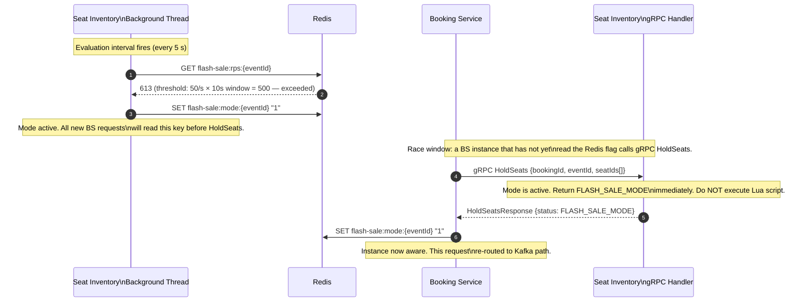
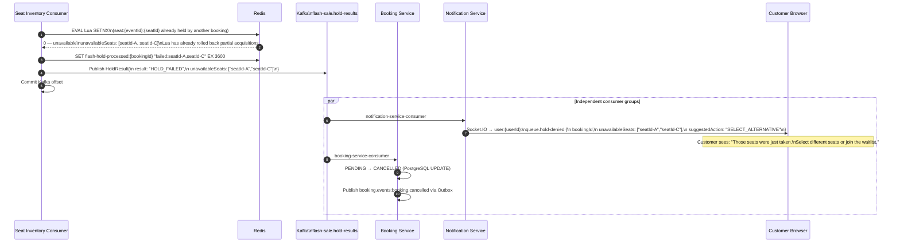
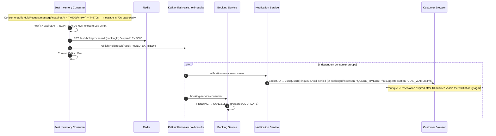
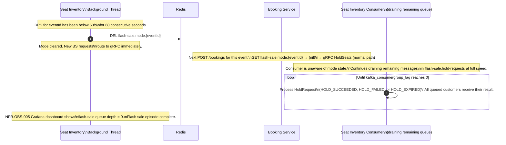

# ADR-007 — Flash Sale Queue Pattern

| Field             | Value                                                                                                                                    |
|-------------------|------------------------------------------------------------------------------------------------------------------------------------------|
| **ID**            | ADR-007                                                                                                                                  |
| **Title**         | Flash Sale Queue Pattern                                                                                                                 |
| **Status**        | Accepted                                                                                                                                 |
| **Date**          | 2025-05-15                                                                                                                               |
| **Author**        | StagePass Architecture                                                                                                                   |
| **Version**       | 1.0.0                                                                                                                                    |
| **Repo**          | stagepass-docs                                                                                                                           |
| **Path**          | /docs/adr/ADR-007-flash-sale-queue-pattern.md                                                                                           |
| **Traces To**     | PRD §8.1 FR-P-003, NFR-PERF-013, NFR-PERF-028, NFR-REL-001, NFR-REL-002, NFR-OBS-005                                                  |
| **Supersedes**    | —                                                                                                                                        |
| **Superseded By** | —                                                                                                                                        |
| **Depends On**    | ADR-003 (topic topology and partition keys), ADR-005 (booking state machine), ADR-006 (seat inventory concurrency and Redis Lua strategy) |
| **Informs**       | ADR-008 (disbursement model — revenue split computation begins after flash sale hold completes)                                          |

---

## Change Log

| Version | Date       | Author                 | Summary            |
|---------|------------|------------------------|--------------------|
| 1.0.0   | 2025-05-15 | StagePass Architecture | Initial acceptance |

---

## Table of Contents

1. [Status](#1-status)
2. [Context](#2-context)
   - 2.1 [Why the normal gRPC path fails at flash sale load](#21-why-the-normal-grpc-path-fails-at-flash-sale-load)
   - 2.2 [Scope](#22-scope)
   - 2.3 [Locked constraints from prior ADRs and NFRs](#23-locked-constraints-from-prior-adrs-and-nfrs)
   - 2.4 [Reconciliation: seat.commands vs flash-sale.hold-results](#24-reconciliation-seatcommands-vs-flash-salehold-results)
3. [Decision](#3-decision)
   - 3.1 [Flash sale mode trigger](#31-flash-sale-mode-trigger)
   - 3.2 [Mode communication and state storage](#32-mode-communication-and-state-storage)
   - 3.3 [Booking Service routing: gRPC vs Kafka](#33-booking-service-routing-grpc-vs-kafka)
   - 3.4 [In-flight gRPC call handling during mode switch](#34-in-flight-grpc-call-handling-during-mode-switch)
   - 3.5 [flash-sale.hold-requests producer schema and partition strategy](#35-flash-salehold-requests-producer-schema-and-partition-strategy)
   - 3.6 [flash-sale.hold-results schema and consumer group strategy](#36-flash-salehold-results-schema-and-consumer-group-strategy)
   - 3.7 [Consumer drain rate and throughput model](#37-consumer-drain-rate-and-throughput-model)
   - 3.8 [Queue position tracking and WebSocket delivery](#38-queue-position-tracking-and-websocket-delivery)
   - 3.9 [Flash sale latency budget](#39-flash-sale-latency-budget)
   - 3.10 [Timeout and expiry](#310-timeout-and-expiry)
   - 3.11 [Flash sale mode exit](#311-flash-sale-mode-exit)
   - 3.12 [Idempotency guarantees](#312-idempotency-guarantees)
   - 3.13 [Dead-letter queue strategy](#313-dead-letter-queue-strategy)
4. [Sequence Diagrams](#4-sequence-diagrams)
   - 4.1 [Flash sale mode activation](#41-flash-sale-mode-activation)
   - 4.2 [Flash sale full lifecycle: enqueue → hold → saga continue](#42-flash-sale-full-lifecycle-enqueue--hold--saga-continue)
   - 4.3 [Seats unavailable at queue front](#43-seats-unavailable-at-queue-front)
   - 4.4 [Queue wait timeout](#44-queue-wait-timeout)
   - 4.5 [Flash sale mode exit and queue drain](#45-flash-sale-mode-exit-and-queue-drain)
5. [Consequences](#5-consequences)
6. [Alternatives Considered](#6-alternatives-considered)
   - 6.1 [Direct gRPC with back-pressure rejection (rejected)](#61-direct-grpc-with-back-pressure-rejection-rejected)
   - 6.2 [Redis queue LPUSH/BRPOP instead of Kafka (rejected)](#62-redis-queue-lpushbrpop-instead-of-kafka-rejected)
   - 6.3 [Token bucket rate limiter at the gateway (rejected as sole mechanism)](#63-token-bucket-rate-limiter-at-the-gateway-rejected-as-sole-mechanism)
   - 6.4 [Shared consumer group for SI and Booking on hold-requests (rejected)](#64-shared-consumer-group-for-si-and-booking-on-hold-requests-rejected)
7. [References](#7-references)
8. [Quick Self-Check](#8-quick-self-check)
9. [Appendix: Flash Sale Observability Checklist](#9-appendix-flash-sale-observability-checklist)

---

## 1. Status

**Accepted.** This ADR governs all aspects of the flash sale funnel: trigger conditions,
mode switching mechanics, Kafka topic usage, consumer drain rate, queue position tracking,
and mode exit. Any change to the trigger threshold, topic schema, consumer group strategy,
or exit criteria requires an amendment reviewed and merged before the implementation PR opens.

---

## 2. Context

### 2.1 Why the normal gRPC path fails at flash sale load

ADR-006 §3.2 establishes the normal seat hold path: the Booking Service calls `HoldSeats`
via gRPC; the Seat Inventory Service executes a Redis Lua script atomically marking the
requested seats as HELD; the gRPC response is returned within a 400 ms deadline.

At normal peak load (300 RPS platform-aggregate), this path holds. Redis serves Lua scripts
at tens of thousands of operations per second; the gRPC connection pool is sized for
concurrent requests at 300 RPS; the Seat Inventory Service's JVM thread pool handles
the parallelism without saturation.

At flash sale load (1,000 RPS, concentrated on a single event), three distinct failure
modes emerge simultaneously:

**Failure mode 1 — gRPC connection pool exhaustion.** Each concurrent `HoldSeats` call
occupies one connection for its duration. At 1,000 concurrent callers, the pool is
exhausted and new callers receive `RESOURCE_EXHAUSTED` or wait past the 400 ms deadline,
cascading as HTTP 503s at the API Gateway.

**Failure mode 2 — Seat Inventory JVM thread saturation.** Even with a generous connection
pool, the Seat Inventory Service has a finite number of gRPC server handler threads. At
1,000 simultaneous requests, context-switching overhead and heap pressure accumulate.
GC pauses grow. The 400 ms deadline breaks down not because Redis is slow, but because
the JVM cannot schedule handlers fast enough.

**Failure mode 3 — Client retry amplification.** When gRPC calls time out, each timed-out
client retries (NFR-REL-006: up to 3 attempts, exponential backoff). A 1,000 RPS ingress
becomes 3,000 RPS effective load. This is the retry storm anti-pattern — the failure is
self-amplifying.

The Kafka funnel eliminates all three failure modes by converting concurrency into
throughput: instead of 1,000 simultaneous gRPC handlers, there is a Kafka partition queue
processed by one consumer thread per partition at a controlled, sustainable rate. The
Booking Service responds with HTTP 202 Accepted immediately and pushes the hold result
asynchronously via WebSocket once the queue processes the request. Load is levelled,
not shed.

> **Pattern named:** "Queue-based load levelling." The queue absorbs burst traffic that
> exceeds the consumer's sustainable processing rate. The consumer drains at its own pace
> without back-pressure collapse. Reference: Kleppmann, DDIA, Ch. 11 §"Event Streams";
> Hohpe & Woolf, Enterprise Integration Patterns — "Message Channel" and "Competing
> Consumers." The anti-pattern being avoided is "synchronous fan-in under spike load,"
> where every upstream caller waits for a downstream service that cannot scale to match
> the instantaneous request rate.

### 2.2 Scope

This ADR decides:

- The trigger condition for entering flash sale mode and the configurable threshold values
- The mechanism by which the Seat Inventory Service signals flash sale mode to Booking Service instances
- How the Booking Service routes `HoldSeats` requests: gRPC on the normal path, Kafka on the flash sale path
- The message schema for `flash-sale.hold-requests` (producer side) and `flash-sale.hold-results` (consumer side)
- The per-partition consumer drain rate and how it relates to Seat Inventory's Redis processing capacity
- How queue position is computed, tracked, and pushed to connected clients via WebSocket
- The flash sale latency budget that replaces NFR-PERF-001 and NFR-PERF-002 on this path
- What happens when a queued customer's requested seats are no longer available at queue front
- What happens when a customer's queue wait exceeds the maximum threshold (600 seconds)
- How and when flash sale mode is deactivated, and what happens to messages already in the queue

This ADR does **not** decide:

- The Redis Lua script mechanism for atomic seat holds (→ ADR-006 §3.2)
- The booking saga state machine (→ ADR-005 §3.2); flash sale mode does not change booking states
- The revenue split computation following a confirmed hold (→ ADR-004, ADR-008)
- The WebSocket Notification Service infrastructure (→ ADR-003 §3.6)

### 2.3 Locked constraints from prior ADRs and NFRs

The following decisions are **locked** and cannot be altered by this ADR:

| Source | Constraint |
|--------|-----------|
| ADR-003 §3.4.2 | Topic: `flash-sale.hold-requests`; partition key: `eventId`; partitions: 24; retention: 1 day; DLQ: `flash-sale.hold-requests.dlq` |
| ADR-003 §3.4.2 | Topic: `flash-sale.hold-results`; partition key: `customerId`; partitions: 12; retention: 1 day; DLQ: `flash-sale.hold-results.dlq` |
| ADR-003 §3.4.2 | Consumers of `flash-sale.hold-results`: `notification-service-consumer` (WebSocket push) and `booking-service-consumer` (saga state advance) |
| ADR-003 §3.6.2 | Socket.IO event from `flash-sale.hold-results`: `queue.hold-granted` / `queue.hold-denied`; room: `flash-sale:{eventId}` and `user:{userId}` |
| ADR-006 §3.3 | The Seat Inventory Service consumer executes the same Redis Lua SETNX script as the gRPC path; the hold mechanism is identical regardless of transport |
| ADR-006 §3.3 | `HoldSeats` gRPC returns `FLASH_SALE_MODE` status to signal Booking Service to switch paths |
| ADR-005 §3.2 | Booking state machine is unchanged on the flash sale path: `PENDING → SEATS_HELD → PAYMENT_PENDING → CONFIRMED`; transport path changes, states do not |
| ADR-005 §3.4 Step 1 | `HoldSeats` must be all-or-nothing: either all requested seats are held, or none are |
| NFR-PERF-013 | 10× normal RPS (1,000 RPS), 60 seconds, 0 oversells, error rate < 0.5% |
| NFR-REL-001 | All write endpoints accept `Idempotency-Key`; flash sale enqueue is a write |
| NFR-REL-002 | All Kafka consumers are idempotent |
| NFR-OBS-005 | Flash sale queue depth (Kafka consumer group lag on `flash-sale.hold-requests`) is a business metric in Grafana, refreshed every 60 s |
| NFR-PERF-028 | Queue position updates delivered to Customer via WebSocket p99 ≤ 2,000 ms |

### 2.4 Reconciliation: `seat.commands` vs `flash-sale.hold-results`

ADR-006 §3.3's sequence diagram routes the hold result to `seat.commands` (partitioned by
`eventId`). ADR-003's topic table defines `flash-sale.hold-results` as a dedicated result
topic (partitioned by `customerId`) consumed by both `notification-service-consumer` and
`booking-service-consumer`.

**Resolution:** `flash-sale.hold-results` (ADR-003) is authoritative. ADR-003 is the
canonical communication patterns document; topic definitions established there take
precedence over sequence diagram annotations in ADR-006. The `seat.commands` topic remains
the channel for seat state commands (admin blocks, batch releases); it is not used for hold
results on the flash sale path. This ADR establishes `flash-sale.hold-results` as the hold
result channel. An amendment to ADR-006's sequence diagram is registered as a documentation
debt item.

---

## 3. Decision

### 3.1 Flash sale mode trigger

Flash sale mode is activated **per-event** (not platform-wide). A single high-demand event
entering flash sale mode does not affect bookings for other events.

**Two trigger sources exist:**

**Trigger A — Admin-manual activation (highest authority):**
An Admin user activates flash sale mode for a specific event via the Admin dashboard. This
sets a Redis key (§3.2) immediately. Manual activation is appropriate when the demand surge
is anticipated (known on-sale date for a high-profile act). Manual activation persists until
manually deactivated or the event's on-sale window closes (§3.11).

**Trigger B — Automatic RPS-based detection:**
The Seat Inventory Service monitors `HoldSeats` gRPC call rate per event using a sliding
window counter in Redis:

```
Redis key:  flash-sale:rps:{eventId}
Type:       Integer counter
Strategy:   INCR on every HoldSeats gRPC call for this eventId;
            TTL reset to {window-seconds} on each INCR.
            (INCR + EXPIRE in one atomic Lua call)
Evaluation: Every {evaluation-interval} seconds, a background thread reads the counter.
            If counter > threshold × window-seconds, mode is activated.
```

**Threshold values (configurable, not hardcoded):**

| Parameter | Default | Storage | Scope |
|-----------|---------|---------|-------|
| `flash-sale.trigger.rps-per-event` | 50 req/s | Spring Cloud Config (Git-backed) | Platform-wide default |
| `flash-sale.trigger.rps-per-event.{eventId}` | inherits default | Admin dashboard → Redis override | Per-event override |
| `flash-sale.trigger.window-seconds` | 10 | Spring Cloud Config | Platform-wide |
| `flash-sale.trigger.evaluation-interval-seconds` | 5 | Spring Cloud Config | Platform-wide |
| `flash-sale.exit.rps-below-threshold-seconds` | 60 | Spring Cloud Config | Platform-wide |

**Why 50 req/s per event as the default:**
At 50 req/s on a single event, the gRPC path is handling 500 concurrent calls across the
evaluation window — approaching the region where connection pool pressure appears. Activating
at 50 req/s provides a comfortable margin before the failure modes of §2.1 materialise.
The threshold is deliberately conservative: entering flash sale mode increases customer
latency (202 Accepted vs 200 OK with immediate hold result), but it prevents system
collapse. A threshold that is too high risks triggering after failure has already begun.

**Why per-event, not platform-wide:**
A single event dominating platform RPS should not penalise customers booking other events.
Partitioning flash sale mode by `eventId` ensures isolation. Customers booking low-demand
events on the same platform get the normal synchronous path throughout.

### 3.2 Mode communication and state storage

Flash sale mode state for each event is stored in Redis and read by every Booking Service
instance before each `HoldSeats` decision:

```
Redis key:   flash-sale:mode:{eventId}
Value:       "1" (active) | absent or "0" (inactive)
TTL:         None (persists until explicitly cleared by deactivation logic, §3.11)
SET by:      Seat Inventory Service background thread (Trigger B, §3.1)
             Admin Service via management REST endpoint (Trigger A, §3.1)
CLEARED by:  Seat Inventory Service background thread (auto-exit, §3.11)
             Admin Service (manual deactivation, §3.11)
```

Every Booking Service instance checks this key as the **first action** when processing a
`POST /bookings` request — before making any gRPC call:

```
if Redis GET flash-sale:mode:{eventId} == "1":
    route to Kafka path (§3.3)
else:
    route to gRPC path
    if gRPC response.status == FLASH_SALE_MODE:
        // Secondary signal: SI detected mode before BS read the Redis key
        SET flash-sale:mode:{eventId} = "1" in Redis (sync local knowledge)
        switch to Kafka path for this request
```

The gRPC `FLASH_SALE_MODE` response is the safety net for the window between Seat Inventory
detecting the threshold and the Redis key being read by all Booking Service instances. Redis
propagation is sub-millisecond; the window is minimal but not zero.

**Why Redis over in-memory flags:**
Booking Service runs as multiple instances. An in-memory flag requires coordination between
instances (gossip, broadcast) that adds complexity and lag. Redis is already a shared
substrate for idempotency keys and hold state — this is one additional key, not a new
dependency. Redis reads are sub-millisecond and do not materially affect the critical
latency path.

### 3.3 Booking Service routing: gRPC vs Kafka

The Booking Service implements a `HoldSeatsRouter` component — a domain-specific routing
decision with its own lifecycle, not a general feature flag system:

**Normal path** (`flash-sale:mode:{eventId}` absent or `"0"`):

```
1. Call gRPC HoldSeats (deadline: 400ms, per ADR-005 §3.4)
2. On SUCCESS     → write Booking(SEATS_HELD) to PostgreSQL → return HTTP 200
3. On UNAVAILABLE → write Booking(CANCELLED) → return HTTP 409
4. On FLASH_SALE_MODE → set Redis flag → switch to Kafka path (step 2 of flash sale path)
5. On deadline exceeded → retry once; on second failure → return HTTP 503
```

**Flash sale path** (`flash-sale:mode:{eventId}` == `"1"`):

```
1. Write Booking(state=PENDING) to PostgreSQL immediately
   (PENDING is a flash-sale-only pre-hold state; the booking exists but no seats are held)
2. Publish HoldRequest to flash-sale.hold-requests (schema: §3.5)
   Record the returned {partition, offset} in Redis:
   SET flash-sale:position:{bookingId} = "{partition}:{offset}" EX 700
3. Return HTTP 202 Accepted immediately:
   {
     "bookingId":             "...",
     "status":                "QUEUED",
     "queuePosition":         <approximate — partition offset - last committed offset>,
     "estimatedWaitSeconds":  <estimate>,
     "expiresAt":             "<enqueuedAt + 600s>"
   }
4. Booking stays PENDING until HoldResult arrives on flash-sale.hold-results
5. On HoldSucceeded consumed (§3.6):
   a. Transition Booking: PENDING → SEATS_HELD
   b. Immediately call Payment Service (REST POST /payments/orders) within the consumer handler
   c. Transition Booking: SEATS_HELD → PAYMENT_PENDING
   d. Saga continues identically to the normal path from this point (ADR-005 §4.1 steps 11+)
6. On HoldFailed consumed: Booking → CANCELLED; push notification (§3.10)
7. On HoldExpired consumed: Booking → CANCELLED; push notification (§3.10)
```

**Booking PENDING state on the flash sale path:**
ADR-005 §3.2 defines the state machine as `PENDING → SEATS_HELD`. On the normal gRPC path,
this transition happens synchronously within the `POST /bookings` handler. On the flash
sale path, the booking is written in `PENDING` state and transitions to `SEATS_HELD` (or
`CANCELLED`) asynchronously when the hold result arrives. The state machine is not changed
— the timing of the `PENDING → SEATS_HELD` transition is path-dependent, which ADR-005
permits because the saga distinguishes between the synchronous portion (the client response)
and the async continuation.

**Idempotency on the flash sale path:**
The `Idempotency-Key` header (NFR-REL-001) applies to the entire `POST /bookings` request.
If a customer retries while their booking is `PENDING`, the cached response returns the
original 202 with the current queue position — it does not publish a second `HoldRequest`.
The idempotency cache key `booking:idem:<Idempotency-Key>` is set immediately after the
first Kafka publish succeeds (TTL: 24 hours).

### 3.4 In-flight gRPC call handling during mode switch

When flash sale mode activates (Redis key set), all new `POST /bookings` requests immediately
route to the Kafka path. Outstanding gRPC `HoldSeats` calls already dispatched before the
mode switch complete normally:

- gRPC deadline is 400 ms (ADR-005 §3.4). Within 400 ms, they receive SUCCESS, UNAVAILABLE,
  or FLASH_SALE_MODE from the Seat Inventory Service.
- **On SUCCESS:** the booking proceeds on the gRPC path normally (→ SEATS_HELD). This is
  safe — the Seat Inventory Service accepted the hold; the seat is correctly HELD in Redis.
- **On FLASH_SALE_MODE:** the Booking Service sets the Redis mode flag and switches to the
  Kafka path for this request. If the booking has not yet been written to PENDING, it
  creates the PENDING record and publishes the `HoldRequest`.
- **On deadline exceeded:** treated as hold failure. Booking Service returns HTTP 503;
  the customer's client retries via the flash sale path (202 Accepted).

**There is no special drain period.** The gRPC deadline (400 ms maximum) bounds all
in-flight calls. By the time 400 ms elapses from mode activation, all outstanding gRPC
calls have resolved. The mode switch is effectively instant with a 400 ms tail on in-flight
requests. No explicit coordination mechanism is required.

### 3.5 `flash-sale.hold-requests` producer schema and partition strategy

**Topic parameters (locked, ADR-003 §3.4.2):**

| Parameter | Value |
|-----------|-------|
| Topic name | `flash-sale.hold-requests` |
| Partition key | `eventId` |
| Partitions | 24 |
| Retention | 1 day |
| DLQ | `flash-sale.hold-requests.dlq` |
| Consumer group | `seat-inventory-service-consumer` |

**Message schema (JSON, AsyncAPI-aligned):**

```json
{
  "schemaVersion": "1.0",
  "messageType":   "FlashSaleHoldRequest",
  "bookingId":      "<UUID>",
  "eventId":        "<UUID>",
  "customerId":     "<UUID>",
  "seatIds":        ["<UUID>"],
  "idempotencyKey": "<string — echoed from client Idempotency-Key header>",
  "correlationId":  "<UUID — X-Correlation-Id forwarded from gateway>",
  "enqueuedAt":     "<ISO-8601 UTC>",
  "expiresAt":      "<ISO-8601 UTC — enqueuedAt + 600 seconds>",
  "holdTtlSeconds": 600
}
```

**Field notes:**

- **`expiresAt`:** The Seat Inventory consumer checks this field against the current time
  before executing the Lua script. If the message has aged past its expiry, the consumer
  publishes `HoldExpired` to `flash-sale.hold-results` and commits the offset without
  executing Redis. This prevents stale messages from holding seats for customers who have
  long since abandoned the queue (§3.10, Case B).

- **`holdTtlSeconds`:** Always 600 (NFR-REL-004). Included in the message so the consumer
  is not hard-coded to a single value. A future Admin capability to configure per-event hold
  windows carries the override here without a schema change.

- **`seatIds`:** 1–8 seats (ADR-005 §3.4 Step 1 validation). The consumer does not
  re-validate count — this was validated by the Booking Service before publishing.

**Partition key rationale (locked, ADR-003):**
All `HoldRequest` messages for a given event land on the same partition, providing **total
ordering per event**: the consumer thread processes hold requests for event X in strict
arrival order. Within a single event, this is a first-come, first-served guarantee
(PRD FR-P-003 AC5). Across events, different partitions run concurrently without
interference.

**Producer configuration (Booking Service, Spring Kafka):**

```java
// Idempotent producer — guarantees exactly-once publish
props.put(ProducerConfig.ACKS_CONFIG, "all");
props.put(ProducerConfig.ENABLE_IDEMPOTENCE_CONFIG, true);
props.put(ProducerConfig.MAX_IN_FLIGHT_REQUESTS_PER_CONNECTION, 5);
props.put(ProducerConfig.RETRIES_CONFIG, Integer.MAX_VALUE);
props.put(ProducerConfig.COMPRESSION_TYPE_CONFIG, "snappy");

// After successful send: capture partition + offset for queue position tracking (§3.8)
// RecordMetadata meta = future.get();
// redis.set("flash-sale:position:" + bookingId,
//           meta.partition() + ":" + meta.offset(),
//           Duration.ofSeconds(700));
```

`acks=all` with an idempotent producer guarantees that a successfully returned
`RecordMetadata` means the message is durably written to Kafka and will not be lost.
The offset recorded in Redis is the source of truth for queue position calculation (§3.8).

### 3.6 `flash-sale.hold-results` schema and consumer group strategy

**Topic parameters (locked, ADR-003 §3.4.2):**

| Parameter | Value |
|-----------|-------|
| Topic name | `flash-sale.hold-results` |
| Partition key | `customerId` |
| Partitions | 12 |
| Retention | 1 day |
| DLQ | `flash-sale.hold-results.dlq` |
| Consumer groups | `notification-service-consumer`, `booking-service-consumer` |

**Message schema (JSON, AsyncAPI-aligned):**

```json
{
  "schemaVersion":    "1.0",
  "messageType":      "FlashSaleHoldResult",
  "bookingId":        "<UUID>",
  "customerId":       "<UUID>",
  "eventId":          "<UUID>",
  "result":           "HOLD_SUCCEEDED | HOLD_FAILED | HOLD_EXPIRED",
  "holdId":           "<UUID | null>",
  "heldUntil":        "<ISO-8601 UTC | null>",
  "unavailableSeats": ["<UUID>"],
  "processedAt":      "<ISO-8601 UTC>",
  "correlationId":    "<UUID>"
}
```

**`result` values:**

| Value | Meaning | Next action |
|-------|---------|-------------|
| `HOLD_SUCCEEDED` | All requested seats atomically held in Redis with 600 s TTL | Booking Service: `PENDING → SEATS_HELD → PAYMENT_PENDING`. Notification: push `queue.hold-granted` |
| `HOLD_FAILED` | At least one seat unavailable; no seats held | Booking Service: `PENDING → CANCELLED`. Notification: push `queue.hold-denied` with `unavailableSeats[]` |
| `HOLD_EXPIRED` | Request reached consumer after `expiresAt`; Lua script not executed | Booking Service: `PENDING → CANCELLED`. Notification: push `queue.hold-denied` (timeout variant) |

**Consumer group behaviour:**

Two independent consumer groups subscribe to `flash-sale.hold-results`. Each group receives
every message independently (Kafka fan-out — same pattern as `booking.events` in
ADR-005 §5.1):

- **`notification-service-consumer`:** reads the result, determines the Socket.IO event
  type (`queue.hold-granted` or `queue.hold-denied`), and pushes to `user:{userId}` room
  (personalised result — these specific seats) and to `flash-sale:{eventId}` room
  (aggregate seat state update visible to all browsers on the seat map for this event).

- **`booking-service-consumer`:** reads the result and advances the booking saga. On
  `HOLD_SUCCEEDED`, transitions the booking to `SEATS_HELD` and immediately initiates the
  payment step (ADR-005 §3.4 Step 2: REST POST to Payment Service) within the consumer
  handler. The saga continues identically to the normal path from `PAYMENT_PENDING`.

**Why `customerId` as the partition key for results (not `bookingId` or `eventId`):**
The Notification Service pushes results to the customer's WebSocket room. Keying by
`customerId` collocates all notifications for one customer on one partition, ensuring
ordering of messages to a given user — a "hold granted" cannot arrive after "booking
confirmed" due to partition reordering. The Booking Service consumer group sees the same
benefit: booking state transitions for one customer are ordered, preventing state machine
corruption. Keying by `eventId` would have collocated all customers of one event on one
partition, creating a hotspot for popular events.

### 3.7 Consumer drain rate and throughput model

The Seat Inventory Service consumer (`seat-inventory-service-consumer`) processes
`flash-sale.hold-requests` with **one thread per partition**.

**Per-message processing time breakdown:**

| Step | Time | Notes |
|------|------|-------|
| Kafka poll and deserialise | ~2 ms | Spring Kafka poll overhead |
| Redis idempotency check (`GET flash-hold-processed:{bookingId}`) | ~1 ms | Single Redis GET |
| `expiresAt` evaluation | <0.1 ms | Local clock comparison |
| Redis Lua script (SETNX per seat, N seats) | ~2–5 ms | Linear with seat count; 1–8 seats per booking |
| PostgreSQL async write (non-blocking handoff) | ~0 ms | Write queued; does not block consumer thread |
| Kafka produce to `flash-sale.hold-results` (`acks=all`, batched) | ~3 ms | Async produce |
| Kafka offset commit | ~2 ms | Manual commit after publish acknowledged |
| **Total sequential work per message** | **~10–13 ms** | |

**Effective per-partition throughput:**

At ~12 ms per message (midpoint), one consumer thread processes approximately **83
messages/second per partition**. With 24 partitions across all events, total throughput
is **~2,000 messages/second** when events are spread across partitions.

**Worst case: all 1,000 RPS concentrated on one event** (one partition):

- Queue depth growth rate: 1,000 – 83 = **917 messages/second accumulated**
- Over the 60-second burst: maximum queue depth ≈ **55,000 messages** (60 × 917)

**Important mitigating factor — seat exhaustion acceleration:**
Once all available seats are HELD or BOOKED, the Lua script returns `0` immediately for
every subsequent request. The per-message processing time for a failed hold drops to ~7 ms
(no PG write), increasing throughput to ~143 messages/second. If an event has 10,000 seats,
the first 10,000 successful holds occur within ~120 seconds (83/s × 120). Subsequent
messages in the queue drain at 143/second — the queue empties in approximately
(55,000 – 10,000) / 143 ≈ **315 seconds** after seat exhaustion.

**Total worst-case queue lifetime: ~7 minutes.** This is within the 10-minute hold TTL
(NFR-REL-004) and the 600-second maximum queue wait (§3.10).

**Tuning parameters:**

The per-partition drain rate can be tuned via `spring.kafka.listener.concurrency` in
the Seat Inventory Service (one thread per partition is the maximum for ordered processing;
increasing this would break per-event FIFO). To increase throughput within one partition,
the options are: reduce per-message Redis latency (Lua script optimisation) or batch the
PostgreSQL async writes. **Partition count changes require an ADR amendment** — they are a
breaking topic topology change affecting all consumer group assignments.

### 3.8 Queue position tracking and WebSocket delivery

**How queue position is computed:**

When the Booking Service publishes a `HoldRequest` and receives `RecordMetadata` from the
Kafka producer API, it stores the position:

```
Redis key:   flash-sale:position:{bookingId}
Value:       "{partition}:{offset}"
TTL:         700 seconds (slightly longer than max queue wait)
```

A background task in the Notification Service runs every **1 second** and computes queue
positions for all active flash sale events:

```
For each active event where flash-sale:mode:{eventId} == "1":
  1. Query Kafka AdminClient for the committed offset of seat-inventory-service-consumer
     on the flash-sale.hold-requests partition that receives this eventId's messages.
     (Partition is deterministic: partition = hash(eventId) % 24)
  2. For each bookingId with a flash-sale:position:{bookingId} key in Redis:
     a. Parse stored {partition}:{offset}
     b. position = stored_offset - last_committed_offset  (0 = next to be processed)
     c. estimatedWaitSeconds = position / 83  (per-partition drain rate, §3.7)
     d. If position ≤ 0 (already committed), skip (consumer has passed this message)
     e. Publish queue.position-updated to notification.commands topic →
        Notification Service consumer → Socket.IO push to user:{userId}
```

**Why Kafka AdminClient polling (not a push model):**
Kafka does not push consumer group offsets to observers — they must be polled via
`AdminClient.listConsumerGroupOffsets()`. The 1-second poll interval satisfies
NFR-PERF-028 (position updates p99 ≤ 2,000 ms): maximum delay between a position change
and the client receiving it is 1 s (poll) + <100 ms (WebSocket delivery) = well within
2,000 ms.

**WebSocket event payload (Socket.IO event: `queue.position-updated`, room: `user:{userId}`):**

```json
{
  "eventId":              "<UUID>",
  "bookingId":            "<UUID>",
  "queuePosition":        42,
  "estimatedWaitSeconds": 31,
  "expiresAt":            "2025-05-15T10:10:00Z"
}
```

`queuePosition` is 1-indexed. Position 1 = next to be processed. When position reaches 0,
the result will arrive within the next consumer poll cycle (~12 ms). The client UX should
communicate this as an estimate ("approximately N people ahead of you"), not a precise
count, because messages ahead may expire, fail instantly, or be processed faster than the
estimate.

**Prometheus metric for Grafana dashboard (NFR-OBS-005):**

```promql
# Flash sale queue depth per event — consumer lag on the flash sale request topic
kafka_consumergroup_lag{
  consumer_group="seat-inventory-service-consumer",
  topic="flash-sale.hold-requests"
}
```

This is the "flash sale queue depth" business metric (NFR-OBS-005). It is labelled by
partition, from which `eventId` can be derived (deterministic hash mapping). The Grafana
dashboard aggregates by event label via a join with an event metadata source.

### 3.9 Flash sale latency budget

**NFR-PERF-001** (seat hold p99 < 500 ms) and **NFR-PERF-002** (booking submit synchronous
portion p99 < 2 s) are defined for the normal gRPC path. On the flash sale path, these
targets are **replaced** by the following explicit SLOs, established by this ADR:

| Metric | Target | Measurement point |
|--------|--------|-------------------|
| `POST /bookings` → HTTP 202 Accepted (synchronous response) | p99 < 500 ms | API Gateway ingress to client response |
| HTTP 202 Accepted → first `queue.position-updated` WebSocket event | p99 < 2,000 ms | Client WebSocket room join to first position event |
| Queue position update delivery latency | p99 < 2,000 ms per update | Position change to WebSocket delivery (NFR-PERF-028) |
| HTTP 202 Accepted → `queue.hold-granted` WebSocket event | No hard p99; queue-depth dependent; maximum 600 s | Bounded by max queue wait |
| `queue.hold-granted` → `booking.confirmed` WebSocket event | p99 < 10 s **from hold grant** | NFR-PERF-003 applies from hold grant onward |

**Why NFR-PERF-003 is re-baselined from hold grant:**
NFR-PERF-003 states the booking saga end-to-end completes p99 < 10 s from checkout submit.
Under flash sale conditions, applying this from `POST /bookings` to `booking.confirmed` is
impossible when queue depth is 50,000 messages. Instead, NFR-PERF-003 applies from the hold
grant to booking confirmation — the saga steps after hold completion (payment initiation →
payment capture → commit → ticket issuance → WebSocket push) are identical to the normal
path and must complete within 10 seconds. The customer-facing SLO for queue wait is
communicated via position updates and the `expiresAt` field. Customers may leave the queue
at any time before their hold is granted.

### 3.10 Timeout and expiry

**Case A — Seats no longer available when request reaches queue front:**

The Redis Lua script returns `0` (unavailable). The Seat Inventory consumer publishes
`HoldResult{result: HOLD_FAILED, unavailableSeats: [...]}` to `flash-sale.hold-results`.

- **`booking-service-consumer`:** Transitions Booking → `CANCELLED`. Publishes
  `booking.events:booking.cancelled` via Outbox.
- **`notification-service-consumer`:** Pushes `queue.hold-denied` to `user:{userId}` room
  with `unavailableSeats[]` and a `suggestedAction`:
  - `SELECT_ALTERNATIVE` if remaining seats exist for this event
  - `JOIN_WAITLIST` if the event is fully sold out

The customer's browser presents the unavailability notification and the appropriate next
action. No automatic seat selection is performed — the customer makes an explicit choice
(PRD FR-P-003 AC6). A new booking for different seats starts a fresh request (flash sale
or normal path, depending on current mode).

**Case B — Queue wait exceeded (max threshold: 600 seconds):**

The `expiresAt` field in the `HoldRequest` is `enqueuedAt + 600 seconds`. The Seat
Inventory consumer checks this before executing the Lua script:

```
if now() > message.expiresAt:
    publish HoldResult{result: HOLD_EXPIRED, unavailableSeats: []}
    SET flash-hold-processed:{bookingId} = "expired" EX 3600
    commit Kafka offset
    // Do NOT execute Lua script — no seats held for a potentially abandoned session
    return
```

**Why not execute the Lua script for expired messages:**
Executing the Lua script for an expired request holds seats for a booking whose customer
may have closed their browser. The hold would block legitimate buyers for 10 minutes
before auto-releasing. Skipping the Lua script on expiry is the conservative and correct
choice: the customer is cleanly notified of the timeout, and the seats remain available
for the next legitimate buyer in the queue.

**Why 600 seconds as the max wait:**
600 seconds = 10 minutes = the hold TTL (NFR-REL-004). A customer granted a hold at
second 599 has 1 second to complete payment — not useful. In practice, the expected
maximum wait at the drain rate modelled in §3.7 is ~7 minutes, leaving ~3 minutes for
payment completion. The 600-second expiry is a hard safety ceiling, not an expected wait.

**Hold extension on Payment Service unavailability (NFR-AVAIL-003):**
If the Booking Service's `INITIATE_PAYMENT` step (ADR-005 §3.4 Step 2) fails because the
Payment Service is unreachable, NFR-AVAIL-003 requires extending the hold by 5 minutes.
This extension applies identically on the flash sale path — the hold was granted via Redis
Lua (TTL 600 s), and the extension calls `ExtendHold` via gRPC to Seat Inventory, which
updates the Redis TTL. The booking state machine is unchanged.

### 3.11 Flash sale mode exit

Flash sale mode for an event is deactivated by one of two conditions:

**Exit condition A — RPS drops below threshold (auto-exit):**
The same background thread that evaluates activation (§3.1 Trigger B) evaluates exit. If
the measured RPS for an event drops below `flash-sale.trigger.rps-per-event` and remains
below it for `flash-sale.exit.rps-below-threshold-seconds` (default: 60 seconds), the
thread clears the Redis key: `DEL flash-sale:mode:{eventId}`.

**Exit condition B — Admin manual deactivation:**
An Admin user disables flash sale mode via the Admin dashboard. The Admin Service calls
the Seat Inventory Service management endpoint `DELETE /flash-sale/mode/{eventId}`, which
clears the Redis key.

**What happens to messages already in the queue when mode exits:**

Flash sale mode exit affects only the routing of **new** `POST /bookings` requests. Messages
already published to `flash-sale.hold-requests` are **fully processed** regardless of mode
state. The consumer is unaware of mode — it drains whatever is in the partition.

This is the correct behaviour: customers who entered the queue while flash sale mode was
active are entitled to have their requests processed. Abandoning in-flight queue messages
at mode exit would leave bookings stuck in `PENDING` state indefinitely, requiring
reconciliation.

**New requests after mode exit:**
Once `flash-sale:mode:{eventId}` is cleared from Redis, the next `POST /bookings` for that
event routes to the normal gRPC path. If the residual queue is still draining and demand
remains high, the gRPC path may re-trigger auto-detection and re-enter flash sale mode.
This oscillation is expected and safe — the two paths do not conflict. Idempotency (§3.12)
prevents double holds if a customer's queued request is re-submitted via gRPC before the
queue processes the original.

**Event on-sale window closes:**
When the event's on-sale window closes, the Seat Inventory Service background thread
performs an emergency mode exit: clears `flash-sale:mode:{eventId}` and publishes
`HoldExpired` for any remaining messages in the queue whose `expiresAt` is past. The
consumer itself handles natural expiry via the `expiresAt` check — the emergency path is
belt-and-suspenders for a clean shutdown.

### 3.12 Idempotency guarantees

**Producer-side idempotency (Booking Service → `flash-sale.hold-requests`):**
The Booking Service uses an idempotent Kafka producer (`ENABLE_IDEMPOTENCE=true`, §3.5).
A repeat `POST /bookings` with the same `Idempotency-Key` while the booking is `PENDING`
returns the cached 202 response without publishing a second `HoldRequest` (NFR-REL-001).
The idempotency cache key `booking:idem:<Idempotency-Key>` is set immediately after the
first Kafka publish succeeds.

**Consumer-side idempotency (Seat Inventory, `flash-sale.hold-requests`):**
Per ADR-006 §3.3, the consumer checks Redis key `flash-hold-processed:{bookingId}` before
executing the Lua script. If the key exists (from a prior processing attempt), the original
result is re-published to `flash-sale.hold-results` and the Kafka offset is committed.
No re-execution occurs. Idempotency key TTL: 3,600 seconds (NFR-REL-002).

**Consumer-side idempotency (`flash-sale.hold-results` consumers):**
- **`booking-service-consumer`:** Checks current booking state in PostgreSQL before
  transitioning. If the booking is already `SEATS_HELD` or `CANCELLED`, the message is a
  duplicate — log and commit offset without re-execution.
- **`notification-service-consumer`:** WebSocket pushes are fire-and-forget. Duplicate
  pushes are handled client-side: the browser ignores `queue.hold-granted` events for
  an already-confirmed or already-cancelled booking.

### 3.13 Dead-letter queue strategy

Both flash sale topics have DLQs (locked, ADR-003):

| DLQ Topic | Source consumer | Triggers Prometheus alert when |
|-----------|----------------|-------------------------------|
| `flash-sale.hold-requests.dlq` | `seat-inventory-service-consumer` | DLQ depth > 0 for > 5 min (NFR-REL-007) |
| `flash-sale.hold-results.dlq` | `booking-service-consumer` or `notification-service-consumer` | DLQ depth > 0 for > 5 min (NFR-REL-007) |

**What lands in the DLQ on `flash-sale.hold-requests`:**
- Deserialisation failure (corrupt message): `ErrorHandlingDeserializer` moves to DLQ
  immediately (no retry — retrying a corrupt message is pointless).
- Repeated processing failure (Redis unavailable, all 3 retries exhausted per NFR-REL-006):
  message moves to DLQ after exponential backoff.

**Consequence of DLQ messages on `flash-sale.hold-requests`:**
A `HoldRequest` in the DLQ means the Booking Service will never receive a hold result.
The Booking Service reconciliation job (Phase 4) scans for `PENDING` bookings older than
10 minutes and transitions them to `CANCELLED` with a `queue.hold-denied` WebSocket push.
This is the recovery path — the customer's booking is cleanly cancelled rather than left
in `PENDING` indefinitely.

The DLQ alert fires Prometheus alert → Alertmanager → Slack. Runbook:
`stagepass-docs/docs/runbooks/flash-sale-hold-requests-dlq.md`.

---

## 4. Sequence Diagrams

### 4.1 Flash sale mode activation



### 4.2 Flash sale full lifecycle: enqueue → hold → saga continue

```mermaid
sequenceDiagram
    autonumber
    participant C   as Customer Browser
    participant GW  as API Gateway
    participant BS  as Booking Service
    participant R   as Redis
    participant KQ  as Kafka\nflash-sale.hold-requests
    participant SI  as Seat Inventory Consumer\n(Thread for partition P)
    participant KR  as Kafka\nflash-sale.hold-results
    participant NS  as Notification Service
    participant PS  as Payment Service (REST)

    C->>GW: POST /bookings {eventId, seatIds[], Idempotency-Key}
    GW->>BS: Forward (JWT validated, X-User-Id + X-Correlation-Id injected)

    BS->>R: GET booking:idem:{Idempotency-Key}
    R-->>BS: (nil — not a retry)

    BS->>R: GET flash-sale:mode:{eventId}
    R-->>BS: "1" — flash sale active

    BS->>BS: Write Booking{state=PENDING} to PostgreSQL
    BS->>KQ: Publish HoldRequest{bookingId, eventId, customerId,\nseatIds[], idempotencyKey, enqueuedAt,\nexpiresAt=enqueuedAt+600s, holdTtlSeconds=600}
    note over KQ: Producer returns RecordMetadata\n{partition=P, offset=O}

    BS->>R: SET flash-sale:position:{bookingId} "P:O" EX 700
    BS->>R: SET booking:idem:{Idempotency-Key} "202:{bookingId}" EX 86400

    BS-->>GW: HTTP 202 Accepted {bookingId, status:"QUEUED",\nqueuePosition: O-lastCommittedOffset(P),\nestimatedWaitSeconds, expiresAt}
    GW-->>C: 202 Accepted

    note over C: Client joins WebSocket rooms:\nuser:{userId} and flash-sale:{eventId}

    note over KQ,SI: Notification Service background task polls\nAdminClient every 1s; pushes position updates\nto user:{userId} room (NFR-PERF-028)

    SI->>KQ: Poll HoldRequest at offset O
    SI->>R: GET flash-hold-processed:{bookingId}
    R-->>SI: (nil — first processing)

    SI->>SI: now() < expiresAt ✓

    SI->>R: EVAL Lua SETNX script\n(SET seat:{eventId}:{seatId} NX EX 600 for each seat)
    R-->>SI: 1 — all seats acquired

    SI->>SI: Handoff async PostgreSQL write\n(seat_holds INSERT, seat_state UPDATE)
    SI->>R: SET flash-hold-processed:{bookingId} "success" EX 3600
    SI->>KR: Publish HoldResult{bookingId, customerId, eventId,\nresult:"HOLD_SUCCEEDED", holdId, heldUntil}\npartitionKey=customerId
    SI->>KQ: Commit offset O

    par Two independent consumer groups on flash-sale.hold-results
        KR->>NS: notification-service-consumer
        NS->>C: Socket.IO → user:{userId}:\nqueue.hold-granted {bookingId, holdId, heldUntil}
        NS->>C: Socket.IO → flash-sale:{eventId}:\nseat.state-changed {seatIds[], newState:"HELD"}

        KR->>BS: booking-service-consumer
        BS->>BS: PENDING → SEATS_HELD (PostgreSQL UPDATE)
        BS->>PS: REST POST /payments/orders\n{bookingId, amount, Idempotency-Key}
        PS-->>BS: {paymentOrderId, paymentUrl}
        BS->>BS: SEATS_HELD → PAYMENT_PENDING (PostgreSQL UPDATE)
    end

    note over C: Customer sees "Seats secured — proceed to payment."\nSaga continues identically to normal path\nfrom PAYMENT_PENDING (ADR-005 §4.1 steps 11+)
```

### 4.3 Seats unavailable at queue front



### 4.4 Queue wait timeout



### 4.5 Flash sale mode exit and queue drain



---

## 5. Consequences

### 5.1 Positive

**NFR-PERF-013 achievable.** The Kafka funnel converts 1,000 concurrent gRPC connections
into a managed queue consumed at ~83 messages/second per partition. The Seat Inventory
Service operates well within its Redis capacity. Oversell is impossible because the Redis
Lua script is the mutual exclusion mechanism — the queue adds serialisation, it does not
weaken the atomicity guarantee (ADR-006 §3.3).

**FIFO fairness is guaranteed.** All `HoldRequests` for a given event land on the same
Kafka partition (partition key: `eventId`). The first customer whose message is committed
to the partition is the first served (PRD FR-P-003 AC5). There is no priority queue, no
VIP lane, no random shuffle — Kafka partition ordering is the fairness mechanism.

**Booking state machine unchanged.** The flash sale path transitions through the same
states (`PENDING → SEATS_HELD → PAYMENT_PENDING → CONFIRMED`) as the normal path. All
downstream saga steps (payment initiation, ticket issuance, disbursement scheduling) are
identical. Implementation surface is limited to the Booking Service's routing layer and
the Seat Inventory consumer.

**Observable by design.** Flash sale queue depth is a single Kafka consumer group lag
metric, visible in Grafana (NFR-OBS-005). Per-event queue depth is derivable from
partition lag. DLQ alerting (NFR-REL-007) fires on `flash-sale.hold-requests.dlq` depth
without additional instrumentation.

**Event isolation.** Flash sale mode for event A does not affect bookings for event B.
Each event occupies its own Kafka partition(s). Normal-path bookings for other events
continue at their normal latency.

### 5.2 Negative / trade-offs

**Increased booking latency for customers in flash sale mode.** A customer in the flash
sale queue receives HTTP 202 instead of HTTP 200. The hold result arrives asynchronously
via WebSocket (seconds to minutes, queue-depth dependent) rather than in the same HTTP
response. This is a deliberate trade: system availability and correctness are prioritised
over individual booking latency during extreme load. Customer UX must communicate queue
position clearly (PRD FR-P-003 AC3).

**Two async result paths in Booking Service.** The normal path gets a synchronous gRPC
response within the `POST /bookings` handler. The flash sale path gets the result via
Kafka consumer. Both paths must be tested independently. The `PENDING` state
(pre-hold, flash sale only) must be explicitly handled in the reconciliation job.

**`PENDING` state introduces a reconciliation concern.** A booking stuck in `PENDING` (DLQ
event; hold result never delivered) must be detected and cancelled by the reconciliation
job (scans for `PENDING` bookings older than 10 minutes). This is operational overhead
absent on the normal path.

**Queue position estimate is approximate.** The Notification Service polls AdminClient
every 1 second. Queue position shown to the customer is a sampled value that can jump
(if messages ahead fail fast due to expiry or seat unavailability). The UI must communicate
this as an estimate, not a precise count.

**Mode switch oscillation risk.** If the activation and exit thresholds are too close, the
system may oscillate between modes. Mitigated by the hysteresis in the exit condition
(60-second sustained below-threshold window). Operators may widen the gap by setting a
lower exit threshold via config without an ADR amendment.

---

## 6. Alternatives Considered

### 6.1 Direct gRPC with back-pressure rejection (rejected)

**Mechanism:** Retain the gRPC path for all loads. When Seat Inventory detects saturation
(thread pool utilisation > 80%), it returns `RESOURCE_EXHAUSTED`. The API Gateway applies
a token bucket rate limiter and returns HTTP 429 to excess clients.

**Why considered:** Simpler implementation. No Kafka consumer loop. No queue position
tracking. The client retries on 429 according to a `Retry-After` header.

**Why rejected:** Rate limiting sheds load — it rejects customers rather than queuing them.
At 1,000 RPS for a hot event, 70% of customers receive 429 and must retry manually. In a
real flash sale, these customers retry immediately, creating a retry storm that maintains
1,000 RPS at the gateway indefinitely. The effective result is an oscillation between
overload and rejection with no throughput increase.

Queue-based load levelling preserves every request and serves them in FIFO order. Rejection
with retry loop does not provide fairness — the customer with the fastest client (or most
aggressive retry logic) is favoured, not the customer who clicked first.

> **The anti-pattern named:** "Drop and retry" under spike load creates retry amplification.
> The load that triggered the limit does not decrease — it increases, because each rejection
> becomes a scheduled retry. A queue absorbs the spike and smooths it into a sustainable
> drain rate. Reference: Kleppmann, DDIA, Ch. 11.

### 6.2 Redis queue (LPUSH/BRPOP) instead of Kafka (rejected)

**Mechanism:** Booking Service publishes `HoldRequest` via `LPUSH` to a Redis list per
event. Seat Inventory runs a `BRPOP` consumer per list.

**Why considered:** Redis is already a dependency. This avoids adding Kafka to the flash
sale path. Redis lists support O(1) push/pop; `BRPOP` provides blocking consumption.

**Why rejected:** Redis lists have no consumer group semantics. If two consumer threads
`BRPOP` the same list, each message is delivered to exactly one consumer — there is no
fan-out to the `notification-service-consumer` that needs to push WebSocket position
updates. Fan-out would require publishing to multiple Redis lists (one per consumer),
which is operationally fragile.

Redis lists also have no built-in DLQ, no offset tracking (so `kafka_consumergroup_lag`
is not observable), no schema evolution contract, and no replay capability. A crashed
BRPOP consumer that was mid-processing loses the message permanently (unless Redis
persistence is synchronous, which defeats the performance purpose). Kafka's consumer group
model, offset commit semantics, DLQ routing, and observability make it the correct
substrate for this pattern.

### 6.3 Token bucket rate limiter at the gateway (rejected as sole mechanism)

**Mechanism:** The API Gateway applies per-event rate limiting. Requests above the threshold
receive HTTP 429 (leaky bucket: requests drain at a constant rate; when full, new requests
are rejected).

**Why considered:** Simplest implementation. No Kafka. No async path.

**Why rejected as the sole mechanism:** Same arguments as §6.1 — rejection is not queuing.
Customers rejected by a gateway rate limiter receive no queue position, no WebSocket
updates, no fairness guarantee. They either retry (amplifying load) or give up (lost sale).

Gateway-level rate limiting is **retained as a complementary protection**, not the primary
mechanism. The API Gateway enforces NFR-SEC-009's limits globally (100 req/min
unauthenticated, 1,000 req/min authenticated). These protect against individual client
abuse. The flash sale queue handles legitimate aggregate load that exceeds system capacity.

### 6.4 Shared consumer group for SI and Booking on `hold-requests` (rejected)

**Mechanism:** Both Seat Inventory and Booking Service consume `flash-sale.hold-requests`
in the same consumer group, each receiving a subset of messages.

**Why considered:** Removes the need for a separate result topic; Booking Service reads
the request directly and knows what was submitted.

**Why rejected:** Consumer groups in Kafka provide competing consumers — each message is
delivered to exactly one consumer instance in the group. If SI and Booking share a group,
some messages go to SI and some to Booking. Booking cannot advance the saga without the
hold *result* from SI — it needs to know whether SI succeeded or failed, not just what
was requested. The result topic (`flash-sale.hold-results`) is necessary for SI to
communicate the outcome to Booking and Notification independently. Sharing the request
topic across services with different responsibilities violates the topic ownership and
consumer group separation established in ADR-003 §3.4.

---

## 7. References

| Source | Relevance |
|--------|-----------|
| PRD §8.1 FR-P-003 AC1–AC6 | Flash sale functional requirements: trigger, drain rate, queue position, 10× RPS, FIFO, unavailability handling |
| NFR-PERF-013 | 10× RPS (1,000 RPS), 60 seconds, 0 oversells, error rate < 0.5% |
| NFR-PERF-028 | Queue position updates p99 ≤ 2,000 ms to WebSocket delivery |
| NFR-REL-001 | All write endpoints idempotent; flash sale enqueue is a write |
| NFR-REL-002 | All Kafka consumers idempotent |
| NFR-REL-004 | Hold TTL 600 s; max queue wait matches hold TTL |
| NFR-REL-007 | DLQ alert fires when DLQ depth > 0 for > 5 min |
| NFR-OBS-005 | Flash sale queue depth in Grafana; Kafka consumer group lag metric |
| ADR-003 §3.4.2 | Authoritative topic definitions for `flash-sale.hold-requests` and `flash-sale.hold-results` |
| ADR-003 §3.6.2 | WebSocket event mapping: `flash-sale.hold-results` → `queue.hold-granted` / `queue.hold-denied` |
| ADR-005 §3.2 | Booking state machine — unchanged on flash sale path |
| ADR-005 §3.4 Step 1 | `HoldSeats` all-or-nothing atomicity requirement |
| ADR-006 §3.2 | Redis Lua SETNX script mechanism — used identically on flash sale path |
| ADR-006 §3.3 | Seat Inventory consumer model; `FLASH_SALE_MODE` gRPC status |
| Kleppmann — DDIA Ch. 11 | Event streams; queue-based load levelling vs synchronous processing |
| Richardson — Microservices Patterns Ch. 6 | Event-driven communication; fan-out via consumer groups |
| Hohpe & Woolf — Enterprise Integration Patterns | Message Channel; Competing Consumers; Message Expiration |

---

## 8. Quick Self-Check

Answer these without looking at this document. If you cannot answer them, re-read the
relevant section before writing any implementation code.

**Q1:** A Booking Service instance calls `HoldSeats` via gRPC during the window between the
Redis `flash-sale:mode:{eventId}` key being set and the Booking Service reading that key.
The gRPC call returns `FLASH_SALE_MODE`. What does the Booking Service do next? Does it
publish to Kafka with the same `bookingId`? What prevents a double hold?

> **Expected answer:** The Booking Service writes `flash-sale:mode:{eventId} = "1"` to Redis
> (so subsequent calls from this instance route directly to Kafka) and re-routes this specific
> request to the Kafka path. It publishes one `HoldRequest` with the same `bookingId`. There
> is no double hold risk: `FLASH_SALE_MODE` is returned by the Seat Inventory gRPC handler
> *before* executing the Lua script — so no hold was created on the gRPC path. If the client
> retries, the Booking Service idempotency cache (`booking:idem:<Idempotency-Key>`) returns
> the cached 202 response without re-publishing. If somehow a second `HoldRequest` reached
> the consumer, the consumer's `flash-hold-processed:{bookingId}` idempotency key prevents
> double execution.

**Q2:** A flash sale is at peak: 55,000 messages in the `flash-sale.hold-requests`
partition. A customer at offset O (position 42,000) has been waiting 8 minutes. Their
`expiresAt` is in 2 minutes. The consumer is draining at 83 messages/second. Will their
request be processed before it expires? Show your working.

> **Expected answer:** Remaining messages ahead: 42,000. Drain rate: 83/second. Time to
> reach offset O: 42,000 ÷ 83 ≈ 506 seconds ≈ 8.4 minutes from now. The customer's
> `expiresAt` is in 2 minutes = 120 seconds. The consumer will reach their message in
> ~506 seconds, but their message expires in 120 seconds. When the consumer polls it,
> `now() > expiresAt` will be true. The consumer publishes `HOLD_EXPIRED`, commits the
> offset, and does NOT execute the Lua script. The customer receives a `queue.hold-denied`
> (timeout) WebSocket push. Booking → CANCELLED. This is correct: holding seats at the
> end of a 10-minute queue for a customer who likely abandoned is harmful, not helpful.

**Q3:** Flash sale mode exits (Redis key cleared). The queue still has 20,000 messages.
A new customer submits `POST /bookings` for the same event. They are routed to the gRPC
path (mode is off) and their hold is granted immediately. Customer #18,000 in the queue
had requested the same seat. What prevents customer #18,000 from also getting a hold?

> **Expected answer:** When customer #18,000's message reaches the Seat Inventory consumer,
> the consumer executes the Redis Lua SETNX script. The seat is already held by the new
> customer (key `seat:{eventId}:{seatId}` exists). SET NX fails; the Lua script returns 0
> (unavailable). The consumer publishes `HOLD_FAILED` for customer #18,000. Their booking
> → CANCELLED. No double hold. The Redis Lua atomicity guarantee is the last line of
> defence regardless of which transport path (gRPC or Kafka) granted the competing hold.
> The queue does not bypass the mutual exclusion mechanism — it feeds into it.

---

## 9. Appendix: Flash Sale Observability Checklist

Every flash sale episode should be visible through the following instruments. All metrics
must be present in the Grafana flash sale dashboard before Phase 7 (Quality Engineering).

| What to observe | Instrument | Metric / Query |
|-----------------|------------|----------------|
| Flash sale mode active per event | Grafana custom metric | `flash_sale_mode_active{event_id="..."}` (set 1/0 by SI background thread via Prometheus gauge) |
| Queue depth (messages awaiting processing) | Grafana / Kafka exporter | `kafka_consumergroup_lag{consumer_group="seat-inventory-service-consumer", topic="flash-sale.hold-requests"}` |
| Drain rate (messages/second processed) | Grafana | `rate(kafka_consumer_records_consumed_total{topic="flash-sale.hold-requests"}[1m])` |
| Hold success rate | Grafana | `rate(flash_sale_hold_results_total{result="HOLD_SUCCEEDED"}[1m]) / rate(flash_sale_hold_results_total[1m])` |
| Hold failure rate (seats unavailable) | Grafana | `rate(flash_sale_hold_results_total{result="HOLD_FAILED"}[1m])` |
| Hold expiry rate (queue timeout) | Grafana | `rate(flash_sale_hold_results_total{result="HOLD_EXPIRED"}[1m])` |
| DLQ depth alert | Alertmanager | `kafka_consumergroup_lag{topic="flash-sale.hold-requests.dlq"} > 0 for 5m` → runbook: `flash-sale-hold-requests-dlq.md` |
| Queue position update latency p99 | Grafana | `histogram_quantile(0.99, websocket_push_duration_seconds{event="queue.position-updated"})` |
| 202 Accepted response latency p99 | Grafana | `histogram_quantile(0.99, http_request_duration_seconds{path="/bookings", status="202"})` |
| Oversell guard (should always be 0) | Grafana | `flash_sale_oversell_attempts_total` (counter incremented if Lua returns 0 after prior success for same bookingId — should be impossible; non-zero is a critical alert) |
