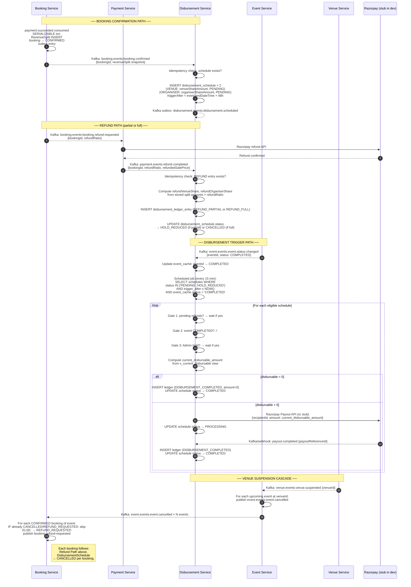

# ADR-008 — Revenue Split and Disbursement Model

| Field             | Value                                                                                                                                        |
|-------------------|----------------------------------------------------------------------------------------------------------------------------------------------|
| **ID**            | ADR-008                                                                                                                                      |
| **Title**         | Revenue Split and Disbursement Model                                                                                                         |
| **Status**        | Accepted                                                                                                                                     |
| **Date**          | 2025-05-16                                                                                                                                   |
| **Author**        | StagePass Architecture                                                                                                                       |
| **Version**       | 1.0.0                                                                                                                                        |
| **Repo**          | stagepass-docs                                                                                                                               |
| **Path**          | /docs/adr/ADR-008-revenue-split-disbursement-model.md                                                                                        |
| **Traces To**     | PRD §7.3, PRD §9.1, NFR-REL-008, NFR-REL-011, NFR-REL-012, NFR-PERF-002, ADR-004 §3.6, ADR-005 §3.3 Steps 4–5b                             |
| **Depends On**    | ADR-004 (money type representation, RevenueSplit schema, rounding rules), ADR-005 (booking saga, split computation placement, compensation)  |
| **Informs**       | Phase 4 Disbursement Service implementation, Phase 4 Payment Service refund logic, Phase 8 reconciliation pipeline                          |
| **Supersedes**    | —                                                                                                                                            |
| **Superseded By** | —                                                                                                                                            |

---

## Change Log

| Version | Date       | Author                 | Summary            |
|---------|------------|------------------------|--------------------|
| 1.0.0   | 2025-05-16 | StagePass Architecture | Initial acceptance |

---

## Table of Contents

1. [Status](#1-status)
2. [Context](#2-context)
   - 2.1 [The three-party revenue problem](#21-the-three-party-revenue-problem)
   - 2.2 [Why disbursement cannot happen at booking time](#22-why-disbursement-cannot-happen-at-booking-time)
   - 2.3 [The escrow problem: who holds the money and where](#23-the-escrow-problem-who-holds-the-money-and-where)
   - 2.4 [The rounding residual problem](#24-the-rounding-residual-problem)
   - 2.5 [The refund complexity problem](#25-the-refund-complexity-problem)
   - 2.6 [The cascade problem: Venue suspension across N events](#26-the-cascade-problem-venue-suspension-across-n-events)
3. [Decision](#3-decision)
   - 3.1 [Revenue split formula and timing](#31-revenue-split-formula-and-timing)
   - 3.2 [Rounding rule: who absorbs the residual](#32-rounding-rule-who-absorbs-the-residual)
   - 3.3 [Ledger semantics: append-only immutable records](#33-ledger-semantics-append-only-immutable-records)
   - 3.4 [Escrow mechanics](#34-escrow-mechanics)
   - 3.5 [Disbursement trigger and validation gates](#35-disbursement-trigger-and-validation-gates)
   - 3.6 [Refund impact on disbursable amounts](#36-refund-impact-on-disbursable-amounts)
   - 3.7 [Venue suspension cascade and multi-event cancellation](#37-venue-suspension-cascade-and-multi-event-cancellation)
   - 3.8 [GST treatment in the disbursement model](#38-gst-treatment-in-the-disbursement-model)
   - 3.9 [Disbursement Service schema](#39-disbursement-service-schema)
4. [Lifecycle Diagram](#4-lifecycle-diagram)
5. [Consequences](#5-consequences)
6. [Alternatives Considered](#6-alternatives-considered)
7. [References](#7-references)
8. [Quick Self-Check](#8-quick-self-check)

---

## 1. Status

**Accepted.** This ADR governs the revenue split computation, escrow model,
disbursement trigger logic, refund accounting, and cascade cancellation handling
for the StagePass platform. Any change to the disbursement trigger condition,
ledger mutation behaviour, or rounding party assignment requires an ADR amendment
reviewed and merged before the implementation PR is opened.

---

## 2. Context

### 2.1 The three-party revenue problem

Every ticket sale on StagePass distributes money across three parties:

- **Platform** — takes a configurable percentage fee for operating the
  marketplace. This is the Admin-controlled `platformFeeRate`.
- **Venue** — takes a negotiated percentage of the base price. This rate is
  locked when the Venue accepts the Organiser's booking request (the
  `VenueBooking` record's `venueShareRate` field, set at `ACCEPTED` state and
  never changed thereafter).
- **Organiser** — receives the remainder after Platform fee and Venue share
  are deducted.

The Customer pays a single GST-inclusive price. The split is computed on the
GST-exclusive base price (PRD §9.1; ADR-004 §3.7). GST is collected and
remitted separately — it does not flow through the three-party split.

This is not a simple escrow hold: the precise amounts due to each party must be
computed at booking confirmation time, stored immutably, and used as the sole
arithmetic input to any future refund or disbursement computation. The Admin
may change `platformFeeRate` between bookings; the Organiser may negotiate a
different Venue share for different events. Rates are snapshots — the stored
split amounts are the authoritative record, not the current rate configuration.

### 2.2 Why disbursement cannot happen at booking time

The intuitive model — capture payment, immediately split and pay out — fails
for a live ticketing platform for three reasons:

**Refund risk.** A Customer may cancel their booking after payment capture.
The refund policy (full refund if cancelled more than 7 days before the event;
50% refund within 7 days; no refund within 24 hours) means the Organiser's and
Venue's share may be reduced or eliminated after the initial payment. If funds
were disbursed at booking time, recovering them from a third-party bank account
is operationally complex and legally problematic.

**Event cancellation risk.** The Organiser may cancel the entire event after
ticket sales begin. This requires refunding all customers. If Venue and Organiser
shares were already disbursed, the platform has no leverage and no mechanism to
recover them.

**Attendance verification.** The Venue share (and optionally the Organiser
share) is conditioned on the event actually occurring. A no-show event where the
Organiser simply fails to show up should not result in disbursement. The
disbursement window after event completion (48 hours by default, configurable by
Admin) gives the platform time to receive and process any dispute.

The correct model: **funds are held in escrow from payment capture until the
event completes and the post-event disbursement window closes**. Only then are
funds released per the stored split amounts, reduced by any refunds that
occurred in the interim.

### 2.3 The escrow problem: who holds the money and where

In production, the Razorpay payment gateway collects Customer funds into a
Razorpay escrow or settlement account controlled by the Platform (the StagePass
legal entity). The Platform's bank account acts as the operational escrow.
Razorpay's settlement cycle (typically T+2 or T+3) means funds may not be
immediately available, but this is a payment processor operational detail, not
an architectural concern for the platform's data model.

From the data model perspective, escrow is tracked by the **Disbursement
Service's** `escrow_balance` view: the sum of all `DisbursementSchedule` records
with `status IN ('PENDING', 'HOLD_REDUCED')` represents the funds the platform
owes to Organisers and Venues but has not yet transferred. This is a **logical
escrow** — it tracks obligations, not bank balances. Reconciliation with actual
bank settlements is an operational process (Phase 8 concern).

The Platform fee is never "disbursed" to a third party — it is retained in-platform
and recognised as revenue when the disbursement window closes. A separate
Admin-controlled process manages Platform fee accounting and is out of scope for
this ADR.

### 2.4 The rounding residual problem

When splitting a monetary amount across three parties using percentage rates,
the three computed shares will not sum exactly to the base price unless all
rates divide evenly (which they rarely do in practice). The question is: which
party absorbs the rounding residual?

This is not a trivial policy question. Consider base price ₹1,000.0000 with:
- Platform fee rate: 5% → `platformFee = 50.0000` (exact)
- Venue share rate: 17.5% → `venueShare = 175.0000` (exact)
- Organiser remainder: `1000.0000 − 50.0000 − 175.0000 = 775.0000` (exact)

Now consider base price ₹1,001.0000 with same rates:
- `platformFee = 1001.0000 × 0.0500 = 50.0500` (exact at 4dp)
- `venueShare = 1001.0000 × 0.1750 = 175.1750` (exact at 4dp)
- Sum so far: `225.2250`
- `organiserShare = 1001.0000 − 225.2250 = 775.7750` (exact remainder)

And with base price ₹999.99 and platform fee rate 7.33%:
- `platformFee = 999.99 × 0.0733 = 73.2993` (4dp, HALF_UP; exact is 73.29927)
- The 4dp rounding takes `73.29927...` → `73.2993` — a rounding loss of `0.00003`
- This `0.00003` residual cannot appear in the stored split; it must go somewhere.
- Assigning `organiserShare` as the mathematical remainder means the Organiser
  receives `999.99 − 73.2993 − venueShare`, absorbing the residual exactly.

The decision of which party absorbs the residual is not purely mathematical — it
is a business policy and audit choice documented here explicitly (§3.2).

### 2.5 The refund complexity problem

Refunds interact with the split in a non-obvious way. There are three cases:

**Full refund:** The Customer cancels before the no-refund cutoff. The entire
`salePrice` is refunded. Each party's disbursable amount is reduced to zero. No
disbursement occurs for this booking.

**Partial refund (refund policy):** The Customer cancels within 7 days but
outside the 24-hour window. 50% of `salePrice` is refunded. Each party's share
is reduced proportionally: `refundedAmount = storedAmount × 0.5000`. The stored
split amounts must not be mutated — a compensating entry is appended to the ledger.

**Zero refund (no-refund window):** Customer cancels within 24 hours. No refund.
Split amounts remain fully disbursable.

The key invariant (NFR-REL-012): **refunds are computed from the stored
`RevenueSplit` amounts, never from re-applying current rates to the sale price**.
The rates may have changed since booking. The stored amounts are the contract.

### 2.6 The cascade problem: Venue suspension across N events

When an Admin suspends a Venue, all upcoming events at that Venue are
automatically cancelled. Each cancelled event fans out to refunds for all
confirmed bookings. A Venue with 5 upcoming events, each with 100 confirmed
bookings, generates 500 refund requests and up to 1,000 disbursement schedule
cancellations (Organiser + Venue records per booking) in a single cascade.

Two problems emerge:

**Idempotency:** If the cascade is retried (e.g., the Event Service consumer
crashes midway through emitting `event.cancelled` for each affected event), the
Booking Service must not issue duplicate refunds for bookings already in
`CANCELLED` or `REFUND_REQUESTED` state. The `bookingId` is the idempotency
key for the refund operation (NFR-REL-011).

**Disbursement cancel idempotency:** If a `DisbursementSchedule` record is
already `CANCELLED` (from a prior cascade attempt), a second `CANCEL_DISBURSEMENT_SCHEDULE`
command must return success without creating a second cancellation ledger entry.
The idempotency key is the `disbursementId`.

---

## 3. Decision

### 3.1 Revenue split formula and timing

**Decision: the split is computed once, at the `PAYMENT_PENDING → CONFIRMED`
state transition in the Booking Service, inside a `SERIALIZABLE` transaction
that also writes the booking state and the Outbox entry (ADR-005 §3.4, Step 4).**

The computation follows ADR-004 §3.6 exactly. For completeness, the full
algorithm is restated here with its constraints:

```
Input:
  salePrice       — GST-inclusive price paid by Customer (BigDecimal, 4dp)
  gstRate         — snapshot from Event config at booking time (BigDecimal, 4dp)
  platformFeeRate — snapshot from Admin config at booking time (BigDecimal, 4dp)
  venueShareRate  — from VenueBooking.venueShareRate, locked at ACCEPTED state (BigDecimal, 4dp)

Step 1.  basePrice       = salePrice / (1 + gstRate)
         → setScale(4, HALF_UP)

Step 2.  gstAmount       = salePrice − basePrice
         → No separate rounding: exact subtraction preserves 4dp

Step 3.  platformFee     = basePrice × platformFeeRate
         → setScale(4, HALF_UP)

Step 4.  venueShare      = basePrice × venueShareRate
         → setScale(4, HALF_UP)

Step 5.  organiserShare  = basePrice − platformFee − venueShare
         → No rounding: mathematical remainder; always exact at 4dp

Invariant: platformFee + venueShare + organiserShare = basePrice
           (enforced by PostgreSQL CHECK constraint — ADR-004 §3.4.1)
```

**Why at `CONFIRMED` and not at `SEATS_HELD` or `PAYMENT_PENDING`?**

The split must be computed from the confirmed payment amount. Before
`CONFIRMED`, the payment has not been captured — the Customer could still
abandon checkout. Computing the split at `SEATS_HELD` or `PAYMENT_PENDING`
would create a split record that may never correspond to real captured funds.
The `PAYMENT_PENDING → CONFIRMED` transition is the earliest point at which
a payment capture is known to have succeeded (ADR-005 §3.4, Step 4 consuming
`payment.events:payment.succeeded`). This is also the step that must complete
within the p99 < 10 s saga budget (NFR-PERF-003); the split computation is
O(1) BigDecimal arithmetic and adds negligible latency to the `CONFIRMED`
transition.

**Why inside the `SERIALIZABLE` transaction (NFR-REL-008)?**

The `RevenueSplit` write and the `booking → CONFIRMED` state update must be
atomic. If the state update commits but the split write fails (or vice versa),
the system violates ADR-005 Invariant 1: "a CONFIRMED booking always has a
corresponding immutable RevenueSplit record." `SERIALIZABLE` isolation also
prevents two concurrent payment callbacks from producing two `RevenueSplit`
records for the same `bookingId` — the `UNIQUE` constraint on
`revenue_split(booking_id)` catches this at the DB level, but
`SERIALIZABLE` prevents the race entirely.

**Rate snapshot discipline:**

The `platformFeeRate` and `gstRate` are read from Admin configuration and
snapshotted into the `RevenueSplit` record at computation time. The
`venueShareRate` is read from `VenueBooking.venueShareRate`, which was locked
when the Venue accepted the Organiser's request. Neither rate is re-read at
refund or disbursement time — the stored values in `RevenueSplit` are the
authoritative inputs for all downstream computations.

### 3.2 Rounding rule: who absorbs the residual

**Decision: the Organiser absorbs the rounding residual.**

`organiserShare` is computed as the mathematical remainder:
`basePrice − platformFee − venueShare`. It is never computed by multiplying a
rate against `basePrice`.

**Why the Organiser and not the Platform or Venue?**

The choice is a business policy, documented here for auditability. Three
options were considered:

| Option | Party absorbs residual | Maximum residual per ticket | Rationale |
|--------|------------------------|----------------------------|-----------|
| A      | Platform               | ₹0.0001                    | Platform takes upside; Organiser sees exact rate-derived amount |
| B      | Venue                  | ₹0.0001                    | Venue sees rate-derived amount; Organiser sees exact remainder |
| **C**  | **Organiser**          | **₹0.0001**                | **Platform and Venue see rate-derived amounts; Organiser holds remainder** |

Option C is chosen because:
1. The Platform fee and Venue share are contractually rate-based (the contract
   says "5% of base price" and "20% of base price"). The Organiser's contract
   says "the remainder after Platform fee and Venue share." The remainder
   assignment is therefore the correct contractual encoding of the Organiser's
   entitlement — not a compromise.
2. The Platform (the system operator) must not systematically take more than its
   stated rate. Option A would cause the Platform to round up its fee on every
   ticket — not contractually defensible.
3. The maximum residual is ₹0.0001 per ticket (one paisa at 2dp display). At
   any realistic scale, this is immaterial to the Organiser and does not
   constitute a meaningful systematic shortfall.

**This assignment is immutable and is part of the audit contract.** A reviewer
inspecting any `RevenueSplit` record can verify: `platformFeeAmount +
venueShareAmount + organiserShareAmount = basePriceAmount` (the PostgreSQL
`CHECK` constraint enforces this at write time).

**Refund rounding follows the same rule:** when computing refund amounts, the
`refundOrganiserShare` is assigned as the mathematical remainder:
```
refundOrganiserShare = refundSalePrice − refundPlatformFee − refundVenueShare
```
The Organiser absorbs the refund rounding residual as well, for the same
contractual reason.

### 3.3 Ledger semantics: append-only immutable records

**Decision: the revenue split ledger is append-only. No `UPDATE` is ever
issued against a `RevenueSplit` row. Refunds create new compensating ledger
entries. Cancellations update `DisbursementSchedule` status but never mutate
`RevenueSplit`.**

#### 3.3.1 Why append-only?

An append-only ledger is the correct model for financial records for four
reasons:

**Auditability.** At any future point in time, a regulator, auditor, or
support engineer can reconstruct the exact financial position of any booking
by reading its ledger entries in creation order. No information is lost to
in-place updates.

**Correctness under failure.** If a refund operation fails partway through,
an in-place update may leave the `RevenueSplit` row in a partially-modified
state that does not represent any valid business state. An append-only model
means the original record is always intact; a partially-written compensating
entry can be detected (its `status` is `PENDING`) and retried.

**Concurrent read safety.** Downstream services (Disbursement Service,
Analytics) read `RevenueSplit` records to compute disbursement amounts.
If the record could be mutated, these services would need to take locks or
implement optimistic concurrency control on their reads. With append-only
semantics, reads are always safe — the original record never changes.

**NFR-REL-012 compliance.** "Revenue split amounts are immutable once created."
An append-only schema is the structural enforcement of this NFR.

#### 3.3.2 Ledger entry types

The `revenue_split_ledger` (the Disbursement Service's view over all split
and refund entries) recognises four entry types:

| Entry Type            | When created                                  | Effect on disbursable amount    |
|-----------------------|-----------------------------------------------|---------------------------------|
| `SPLIT_CREATED`       | Booking → CONFIRMED                           | Establishes base disbursable amount |
| `REFUND_PARTIAL`      | Partial refund processed                      | Reduces disbursable by refund ratio |
| `REFUND_FULL`         | Full refund processed                         | Sets disbursable to zero        |
| `DISBURSEMENT_COMPLETED` | Funds transferred to recipient             | Closes the disbursement record  |

`SPLIT_CREATED` entries live in the `revenue_split` table (owned by Booking
Service; passed via Kafka to Disbursement Service). `REFUND_PARTIAL`,
`REFUND_FULL`, and `DISBURSEMENT_COMPLETED` entries live in the Disbursement
Service's own `disbursement_ledger_entry` table, keyed to the original
`revenue_split.id`.

#### 3.3.3 Database-level immutability enforcement

The `revenue_split` table in the Booking Service's PostgreSQL database has a
row-level trigger (ADR-004 §3.4.1) that raises an exception on any `UPDATE`:

```sql
CREATE OR REPLACE FUNCTION prevent_revenue_split_update()
RETURNS TRIGGER LANGUAGE plpgsql AS $$
BEGIN
    RAISE EXCEPTION
        'revenue_split records are immutable. bookingId=% attempted mutation.',
        OLD.booking_id
    USING ERRCODE = 'restrict_violation';
END;
$$;

CREATE TRIGGER revenue_split_immutability
    BEFORE UPDATE ON revenue_split
    FOR EACH ROW EXECUTE FUNCTION prevent_revenue_split_update();
```

The Disbursement Service's `disbursement_schedule` table similarly has no
mutation path for amounts — only `status` transitions are permitted, via a
separate trigger-enforced transition table (see §3.9).

### 3.4 Escrow mechanics

**Decision: escrow is modelled as a logical obligation tracked by the
Disbursement Service. Physical escrow (funds in the Platform's Razorpay
settlement account) is managed operationally. No separate escrow service is
introduced.**

#### 3.4.1 What "escrow" means in this model

When a Customer's payment is captured:
1. Real funds move from the Customer's payment instrument to the Platform's
   Razorpay account (a Razorpay operational concern, not a service concern).
2. The Booking Service writes a `RevenueSplit` record encoding the three-party
   obligation (ADR-005 §3.4, Step 4).
3. The Booking Service publishes `booking.events:booking.confirmed` with the
   `RevenueSplit` snapshot embedded in the payload.
4. The Disbursement Service consumes `booking.confirmed` and writes
   `DisbursementSchedule` records (two per booking: one for Venue, one for
   Organiser) with `status = PENDING` and `disbursableAmount` equal to the
   stored split amounts.

The **logical escrow balance** for a recipient at any moment is:
```
escrowBalance(recipientId) =
  SUM(disbursableAmount) for all DisbursementSchedule records WHERE
    recipientId = ?
    AND status IN ('PENDING', 'HOLD_REDUCED')
```

This balance represents funds owed but not yet transferred. It is tracked in
the Disbursement Service's PostgreSQL database and is the source of truth for
disbursement obligations.

#### 3.4.2 Who owns escrow

The **Disbursement Service** (Java / Spring Boot 3) is the sole owner of the
`disbursement_schedule` and `disbursement_ledger_entry` tables. No other
service writes to these tables. The Booking Service and Payment Service produce
the `booking.confirmed` and `refund.completed` events that the Disbursement
Service consumes — they do not modify disbursement records directly.

This ownership boundary means:
- Disbursement Service is the authoritative answer to "how much do we owe
  Organiser X?" and "when will Event Y's funds be released?"
- No other service needs to model escrow state — they emit events, and the
  Disbursement Service maintains the obligation.

#### 3.4.3 Platform fee handling

The Platform fee amount is tracked in the `RevenueSplit` record but has no
corresponding `DisbursementSchedule` entry. Platform fees are retained in-platform
and recognised as revenue when the disbursement window closes. The Disbursement
Service tracks the platform fee amount for reconciliation purposes (so that the
sum of Venue share + Organiser share + Platform fee = base price for every
booking), but does not initiate any payout for the Platform. An Admin-facing
financial reporting view surfaces Platform fee accrual over time.

#### 3.4.4 GST escrow

The `gstAmount` from the `RevenueSplit` record is tracked by the Disbursement
Service as a separate ledger obligation (see §3.8). GST funds are held until
the applicable GST filing period and remitted to the tax authority. This is
separate from Organiser/Venue disbursement and does not gate either party's
payout.

### 3.5 Disbursement trigger and validation gates

**Decision: disbursement triggers automatically when `eventEndDateTime + configuredWindow`
elapses, subject to three validation gates: (1) no pending refunds, (2) event
status is `COMPLETED`, (3) Admin has not placed a disbursement hold.**

#### 3.5.1 The trigger signal

The disbursement trigger is **time-based**, not event-driven. A scheduled job
in the Disbursement Service runs every 15 minutes and queries for
`DisbursementSchedule` records where:

```sql
status = 'PENDING'
AND trigger_after <= NOW()
AND event_id IN (SELECT id FROM event_cache WHERE status = 'COMPLETED')
```

The `event_cache` is a lightweight read-model maintained by the Disbursement
Service, populated from `event.events:event.status-changed` Kafka messages.
The Disbursement Service does not make synchronous calls to the Event Service
to check event status — it maintains its own eventually-consistent view.

**Why a scheduled job rather than a Kafka event?**

An event-driven trigger (e.g., consume `event.events:event.completed` and
immediately disburse) creates a race condition: the `event.completed` event
may arrive before all refund requests for that event have been processed.
A scheduled job with a configurable post-event window avoids this race at
the cost of slightly delayed disbursement. The default window is 48 hours,
which is sufficient for all refund-related Kafka events to be processed in any
realistic failure scenario.

**Why 15-minute polling interval?**

The disbursement trigger does not need to be real-time. Organisers and Venues
do not expect instant bank transfer the moment an event ends — a T+2 or T+3
settlement expectation is standard in the Indian entertainment industry. A
15-minute polling interval is responsive enough for operational purposes and
puts negligible load on the Disbursement Service's database.

#### 3.5.2 Validation gates

Before initiating a payout for a `DisbursementSchedule`, the Disbursement
Service evaluates three gates in order:

**Gate 1: No pending refunds.**
Query the `disbursement_ledger_entry` table for any `REFUND_PARTIAL` or
`REFUND_FULL` entries for this booking that have `status = 'PROCESSING'`.
If any exist, defer disbursement for this booking (set `next_check_at = NOW()
+ 1 hour`). A refund in progress may still change the disbursable amount.

**Gate 2: Event status is `COMPLETED`.**
Check the `event_cache` read-model. If the event is not in `COMPLETED` state
(e.g., it is `POSTPONED` or `CANCELLED`), do not disburse. An event in
`CANCELLED` state will have triggered a full refund cascade; the disbursable
amounts will be zero and the `DisbursementSchedule` records will be in
`CANCELLED` state (§3.7).

**Gate 3: No Admin disbursement hold.**
Check the `disbursement_hold` table for a hold record on this event or
recipient. An Admin can place a hold (e.g., fraud investigation, dispute)
that pauses disbursement. The hold has an expiry timestamp; the gate
automatically clears when the hold expires.

**Configurable post-event window:**
The `triggerAfter` timestamp is computed as:
```
triggerAfter = event.endDateTime + Admin.disbursementWindowHours
```
The default `disbursementWindowHours` is 48. Admin can configure this per
platform (global default) or override it per event. The override is stored
in the `DisbursementSchedule` record at creation time (from the `booking.confirmed`
Kafka payload which includes the Event's configured window).

#### 3.5.3 Disbursement execution

When all three gates pass:
1. The Disbursement Service computes the final `disbursableAmount`:
   `originalAmount − SUM(refundAmounts for this recipient/booking)`.
2. If `disbursableAmount = 0.0000`, mark `DisbursementSchedule` as `COMPLETED`
   (zero disbursement — all funds refunded) and write a `DISBURSEMENT_COMPLETED`
   ledger entry. No payout API call is made.
3. If `disbursableAmount > 0.0000`, initiate a Razorpay Payout API call
   (Phase 9 concern for production; stubbed in Phase 4 development).
4. On payout initiation success: update `DisbursementSchedule.status = 'PROCESSING'`.
5. Consume `disbursement.events:payout.completed` (webhook from Razorpay via
   Payment Service, or a synthetic event in development): update status to
   `COMPLETED`, write `DISBURSEMENT_COMPLETED` ledger entry.
6. On payout failure: update status to `FAILED`, write to `disbursement_outbox`
   for retry. Alert fires after 3 consecutive failures.

All these writes use `SERIALIZABLE` isolation (NFR-REL-008). The
`DisbursementSchedule` status transition is the only permitted mutation of that
record; the amount fields are never updated.

### 3.6 Refund impact on disbursable amounts

**Decision: a refund creates a compensating ledger entry in the Disbursement
Service. The disbursable amount for each party is reduced proportionally using
only the stored `RevenueSplit` amounts as inputs. The `RevenueSplit` record is
never mutated.**

#### 3.6.1 Refund amount computation

When the Payment Service successfully processes a refund, it publishes
`payment.events:refund.completed` with the following fields:

```json
{
  "bookingId": "<uuid>",
  "refundedSalePrice": { "amount": "737.5000", "currency": "INR" },
  "originalSalePrice": { "amount": "1475.0000", "currency": "INR" },
  "refundRatio": "0.5000",
  "refundPolicy": "PARTIAL_50PCT",
  "refundedAt": "2025-06-15T14:00:00Z"
}
```

The Disbursement Service consumes this event and computes refund deductions:

```
-- All amounts read from the stored RevenueSplit record. Never from current rates.
refundPlatformFee    = storedPlatformFeeAmount    × refundRatio  → round 4dp HALF_UP
refundVenueShare     = storedVenueShareAmount     × refundRatio  → round 4dp HALF_UP
refundOrganiserShare = storedOrganiserShareAmount × refundRatio  → round 4dp HALF_UP

-- Organiser absorbs refund rounding residual (same rule as §3.2).
refundOrganiserShare = refundedSalePrice − refundPlatformFee − refundVenueShare
```

The `refundRatio` is authoritative from the `refund.completed` event. The
Disbursement Service does not re-compute it from refund policy — it trusts
the Payment Service's computation, which is the only service with the full
refund policy logic.

#### 3.6.2 Compensating ledger entry

```sql
INSERT INTO disbursement_ledger_entry (
    id, disbursement_schedule_id, booking_id, entry_type,
    deduction_amount, deduction_currency,
    refund_ratio, reference_event_type, created_at
) VALUES (
    gen_random_uuid(),
    <disbursement_schedule_id for this booking/recipient>,
    '<bookingId>',
    'REFUND_PARTIAL',          -- or 'REFUND_FULL' if refundRatio = 1.0000
    <refundVenueShare | refundOrganiserShare>,   -- per recipient
    'INR',
    0.5000,
    'payment.events:refund.completed',
    NOW()
);
```

The `DisbursementSchedule.status` is updated to `HOLD_REDUCED` if
`disbursableAmount > 0` after the deduction, or `CANCELLED` if
`disbursableAmount = 0`. Neither the `revenue_split` record nor the original
`disbursement_schedule.amount` columns are changed.

#### 3.6.3 Idempotency of refund processing

The Disbursement Service's Kafka consumer is idempotent (NFR-REL-002). The
idempotency key is `(bookingId, refundedAt, entryType)`. Before inserting a
new `disbursement_ledger_entry`, the service checks:

```sql
SELECT id FROM disbursement_ledger_entry
WHERE booking_id = ?
  AND entry_type IN ('REFUND_PARTIAL', 'REFUND_FULL')
  AND created_at = ?    -- or use a payment refund reference ID
```

If a matching entry exists, the consumer commits the Kafka offset and returns
without inserting a duplicate. This prevents double-deduction under
at-least-once Kafka delivery (NFR-REL-002).

### 3.7 Venue suspension cascade and multi-event cancellation

**Decision: Venue suspension triggers an event-driven cascade through two
levels. The cascade is idempotent at every level. The Disbursement Service
handles the multi-event disbursement cancellation via the same per-booking
refund path, not via a bulk operation.**

#### 3.7.1 Cascade sequence

```
Admin suspends Venue
  → Venue Service: venue.status → SUSPENDED
  → Venue Service publishes: venue.events:venue.suspended
      { venueId, suspendedAt, reason }

Booking Service consumes venue.events:venue.suspended:
  → Queries: all Events at this venueId WHERE status IN ('PUBLISHED', 'LIVE')
  → For each event: publishes event.events:event.cancel-requested
      { eventId, reason: "VENUE_SUSPENDED", triggeredBy: venueId }

Event Service consumes event.events:event.cancel-requested (per event):
  → If event.status = 'CANCELLED': commit offset, return (idempotent — already done)
  → Else: transitions event → CANCELLED
  → Publishes event.events:event.cancelled { eventId, cancelledAt }

Booking Service consumes event.events:event.cancelled (per event):
  → Queries: all Bookings for eventId WHERE status = 'CONFIRMED'
  → For each booking:
      IF booking.status IN ('CANCELLED', 'REFUND_REQUESTED'): skip (idempotent)
      ELSE: update booking.status → REFUND_REQUESTED
            publishes booking.events:booking.refund-requested { bookingId, refundRatio: 1.0 }

Payment Service consumes booking.events:booking.refund-requested:
  → IF refund already exists for bookingId: return existing refund (idempotent)
  → Else: initiates full refund via Razorpay
  → Publishes payment.events:refund.completed

Disbursement Service consumes payment.events:refund.completed:
  → Per booking: inserts REFUND_FULL ledger entry
  → Updates DisbursementSchedule.status → CANCELLED for each recipient
```

#### 3.7.2 Idempotency mechanisms per level

| Level | Idempotency check | Guard |
|-------|------------------|----|
| Venue suspension | `venue.status = SUSPENDED` — second suspend is a no-op | Service layer check before publishing cascade |
| Event cancellation | `event.status = CANCELLED` — second cancel-requested is committed without action | Event Service state machine check |
| Booking refund-requested | `booking.status IN ('CANCELLED', 'REFUND_REQUESTED')` — skip | Booking Service pre-check before publishing |
| Payment refund | `bookingId` deduplication key in Payment Service refund table | SQL UNIQUE or IF-NOT-EXISTS insert |
| Disbursement cancel | `(booking_id, entry_type = 'REFUND_FULL')` in `disbursement_ledger_entry` | Disbursement Service pre-check |

Each level enforces NFR-REL-011 independently. A cascade that is retried at
any point — due to consumer crashes, broker failures, or network partitions —
produces the same final state. No booking receives a duplicate refund.

#### 3.7.3 Fan-out throughput

A Venue with 5 events × 200 bookings = 1,000 `booking.refund-requested`
messages in a single cascade. Each is processed independently by the Payment
Service's consumer group. The Payment Service must be capable of processing
1,000 refund initiations in a reasonable window (target: all 1,000 initiated
within 10 minutes of the `venue.suspended` event). This is a performance
concern for Phase 7 load testing, not a design constraint on the cascade
architecture.

The cascade uses separate Kafka consumer groups at each level so that a slow
consumer at one level (e.g., Payment Service processing Razorpay API calls)
does not block progress at other levels (e.g., Event Service cancelling events).

### 3.8 GST treatment in the disbursement model

ADR-004 §3.7 defines how GST is tracked in the `RevenueSplit` record. This
section defines how GST interacts with disbursement.

**GST collection:** The Customer pays `salePrice` (GST-inclusive). The
`gstAmount = salePrice − basePrice` is collected as part of the Customer's
payment.

**GST remittance:** The Platform is the GST-registered supplier for ticket
sales (PRD §9.1, interpretation: the Platform issues the tax invoice). GST
collected across all bookings in a filing period is aggregated and remitted
to GSTN. This is an administrative process, not a real-time disbursement.

**GST on Platform fee:** The Platform fee itself attracts an 18% GST charge
(as a B2B service). This GST is charged to the Organiser (who is the Platform's
business customer). The GST on Platform fee is tracked as:
```
platformFeeGst = platformFeeAmount × 0.1800   → round 4dp HALF_UP
```
This amount is added to the Platform's GST liability and invoiced to the Organiser
separately. It does not reduce the Organiser's disbursable share — it is a
separate invoice line. This is deferred to Phase 4 Disbursement Service
implementation for full elaboration; the `revenue_split` schema reserves a
`platform_fee_gst_amount NUMERIC(19,4)` column (nullable; populated at Phase 4
implementation, not at RevenueSplit creation in Phase 3/4 MVP).

**GST and refunds:** When a Customer is refunded, the GST component of the
refund is also refunded. The `refundedSalePrice` in the `refund.completed`
event is the GST-inclusive refund amount. The GST component:
```
refundGst = refundedSalePrice − (refundedSalePrice / (1 + gstRate))
```
is tracked as a separate negative GST liability in the Platform's GST ledger.
The Disbursement Service records this alongside the refund ledger entry.

### 3.9 Disbursement Service schema

The Disbursement Service owns two primary tables in its PostgreSQL database.

#### 3.9.1 `disbursement_schedule` table

```sql
CREATE TABLE disbursement_schedule (
    id                   UUID           PRIMARY KEY DEFAULT gen_random_uuid(),
    booking_id           UUID           NOT NULL,    -- FK to booking (cross-service, soft ref)
    event_id             UUID           NOT NULL,
    venue_booking_id     UUID           NOT NULL,    -- identifies the venue contract

    recipient_type       TEXT           NOT NULL CHECK (recipient_type IN ('VENUE', 'ORGANISER')),
    recipient_id         UUID           NOT NULL,    -- venueId or organiserId

    -- Amounts from the RevenueSplit snapshot in booking.confirmed payload.
    -- These columns are NEVER updated after INSERT.
    original_amount      NUMERIC(19, 4) NOT NULL,
    original_currency    CHAR(3)        NOT NULL DEFAULT 'INR',

    -- Configurable disbursement window (hours after event end).
    trigger_after        TIMESTAMPTZ    NOT NULL,
    disbursement_window_hours INT       NOT NULL DEFAULT 48,

    -- Status transitions: PENDING → PROCESSING | HOLD_REDUCED | CANCELLED | FAILED | COMPLETED
    status               TEXT           NOT NULL DEFAULT 'PENDING',

    -- Retry tracking for failed payout attempts.
    attempt_count        INT            NOT NULL DEFAULT 0,
    next_check_at        TIMESTAMPTZ,
    last_error           TEXT,

    -- Payout reference (populated when PROCESSING or COMPLETED).
    payout_reference_id  TEXT,          -- Razorpay payout ID or stub ID

    created_at           TIMESTAMPTZ    NOT NULL DEFAULT now(),
    updated_at           TIMESTAMPTZ    NOT NULL DEFAULT now()
);

-- Only status, attempt_count, next_check_at, last_error, payout_reference_id may be updated.
-- original_amount and original_currency are immutable.
CREATE OR REPLACE FUNCTION prevent_disbursement_amount_update()
RETURNS TRIGGER LANGUAGE plpgsql AS $$
BEGIN
    IF OLD.original_amount != NEW.original_amount OR
       OLD.original_currency != NEW.original_currency THEN
        RAISE EXCEPTION
            'disbursement_schedule amounts are immutable. id=%', OLD.id
        USING ERRCODE = 'restrict_violation';
    END IF;
    RETURN NEW;
END;
$$;

CREATE TRIGGER disbursement_amount_immutability
    BEFORE UPDATE ON disbursement_schedule
    FOR EACH ROW EXECUTE FUNCTION prevent_disbursement_amount_update();

-- Status transition constraint: only valid transitions are permitted.
-- Valid transitions: PENDING→{PROCESSING,HOLD_REDUCED,CANCELLED}
--                   PROCESSING→{COMPLETED,FAILED}
--                   FAILED→{PROCESSING,CANCELLED}
--                   HOLD_REDUCED→{PROCESSING,CANCELLED}
-- This is enforced at the service layer, not by DB constraint (too complex for
-- a CHECK expression). The trigger below prevents terminal-state re-entry.
CREATE OR REPLACE FUNCTION prevent_completed_disbursement_update()
RETURNS TRIGGER LANGUAGE plpgsql AS $$
BEGIN
    IF OLD.status IN ('COMPLETED', 'CANCELLED') THEN
        RAISE EXCEPTION
            'disbursement_schedule id=% is in terminal state % and cannot be updated.',
            OLD.id, OLD.status
        USING ERRCODE = 'restrict_violation';
    END IF;
    RETURN NEW;
END;
$$;

CREATE TRIGGER disbursement_terminal_guard
    BEFORE UPDATE ON disbursement_schedule
    FOR EACH ROW EXECUTE FUNCTION prevent_completed_disbursement_update();

CREATE INDEX idx_disbursement_schedule_trigger ON disbursement_schedule (trigger_after)
    WHERE status = 'PENDING';
CREATE INDEX idx_disbursement_schedule_recipient ON disbursement_schedule (recipient_id, status);
CREATE INDEX idx_disbursement_schedule_booking ON disbursement_schedule (booking_id);
```

#### 3.9.2 `disbursement_ledger_entry` table

```sql
CREATE TABLE disbursement_ledger_entry (
    id                        UUID           PRIMARY KEY DEFAULT gen_random_uuid(),
    disbursement_schedule_id  UUID           NOT NULL REFERENCES disbursement_schedule(id),
    booking_id                UUID           NOT NULL,

    -- Append-only. entry_type determines sign convention:
    -- REFUND_PARTIAL/REFUND_FULL: deduction (positive amount = funds removed from obligation)
    -- DISBURSEMENT_COMPLETED: completion record (amount = actual transferred)
    entry_type                TEXT           NOT NULL CHECK (
        entry_type IN ('REFUND_PARTIAL', 'REFUND_FULL', 'DISBURSEMENT_COMPLETED')
    ),

    deduction_amount          NUMERIC(19, 4) NOT NULL,
    deduction_currency        CHAR(3)        NOT NULL DEFAULT 'INR',

    refund_ratio              NUMERIC(5, 4),    -- NULL for DISBURSEMENT_COMPLETED entries
    reference_event_type      TEXT,             -- Kafka event that triggered this entry
    reference_event_id        TEXT,             -- Kafka message ID for tracing (OTel)

    created_at                TIMESTAMPTZ    NOT NULL DEFAULT now()

    -- No updated_at: this table is append-only by design.
    -- No UPDATE trigger needed — the application never issues UPDATE on this table.
);

-- Idempotency constraint: one REFUND_FULL per booking per disbursement_schedule.
CREATE UNIQUE INDEX uix_ledger_refund_full
    ON disbursement_ledger_entry (disbursement_schedule_id)
    WHERE entry_type = 'REFUND_FULL';

-- Idempotency constraint: one DISBURSEMENT_COMPLETED per disbursement_schedule.
CREATE UNIQUE INDEX uix_ledger_completed
    ON disbursement_ledger_entry (disbursement_schedule_id)
    WHERE entry_type = 'DISBURSEMENT_COMPLETED';

CREATE INDEX idx_ledger_booking ON disbursement_ledger_entry (booking_id);
```

#### 3.9.3 Current disbursable amount view

```sql
-- Disbursement Service uses this view to compute how much to pay out.
-- current_disbursable_amount = original_amount − SUM(deductions)
CREATE VIEW v_current_disbursable AS
SELECT
    ds.id                                              AS schedule_id,
    ds.booking_id,
    ds.recipient_type,
    ds.recipient_id,
    ds.original_amount,
    ds.original_currency,
    ds.status,
    ds.trigger_after,
    COALESCE(SUM(le.deduction_amount), 0)              AS total_deductions,
    ds.original_amount - COALESCE(SUM(le.deduction_amount), 0)
                                                       AS current_disbursable_amount
FROM disbursement_schedule ds
LEFT JOIN disbursement_ledger_entry le
    ON le.disbursement_schedule_id = ds.id
    AND le.entry_type IN ('REFUND_PARTIAL', 'REFUND_FULL')
GROUP BY ds.id;
```

---

## 4. Lifecycle Diagram

The full disbursement lifecycle from booking confirmation to funds released
per party:



---

## 5. Consequences

### 5.1 Positive

**Complete financial audit trail.** Every monetary event — split, refund, and
disbursement — is an immutable ledger entry. Auditors can reconstruct the
financial position of any booking, event, or recipient at any point in time by
reading entries in creation order. There is no state that was "overwritten."

**Rate-change safety.** Changing the platform fee rate or renegotiating a Venue
share for a new event has zero impact on existing bookings. The snapshot rates
stored in the `RevenueSplit` record are the sole inputs to all refund and
disbursement computations for that booking. This eliminates an entire class of
financial correctness bugs.

**Cascade resilience.** The Venue suspension cascade is idempotent at every
level. A consumer crash partway through a 1,000-booking cascade is recovered
automatically on restart without producing duplicate refunds or double-cancelled
disbursements. The Kafka at-least-once delivery model is safe because every
processing step checks for prior execution.

**Disbursement Service decoupling.** The Disbursement Service is the sole
owner of disbursement state. No other service needs to model disbursement
obligations. Event-driven coupling (via `booking.confirmed` and
`refund.completed` Kafka events) means the Disbursement Service can be
deployed, scaled, and debugged independently of the Booking and Payment Services.

**Clear escrow balance.** At any time, `SELECT SUM(current_disbursable_amount)
FROM v_current_disbursable WHERE status != 'COMPLETED'` gives the total funds
the Platform owes to Organisers and Venues. This is directly reconcilable
against Razorpay settlement reports.

### 5.2 Negative / costs

**Two-table design adds query complexity.** Computing "what does Organiser X
get paid for Event Y?" requires joining `disbursement_schedule` against
`disbursement_ledger_entry` and summing deductions. The `v_current_disbursable`
view encapsulates this, but it is more complex than a single-column `disbursableAmount`.

**48-hour disbursement window delays payouts.** Organisers and Venues receive
funds 48 hours after their event ends, not immediately. This is intentional
(§2.2) but may create cash-flow concerns for smaller Organisers who run high
costs. The configurable window (Admin per-event override) mitigates this; the
trade-off is documented.

**Eventual consistency in event_cache.** The Disbursement Service's view of
event status is eventually consistent. An event that completes at 23:00 will
be eligible for the next polling cycle at 23:15 at the latest. This 15-minute
window is acceptable given the 48-hour disbursement window; it cannot cause
premature disbursement (the `trigger_after` timestamp is the primary gate).

**GST on Platform fee is deferred.** The `platform_fee_gst_amount` column is
nullable and not populated in Phase 4 MVP. A Phase 4 follow-up ADR (or an
amendment to this ADR) is required before Platform fee GST invoicing is
implemented. This is an acceptable deferral — it does not affect Organiser or
Venue disbursement correctness.

### 5.3 Risks and mitigations

| Risk | Likelihood | Impact | Mitigation |
|------|-----------|--------|------------|
| `refund.completed` delivered twice — double deduction | Low (Kafka at-least-once) | High (incorrect disbursable) | UNIQUE index on `(disbursement_schedule_id, entry_type=REFUND_FULL)` + idempotency pre-check |
| Disbursement job runs while a refund is in `PROCESSING` | Medium (timing race) | High (over-payment) | Gate 1: check for PROCESSING refund entries before initiating payout; defer |
| Admin changes platform fee rate; old refunds use wrong rate | Eliminates with this ADR | High without the fix | Snapshot rates stored in `RevenueSplit`; refunds read stored values only (NFR-REL-012) |
| Razorpay Payout API fails after schedule marked PROCESSING | Low–Medium | Medium (stuck in PROCESSING) | `attempt_count`, `next_check_at`, `last_error` fields; alert after 3 failures; manual retry path |
| Venue cascade produces duplicate `event.cancelled` for same event | Low | Low (idempotent) | Event Service checks `event.status = CANCELLED` before re-publishing |
| `organiserShare` rounding residual accumulates | Certain but tiny | Negligible (≤₹0.0001/ticket) | Documented explicitly; PostgreSQL CHECK constraint validates sum |
| Disbursement Service down during post-event window | Low | Low (delayed, not lost) | Disbursement is a scheduled job; missed runs are caught on next cycle; PENDING records persist |

---

## 6. Alternatives Considered

### 6.1 Immediate disbursement at booking confirmation

**What it is:** Pay out Organiser and Venue shares immediately when the booking
is confirmed, rather than holding funds until after the event.

**Why it seems appealing:** Simpler. No escrow model. No post-event scheduled
job. Organisers get money faster — better cash flow.

**Why it is rejected:** Refunds become operationally unrecoverable once funds
are disbursed to third-party bank accounts. A full event cancellation with 500
bookings, where each booking's Organiser share has already been paid out, requires
recovering funds from the Organiser's bank account — which may be in another bank,
may already be spent, and cannot be done programmatically. The platform would need
to hold the Organiser legally liable and pursue recovery, which is not a scalable
model. Escrow is the standard industry model (BookMyShow, Ticketmaster, Eventbrite
all use post-event settlement windows).

### 6.2 Per-party escrow accounts (Razorpay Split)

**What it is:** Use Razorpay's Split Settlement feature to route Customer
payments directly into separate escrow sub-accounts for Platform, Venue, and
Organiser at payment capture time.

**Why it seems appealing:** Funds are physically separated at capture — no
logical escrow model needed. Refunds from Razorpay automatically reverse the
split. Simpler accounting.

**Why it is rejected:**

First, Razorpay's split settlement is not available on all account tiers and
has per-transaction routing limitations. For a learning project, building
dependency on a specific payment gateway feature would obscure the domain
logic that this ADR is documenting.

Second, split settlement on the payment gateway side does not eliminate the
need for refund management logic — Razorpay reversal semantics for partial
refunds of split settlements require significant gateway-specific handling,
which is harder to reason about than the service-owned ledger model here.

Third, and most importantly for learning: the escrow obligation model (tracking
what the Platform owes each party as a first-class service concern) is the
correct domain model for a multi-party marketplace. It is transferable to any
payment gateway. The Razorpay API details are an infrastructure concern
(Phase 9); the obligation model is a domain concern and must be designed first.

**Verdict:** Valid in production for certain configurations. Rejected here in
favour of an explicit ledger model that is gateway-agnostic and teaches the
correct domain modelling.

### 6.3 Mutable `DisbursementSchedule` amount field

**What it is:** When a refund occurs, update `disbursement_schedule.original_amount`
directly to reflect the reduced disbursable amount, rather than appending a
`disbursement_ledger_entry`.

**Why it seems appealing:** Simpler schema. The disbursable amount is always
readable directly from `disbursement_schedule`. No view needed.

**Why it is rejected:**

This violates the audit trail requirement. If the `original_amount` is updated,
there is no record of what the amount was before the refund, when the refund
was applied, or whether multiple refunds were processed. An auditor cannot
reconstruct the history from the mutable record.

More critically: the mutable approach introduces a race condition. If two partial
refund events arrive concurrently (e.g., two consumers in the same consumer
group due to a partition rebalance), both attempt to update `original_amount`.
Without SERIALIZABLE isolation and explicit locking, one update will overwrite
the other, producing an incorrect disbursable amount. The ledger append approach
avoids this — each `INSERT` is independent, and the `SUM` aggregation in the view
is eventually consistent and self-correcting.

**Anti-pattern name:** In-place financial record mutation — the opposite of
double-entry bookkeeping. Accounting systems have used append-only ledgers for
five centuries for exactly this reason. Martin Fowler's *Accounting Patterns*
(martinfowler.com) and the Event Sourcing pattern both formalise this principle.

### 6.4 Event-driven disbursement trigger (consume `event.completed`)

**What it is:** Instead of a polling job, trigger disbursement by consuming a
`event.events:event.completed` Kafka message. When the Disbursement Service
receives this event, immediately initiate payouts for all eligible schedules.

**Why it seems appealing:** Event-driven, reactive. No polling job. Lower latency
between event completion and disbursement initiation.

**Why it is rejected:**

The race condition described in §3.5.1 is the primary reason. An `event.completed`
event may arrive before all `refund.completed` events for that event have been
processed by the Disbursement Service. If the Disbursement Service immediately
disburses on `event.completed`, it may disburse before a pending refund has been
deducted, resulting in over-payment.

The polling approach with a configurable 48-hour window avoids this race
completely: by the time `trigger_after` is reached, all refund events for that
event's bookings will have been processed with overwhelming probability. The
48-hour window is far longer than any realistic Kafka message processing delay.

Gate 1 (check for PROCESSING refunds) provides an additional safety layer
for edge cases where the window assumption does not hold.

**Verdict:** Valid for a notification (e.g., "event has completed — disbursement
will occur in 48 hours"). Incorrect as the sole disbursement trigger. The
scheduled polling job is the disbursement mechanism; the `event.completed` event
updates only the `event_cache` read-model.

---

## 7. References

| Source | Relevance |
|--------|-----------|
| ADR-004 §3.6 | Revenue split computation algorithm, organiserShare as remainder, refund ratio formula |
| ADR-004 §3.4.1 | `revenue_split` PostgreSQL schema, immutability trigger, CHECK constraint |
| ADR-004 §3.7 | GST tracking in RevenueSplit, gstAmount field |
| ADR-004 §3.8 | Rounding discipline: 4dp HALF_UP throughout, rates as decimal fractions |
| ADR-005 §3.3 Step 4 | RevenueSplit write in SERIALIZABLE transaction at CONFIRMED transition |
| ADR-005 §3.3 Step 5b | SCHEDULE_DISBURSEMENT forward action and CANCEL_DISBURSEMENT_SCHEDULE compensation |
| ADR-005 §3.2 Invariant 1 | CONFIRMED booking always has RevenueSplit — no exceptions |
| NFR-REL-008 | SERIALIZABLE isolation for all money-touching operations |
| NFR-REL-011 | Fan-out cancellation saga idempotency |
| NFR-REL-012 | Revenue split amounts immutable; refunds from stored values only |
| NFR-PERF-002 | Synchronous booking submission p99 < 2 s (split computation is part of CONFIRMED transition) |
| PRD §7.3 | Three-party revenue split model, platform fee, Venue share, Organiser remainder |
| PRD §9.1 | GST-inclusive display price, GST-exclusive split base, tax invoice requirements |
| Richardson, C. *Microservices Patterns*, Ch. 4 | Saga compensation, idempotency in distributed transactions |
| Fowler, M. *Accounting Patterns* — martinfowler.com | Append-only ledger, double-entry bookkeeping, why in-place mutation is wrong |
| Kleppmann, M. *DDIA*, Ch. 11 | Event-driven architectures, at-least-once delivery, idempotency patterns |
| Razorpay Payouts API documentation | Payout initiation, webhook callbacks (Phase 9 integration) |

---

## 8. Quick Self-Check

Answer these without looking at this document. If you cannot answer them, re-read
the relevant section before writing any Disbursement Service code.

---

**Q1: The Admin changes the platform fee rate from 5% to 7% on 1 June. A Customer
made a booking on 15 May (platform fee computed at 5%). They cancel on 10 June.
What rate is used to compute the refund platform fee, and which service performs
the computation?**

> **Expected answer:**
> The refund platform fee is computed from the stored `platform_fee_amount` in the
> `RevenueSplit` record written at booking confirmation on 15 May. That stored amount
> reflects the 5% rate. The current rate (7%) is never consulted. The computation is:
>
> `refundPlatformFee = storedPlatformFeeAmount × refundRatio`
>
> where `refundRatio` comes from the `refund.completed` Kafka event published by the
> Payment Service. The Disbursement Service performs this computation on consuming
> `payment.events:refund.completed` — not the Booking Service, not the Payment Service.
> The Disbursement Service reads `storedPlatformFeeAmount` from the `RevenueSplit`
> snapshot embedded in the original `booking.confirmed` Kafka message (which was stored
> in the Disbursement Service's own record at schedule creation time). It does NOT
> query the Admin configuration service.
>
> NFR-REL-012 governs this behaviour. The answer to "why" is: if rates are re-applied
> at refund time, a rate change between booking and cancellation produces a refund
> amount that differs from the original split, causing the ledger to not balance.

---

**Q2: An Organiser cancels Event X, which has 200 confirmed bookings and 50 bookings
already cancelled by customers. Your disbursement service has received `event.cancelled`
and is processing the cascade. Walk through exactly what the Disbursement Service does
for the 50 already-cancelled bookings. What Kafka messages arrive, and what database
operations are performed?**

> **Expected answer:**
> For the 50 already-cancelled bookings, the refund cascade was already executed when
> each customer cancelled. Each of these bookings' `DisbursementSchedule` records are
> already in `CANCELLED` status (with a `REFUND_FULL` ledger entry) from the original
> customer-cancellation refund processing.
>
> The cascade sequence produces: `event.cancelled` → Booking Service reads all bookings
> for Event X → for each booking in `CANCELLED` or `REFUND_REQUESTED` state, it skips
> (idempotent check) and does NOT publish `booking.refund-requested`. Therefore the
> Payment Service receives **zero** refund requests for the 50 already-cancelled bookings.
> The Disbursement Service receives **zero** new `refund.completed` events for these
> bookings.
>
> The Disbursement Service's `DisbursementSchedule` records for the already-cancelled
> bookings remain as-is (`CANCELLED` with `REFUND_FULL` entries). No duplicate
> deductions are appended. No payout is attempted.
>
> NFR-REL-011 governs this: "cancelling an already-cancelled booking returns success;
> no duplicate refund is processed." The idempotency is enforced at the Booking Service
> layer (pre-check of booking state before publishing refund-requested) and reinforced
> by the UNIQUE index on `(disbursement_schedule_id WHERE entry_type='REFUND_FULL')`.

---

**Q3: A junior developer proposes replacing the 15-minute polling job with a Kafka
consumer that triggers disbursement immediately when it receives `event.events:event.completed`.
They argue this is more reactive and avoids polling. Name the specific failure mode
this introduces and explain what can go wrong with a concrete example.**

> **Expected answer:**
> The failure mode is a **disbursement race against pending refunds**. Concrete example:
>
> Event X ends at 23:00. At 23:01, the Event Service publishes `event.completed`.
> The Disbursement Service's Kafka consumer processes it immediately and initiates
> payouts for all 100 bookings.
>
> Simultaneously (or seconds later), a Customer's partial refund request that was
> submitted at 22:58 is still in the Payment Service's processing queue. At 23:02,
> the Payment Service publishes `refund.completed` for this booking, indicating a
> 50% refund.
>
> The Disbursement Service processes the `refund.completed` and appends a
> `REFUND_PARTIAL` deduction ledger entry — but the payout for this booking was
> already initiated at 23:01 with the full original amount. The Disbursement
> Service has over-paid by 50% of the Organiser's share and 50% of the Venue's
> share for that booking.
>
> Recovering this over-payment requires a clawback from the Organiser's and Venue's
> bank accounts — which may be impossible. ADR-005 §5b documents this as the
> "post-disbursement cancellation" edge case requiring admin intervention.
>
> The polling job with a 48-hour window avoids this by design: the window is long
> enough for all refund events to be processed before the disbursement gate opens.
> Gate 1 (check for PROCESSING refunds) provides an additional safety layer.
> The event-driven alternative removes both protections.

---

*End of ADR-008*
