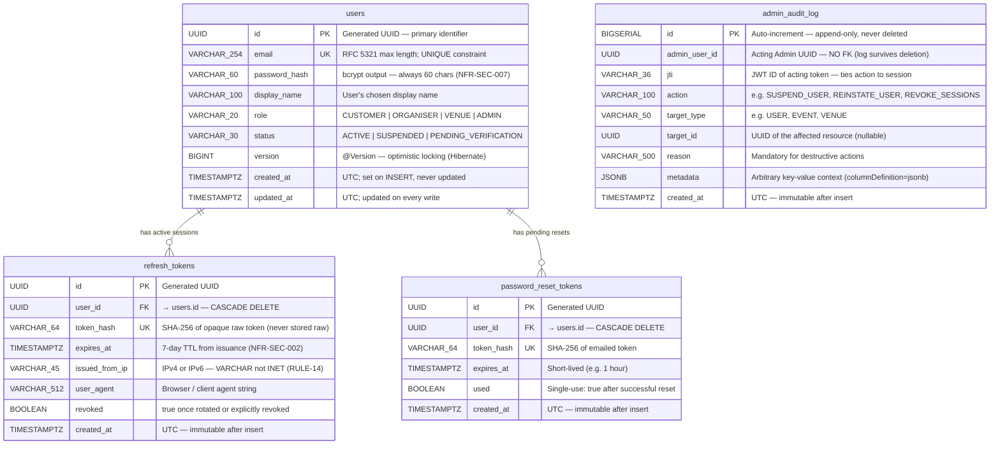

# ER Diagram — Auth Service

| Field        | Value                                          |
|--------------|------------------------------------------------|
| Document ID  | ER-AUTH                                        |
| Title        | Auth Service — Entity-Relationship Diagram     |
| Version      | 1.0.0                                          |
| Status       | Accepted                                       |
| Service Tier | T1 — Critical (99.9% SLO)                     |
| Database     | PostgreSQL (`auth_db`)                         |
| Framework    | Spring Boot 3 + Hibernate (ddl-auto=validate)  |
| Repo         | stagepass-docs                                 |
| Path         | /docs/er-diagrams/auth.md                      |
| Phase        | Phase 3 — Auth + Event                         |
| Traces To    | auth.yaml · ADR-004 · NFR-SEC-007 · STRIDE §5.1 |

### Change Log

| Version | Date       | Author                | Summary                              |
|---------|------------|-----------------------|--------------------------------------|
| 1.0.0   | 2026-05-22 | StagePass Engineering | Initial — Phase 3 close-out          |

---

## 1. Overview

The Auth Service owns the identity root of the StagePass platform. It is a T1 (Critical)
service with a 99.9% SLO. Its PostgreSQL database (`auth_db`) contains four tables managed
by four Flyway migrations (V1–V4). No other service may read or write this database directly.

The database stores user identity, session state (refresh tokens), credential recovery
(password reset tokens), and an immutable audit trail of all Admin actions. The RS256
private key — the platform's highest-sensitivity secret — lives in HashiCorp Vault, never
in the database.

---

## 2. Entity-Relationship Diagram



---

## 3. Table Reference

### 3.1 `users`

Flyway migration: `V1__create_users.sql`

| Column        | PostgreSQL Type  | Constraints                     | Notes                                                              |
|---------------|------------------|---------------------------------|--------------------------------------------------------------------|
| id            | UUID             | PK                              | Application-generated; never DB-generated sequence                |
| email         | VARCHAR(254)     | UNIQUE NOT NULL                 | RFC 5321 maximum. Index: `idx_users_email`                        |
| password_hash | VARCHAR(60)      | NOT NULL                        | bcrypt output is always exactly 60 characters (NFR-SEC-007)       |
| display_name  | VARCHAR(100)     | NOT NULL                        | From `RegisterRequest.displayName`                                 |
| role          | VARCHAR(20)      | NOT NULL                        | Enum: CUSTOMER, ORGANISER, VENUE, ADMIN. Index: `idx_users_role`  |
| status        | VARCHAR(30)      | NOT NULL DEFAULT 'ACTIVE'       | Enum: ACTIVE, SUSPENDED, PENDING_VERIFICATION. Index: `idx_users_status` |
| version       | BIGINT           | NOT NULL DEFAULT 0              | Hibernate `@Version` — optimistic locking guard on profile updates |
| created_at    | TIMESTAMPTZ      | NOT NULL                        | UTC; set once on INSERT                                           |
| updated_at    | TIMESTAMPTZ      | NOT NULL                        | UTC; updated by service on every write                            |

**Indexes:**
- `UNIQUE (email)` — unique user identity
- `INDEX (role)` — Admin list-by-role queries
- `INDEX (status)` — Admin list-suspended queries

**Important type constraints (from build log):**
- `VARCHAR(60)` not `CHAR(60)` — Hibernate `ddl-auto=validate` rejects `bpchar`
- `TIMESTAMPTZ` maps to Java `Instant` via `@Column` — UTC stored, locale displayed
- No `INET` type — `VARCHAR(45)` for IP fields (see `refresh_tokens`)

---

### 3.2 `refresh_tokens`

Flyway migration: `V2__create_refresh_tokens.sql`

| Column         | PostgreSQL Type | Constraints                  | Notes                                                                  |
|----------------|-----------------|------------------------------|------------------------------------------------------------------------|
| id             | UUID            | PK                           | Application-generated                                                  |
| user_id        | UUID            | NOT NULL FK → users.id       | ON DELETE CASCADE — all sessions deleted when user is deleted          |
| token_hash     | VARCHAR(64)     | UNIQUE NOT NULL              | SHA-256 hex digest of the raw opaque token (raw token never stored)    |
| expires_at     | TIMESTAMPTZ     | NOT NULL                     | 7-day TTL from issuance (NFR-SEC-002)                                  |
| issued_from_ip | VARCHAR(45)     | nullable                     | IPv4 (15) or IPv6 (45) — VARCHAR not INET (Hibernate validates to varchar) |
| user_agent     | VARCHAR(512)    | nullable                     | Browser or client user-agent; VARCHAR not TEXT                         |
| revoked        | BOOLEAN         | NOT NULL DEFAULT false       | Set to true on rotation or explicit revoke; never deleted              |
| created_at     | TIMESTAMPTZ     | NOT NULL                     | UTC — immutable                                                        |

**Indexes:**
- `UNIQUE (token_hash)` — fast O(1) lookup on token presentation
- `INDEX (user_id)` — revoke all sessions for a user
- `INDEX (expires_at)` — background cleanup of expired tokens

**Design note — why hash not raw token:** The raw opaque token is sent to the client and
travels over the network. Storing the hash server-side means a database breach does not
immediately yield usable refresh tokens (THR-AUTH-03). The same pattern applies to
`password_reset_tokens`.

---

### 3.3 `password_reset_tokens`

Flyway migration: `V3__create_password_reset_tokens.sql`

| Column     | PostgreSQL Type | Constraints                  | Notes                                                    |
|------------|-----------------|------------------------------|----------------------------------------------------------|
| id         | UUID            | PK                           | Application-generated                                    |
| user_id    | UUID            | NOT NULL FK → users.id       | ON DELETE CASCADE                                        |
| token_hash | VARCHAR(64)     | UNIQUE NOT NULL              | SHA-256 hex digest of the emailed reset token            |
| expires_at | TIMESTAMPTZ     | NOT NULL                     | Short-lived (e.g. 1 hour); service-configurable          |
| used       | BOOLEAN         | NOT NULL DEFAULT false       | Single-use: marked true after successful reset           |
| created_at | TIMESTAMPTZ     | NOT NULL                     | UTC — immutable                                          |

**Indexes:**
- `UNIQUE (token_hash)` — fast lookup on token presentation
- `INDEX (user_id)` — clean up pending resets when user is found/suspended

**Design note — single-use enforcement:** The `used` flag plus a read-before-set check
inside a database transaction ensures that a reset token cannot be replayed. On
presentation: SELECT WHERE token_hash = ? AND used = false AND expires_at > NOW(); UPDATE
SET used = true; — both in the same transaction with SERIALIZABLE isolation.

---

### 3.4 `admin_audit_log`

Flyway migration: `V4__create_admin_audit_log.sql`

| Column        | PostgreSQL Type | Constraints            | Notes                                                                    |
|---------------|-----------------|------------------------|--------------------------------------------------------------------------|
| id            | BIGSERIAL       | PK                     | Auto-increment — sequential for audit ordering                           |
| admin_user_id | UUID            | NOT NULL               | **No FK** — log must survive user deletion (see design note below)       |
| jti           | VARCHAR(36)     | NOT NULL               | JWT ID of the acting token — ties action to the specific JWT session      |
| action        | VARCHAR(100)    | NOT NULL               | e.g. SUSPEND_USER, REINSTATE_USER, REVOKE_ALL_SESSIONS                   |
| target_type   | VARCHAR(50)     | nullable               | e.g. USER, EVENT, VENUE                                                  |
| target_id     | UUID            | nullable               | UUID of the affected resource (null for non-resource actions)            |
| reason        | VARCHAR(500)    | nullable               | Mandatory for destructive actions (enforced at service layer)            |
| metadata      | JSONB           | nullable               | Arbitrary key-value context; uses `columnDefinition = "jsonb"` in entity |
| created_at    | TIMESTAMPTZ     | NOT NULL               | UTC — immutable after insert                                             |

**Indexes:**
- `INDEX (admin_user_id)` — query all actions by a given Admin
- `INDEX (created_at)` — time-range queries for audit reports

**Design note — no FK on admin_user_id:** An Admin can be deleted from `users` (e.g. when
an employee leaves the company). If `admin_audit_log.admin_user_id` had a FK constraint
with ON DELETE CASCADE, the audit record would vanish — destroying non-repudiation. With no
FK, the record persists indefinitely. The `jti` column provides cryptographic attribution:
even after account deletion, the specific JWT that authorised the action is recorded
(THR-AUTH-11).

**Design note — append-only:** No UPDATE or DELETE operations are ever performed on this
table. Application-layer enforcement only in Phase 3; consider PostgreSQL row-level security
or a dedicated append-only role in Phase 9.

---

## 4. Redis Keys (In-Memory State — Not Persisted to PostgreSQL)

The Auth Service uses Redis for two purposes not represented in the PostgreSQL schema:

| Key Pattern           | Type   | TTL                       | Purpose                                                     |
|-----------------------|--------|---------------------------|-------------------------------------------------------------|
| `jti:<jti-value>`     | String | Access token remaining TTL | JTI blocklist — marks a revoked access token (NFR-SEC-002) |
| `rate:<ip>:<endpoint>`| String | 1 minute rolling window   | Rate limit counters (NFR-SEC-009)                          |

These are ephemeral. Redis data loss does not corrupt PostgreSQL state; however, JTI
blocklist loss means recently revoked tokens temporarily become valid again — acceptable
given the ≤15 min access token TTL (NFR-SEC-002).

---

## 5. STRIDE Threat Notes

Security controls are T1-first-class content in this ER diagram, not an appendix.
Full threat enumeration is in `STRIDE.md §5.1`. The four entries below have direct
schema-level implications.

---

**THR-AUTH-01 — JWT Private Key Theft (Spoofing / Information Disclosure)**

| Field       | Value |
|-------------|-------|
| Category    | S — Spoofing |
| Asset       | RS256 private key |
| Schema relevance | The private key is **not stored in any table**. It lives in HashiCorp Vault and is mounted as a secret into the Auth Service pod. No database column, no migration, no log field ever touches key material. |
| Controls    | NFR-SEC-008: Vault only. NFR-SEC-002: access token TTL ≤ 15 min limits the blast radius of any leaked token. NFR-SEC-010: SAST blocks code paths that write key material to logs. |
| Residual    | Medium — Vault policy misconfiguration remains the highest risk. Key rotation procedure must be tested before production. |

---

**THR-AUTH-04 — Refresh Token Replay (Elevation of Privilege)**

| Field       | Value |
|-------------|-------|
| Category    | E — Elevation of Privilege |
| Asset       | `refresh_tokens.token_hash`; active user sessions |
| Schema relevance | `token_hash` stores the SHA-256 digest of the raw token — the raw value never touches the database. `revoked BOOLEAN DEFAULT false` is set to `true` on every rotation. Presenting a revoked token (second use of the same token) returns 401 and, if detected as a possible theft pattern, triggers revocation of all sessions for that user. |
| Controls    | NFR-SEC-002: rotation on every use. Token hash not raw token. `revoked` flag with fast `UNIQUE (token_hash)` lookup. |
| Residual    | Low — the rotation-on-use pattern collapses the theft window to the time between token theft and the legitimate user's next refresh. |

---

**THR-AUTH-07 — Timing Attack on Password Comparison (Information Disclosure)**

| Field       | Value |
|-------------|-------|
| Category    | I — Information Disclosure |
| Asset       | `users.email`; user enumeration |
| Schema relevance | The `password_hash` column is `VARCHAR(60)` — bcrypt output is always 60 chars regardless of input. The service loads a pre-computed dummy hash at startup (`@PostConstruct`). If a login attempt references a non-existent email, the dummy hash is used in the bcrypt comparison so CPU time is equivalent to a real comparison. The response body and HTTP status (401) are identical for "user not found" and "wrong password". |
| Controls    | NFR-SEC-007: bcrypt cost ≥ 12 always runs. Dummy hash pattern. Identical response bodies. |
| Residual    | Low — the dummy hash approach eliminates measurable timing difference. |

---

**THR-AUTH-11 — Admin Action Repudiation (Repudiation)**

| Field       | Value |
|-------------|-------|
| Category    | R — Repudiation |
| Asset       | `admin_audit_log`; platform integrity |
| Schema relevance | `admin_audit_log` is append-only: no UPDATE, no DELETE. `admin_user_id` has no FK (log survives Admin account deletion). `jti VARCHAR(36)` stores the JWT ID of the acting token, providing cryptographic attribution — an Admin cannot deny a logged action if the corresponding JWT was issued by the Auth Service under their credentials. `BIGSERIAL` primary key preserves natural chronological ordering. |
| Controls    | Append-only table. `jti` attribution. No FK on `admin_user_id`. |
| Residual    | Medium — the table is append-only by convention, not by database-level enforcement. Phase 9 should add a PostgreSQL row-level security policy or a dedicated append-only role. |

---

## 6. Cross-Service Data Flow

The Auth Service does **not** publish Kafka events. It is called synchronously at login/register
time and provides JWKS for downstream services to validate JWTs locally. The data flow is:

```
Client → POST /auth/login
  → Auth Service validates credentials (users table, bcrypt comparison)
  → Issues access token (JWT, signed with RS256 private key from Vault)
  → Stores refresh token hash (refresh_tokens table)
  → Returns TokenPair to client

Downstream Service receives request with Authorization: Bearer <access_token>
  → Fetches JWKS from GET /auth/jwks (cached at startup, lazy re-fetch on kid miss)
  → Validates RS256 signature locally — no per-request call to Auth Service
  → Checks JTI blocklist in Redis (for security-sensitive endpoints only)
  → Extracts userId + role from JWT claims for RBAC and tenant isolation
```

No downstream service reads the `users`, `refresh_tokens`, or `password_reset_tokens`
tables. The JWT is the only inter-service identity contract.
