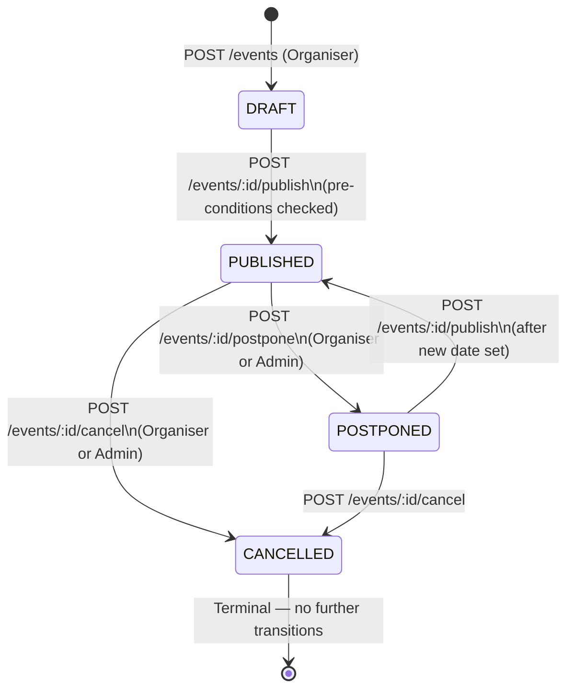

# ER Diagram — Event Service

| Field        | Value                                              |
|--------------|----------------------------------------------------|
| Document ID  | ER-EVENT                                           |
| Title        | Event Service — Entity-Relationship Diagram        |
| Version      | 1.0.0                                              |
| Status       | Accepted                                           |
| Service Tier | T2 — Important (99.5% SLO)                        |
| Database     | MongoDB (`event_db`)                               |
| Framework    | NestJS 10 + Mongoose                               |
| Repo         | stagepass-docs                                     |
| Path         | /docs/er-diagrams/event.md                         |
| Phase        | Phase 3 — Auth + Event                             |
| Traces To    | event.yaml · event_async.yaml · ADR-004 · NFR-SEC-004 · NFR-REL-011 · STRIDE §6.2 |

### Change Log

| Version | Date       | Author                | Summary                              |
|---------|------------|-----------------------|--------------------------------------|
| 1.0.0   | 2026-05-22 | StagePass Engineering | Initial — Phase 3 close-out          |

---

## 1. Overview

The Event Service owns the event lifecycle in StagePass. Its MongoDB database (`event_db`)
holds a single collection: `events`. This collection uses a **document-per-aggregate** design:
sections and pricing tiers are embedded sub-documents within the event document rather than
separate collections. The `Event` document is the aggregate root.

**Why MongoDB for this service?** Events have flexible schema requirements: seating
configurations differ between venues (seated vs general admission), cancellation policy
brackets vary, surge pricing rules are optional, and category/tag data is schema-less.
MongoDB's flexible document model accommodates this without wide nullable columns or a
JSON blob in a relational table (ADR-002 §3.2).

**Why embedded sub-documents for sections and tiers?** Sections and pricing tiers only
make sense in the context of their event. They are never queried independently. Loading
an event always loads all its sections and tiers — one document fetch, no joins. The event
is the consistency boundary: all mutations to sections/tiers happen within a single MongoDB
document update (atomic at the document level).

---

## 2. Collection Structure Diagram

MongoDB does not have tables and foreign keys in the relational sense. The diagram below
uses Mermaid ER notation to represent the document structure: the root document and its
embedded sub-documents. Relationships are shown as cardinality within the document boundary.

```mermaid
erDiagram

    events {
        String      eventId                 UK  "UUID — application-generated (not _id)"
        ObjectId    _id                     PK  "MongoDB internal — not exposed in API"
        String      venueBookingId              "UUID ref to Venue Service booking (external)"
        String      venueId                     "UUID ref to Venue Service (external)"
        String      organiserId             IDX "UUID of creating Organiser — tenant key"
        String      title                       "max 200 chars"
        String      description                 "max 5000 chars (optional)"
        String      status                  IDX "DRAFT | PUBLISHED | CANCELLED | POSTPONED"
        Date        eventDate               IDX "ISO-8601 UTC — must be future on publish"
        Date        doorOpenTime                "Optional; before eventDate"
        Date        postponedDate               "Optional; set on POSTPONED transition"
        String      posterUrl                   "MinIO object URL (optional)"
        StringArray categoryIds                 "UUID[] — platform category references"
        Object      cancellationPolicy          "Embedded — see §3.3"
        Object      surgeRules                  "Embedded optional — see §3.4"
        Date        publishedAt                 "Set on DRAFT→PUBLISHED transition"
        Date        cancelledAt                 "Set on →CANCELLED transition"
        String      cancellationReason          "max 1000 chars; mandatory on cancel"
        Date        createdAt                   "Mongoose timestamps: true"
        Date        updatedAt                   "Mongoose timestamps: true"
    }

    sections {
        String  sectionId           "UUID — application-generated sub-document ID"
        String  name                "max 100 chars — e.g. North Stand"
        String  layoutSectionRef    "Ref to Venue SeatingLayout section identifier"
        String  pricingTierId       "UUID — ref to pricingTiers[].tierId (intra-doc)"
        String  colour              "Hex #RRGGBB — seat map display (optional)"
    }

    pricingTiers {
        String      tierId          "UUID — application-generated sub-document ID"
        String      name            "max 100 chars — e.g. General Admission, Platinum"
        Decimal128  priceAmount     "ADR-004: Decimal128 — never Number/Double"
        String      priceCurrency   "ISO-4217 3-char — e.g. INR, USD"
        Number      capacity        "Optional — max seats at this tier"
        Number      soldCount       "DEFAULT 0 — denormalised; Seat Inventory owns truth"
        Date        createdAt       "Set on sub-document creation"
    }

    events ||--o{ sections      : "embeds (sections[])"
    events ||--o{ pricingTiers  : "embeds (pricingTiers[])"
    sections }o--|| pricingTiers : "pricingTierId → tierId (intra-document ref)"
```

> **Reading this diagram:** `sections` and `pricingTiers` are not separate collections.
> They are sub-document arrays embedded within each `events` document. The relationships
> denote cardinality within one document: one event has zero-or-more sections, zero-or-more
> pricing tiers. The `sections[].pricingTierId → pricingTiers[].tierId` arrow is an
> intra-document reference — no cross-collection join, no MongoDB `$lookup`.

---

## 3. Field Reference

### 3.1 Root Event Document

| Field              | Type       | Required | Index                     | Notes                                                                   |
|--------------------|------------|----------|---------------------------|-------------------------------------------------------------------------|
| `_id`              | ObjectId   | auto     | PK (MongoDB default)      | Internal MongoDB identifier — never exposed in API responses            |
| `eventId`          | String     | yes      | UNIQUE                    | Application-generated UUID; this is the public identifier in all APIs  |
| `venueBookingId`   | String     | yes      | —                         | UUID ref to Venue Service — must reference a CONFIRMED VenueBooking    |
| `venueId`          | String     | no       | —                         | Populated from Venue Service when booking is confirmed; set on publish |
| `organiserId`      | String     | yes      | compound (see §4)         | JWT sub claim of creating Organiser — tenant isolation key             |
| `title`            | String     | yes      | —                         | max 200 chars (from OpenAPI `CreateEventRequest.title`)                |
| `description`      | String     | no       | —                         | max 5000 chars; optional in creation, display in event detail          |
| `status`           | String     | yes      | compound (see §4)         | Enum: DRAFT \| PUBLISHED \| CANCELLED \| POSTPONED                    |
| `eventDate`        | Date       | yes      | compound (see §4)         | ISO-8601 UTC; must be in the future on DRAFT→PUBLISHED transition      |
| `doorOpenTime`     | Date       | no       | —                         | Optional; must be before `eventDate`                                   |
| `postponedDate`    | Date       | no       | —                         | Set on PUBLISHED→POSTPONED; null until postponed                       |
| `posterUrl`        | String     | no       | —                         | MinIO presigned URL for event poster image; optional                   |
| `categoryIds`      | String[]   | no       | —                         | Platform category UUIDs; used for search facets in Elasticsearch       |
| `cancellationPolicy` | Object   | yes      | —                         | Embedded sub-object; see §3.3                                          |
| `surgeRules`       | Object     | no       | —                         | Optional surge pricing config; see §3.4                                |
| `sections`         | Object[]   | no       | —                         | Embedded sub-documents; see §3.2                                       |
| `pricingTiers`     | Object[]   | no       | —                         | Embedded sub-documents; see §3.2                                       |
| `publishedAt`      | Date       | no       | —                         | Set on DRAFT→PUBLISHED; null while DRAFT                               |
| `cancelledAt`      | Date       | no       | —                         | Set on →CANCELLED; null while active                                   |
| `cancellationReason` | String   | no       | —                         | Required for cancel operation (service-layer enforcement); max 1000 chars |
| `createdAt`        | Date       | auto     | —                         | Mongoose `timestamps: true` — set on document creation                 |
| `updatedAt`        | Date       | auto     | —                         | Mongoose `timestamps: true` — updated on every document write          |

---

### 3.2 Embedded Sub-Documents

#### `sections[]`

Sections map regions of the venue's physical layout to a pricing tier. Each section
references one pricing tier (the price applies to all seats in that section).

| Field            | Type   | Required | Notes                                                               |
|------------------|--------|----------|---------------------------------------------------------------------|
| `sectionId`      | String | yes      | Application-generated UUID; unique within the event document        |
| `name`           | String | yes      | max 100 chars — e.g. "North Stand", "Pit", "VIP Balcony"           |
| `layoutSectionRef` | String | yes    | Identifier from the Venue Service's SeatingLayout — links physical layout to event section |
| `pricingTierId`  | String | yes      | UUID ref to `pricingTiers[].tierId` within the same document        |
| `colour`         | String | no       | Hex `#RRGGBB` — used by the frontend seat map SVG renderer          |

#### `pricingTiers[]`

Pricing tiers define ticket prices for a category of seats. Multiple sections can share
a tier (e.g. "General Admission" covers both "South Stand" and "Terrace").

| Field           | Type      | Required | Notes                                                                       |
|-----------------|-----------|----------|-----------------------------------------------------------------------------|
| `tierId`        | String    | yes      | Application-generated UUID; unique within the event document                |
| `name`          | String    | yes      | max 100 chars — e.g. "General Admission", "Platinum"                        |
| `priceAmount`   | Decimal128 | yes     | **ADR-004**: MongoDB `Decimal128` — never `Number` (Double). Exact decimal. |
| `priceCurrency` | String    | yes      | ISO-4217 three-character code — e.g. "INR", "USD"                          |
| `capacity`      | Number    | no       | Optional cap on seats at this tier; if absent, derived from assigned sections |
| `soldCount`     | Number    | yes      | DEFAULT 0 — denormalised counter (see design note below)                   |
| `createdAt`     | Date      | yes      | Set when the sub-document is created                                        |

**Design note — `soldCount` denormalisation:** `soldCount` is owned and incremented by
the Seat Inventory Service (the authoritative source of ticket sale counts). The Event
Service stores it as a convenience field for display purposes (e.g. "200 of 500 sold").
This value is eventually consistent. The invariant is: `soldCount` in the Event document
may lag the Seat Inventory Service's count by at most one Kafka message delivery. It is
**never** used for inventory control — only for display. Rule: do not enforce capacity
limits here; that is Seat Inventory's responsibility.

---

### 3.3 `cancellationPolicy` Embedded Object

| Field       | Type     | Notes                                                                     |
|-------------|----------|---------------------------------------------------------------------------|
| `brackets`  | Object[] | Array of refund brackets, ordered by `hoursBeforeEvent` descending        |
| `brackets[].hoursBeforeEvent` | Number | Threshold — e.g. 72 means "more than 72 hours before event" |
| `brackets[].refundPercentage` | Number | 0–100. If customer cancels more than N hours before, they get N% refund   |

Example: `[{hoursBeforeEvent: 72, refundPercentage: 100}, {hoursBeforeEvent: 24, refundPercentage: 50}, {hoursBeforeEvent: 0, refundPercentage: 0}]`
means full refund 72+ hours out, half refund 24–72 hours out, no refund within 24 hours.

---

### 3.4 `surgeRules` Embedded Object (Optional)

| Field           | Type    | Notes                                                               |
|-----------------|---------|---------------------------------------------------------------------|
| `enabled`       | Boolean | Whether surge pricing is active for this event                      |
| `maxMultiplier` | Number  | Platform-configured ceiling applies regardless of this value        |

Surge pricing adjustments are made by the Demand Prediction Service (Phase 5). The
`surgeRules` object defines the policy; the actual multiplier at any moment is computed
externally and is not stored in this document.

---

## 4. Indexes

| Index Name                          | Fields                                              | Type     | Purpose                                                |
|-------------------------------------|-----------------------------------------------------|----------|--------------------------------------------------------|
| `eventId_unique`                    | `{ eventId: 1 }`                                    | Unique   | Primary API lookup by eventId                          |
| `organiserId_status_eventDate`      | `{ organiserId: 1, status: 1, eventDate: 1 }`       | Compound | Organiser's event list — paginated, filtered by status and date |
| `status_eventDate`                  | `{ status: 1, eventDate: 1 }`                       | Compound | Customer discovery — PUBLISHED events sorted by date   |

**Why no index on `title` or `description`?** Full-text search is delegated to
Elasticsearch (Search Service). Elasticsearch is populated via Kafka on every
`EventPublished` message (NFR-PERF-010: indexed within 30 seconds). The MongoDB
`events` collection is not queried by title — it handles lifecycle operations,
not search.

---

## 5. State Machine

The event status field follows a strictly enforced state machine. Transitions that are
not in this diagram are rejected at the service layer (not at the database layer — MongoDB
has no enum constraint equivalent).



**Publish pre-conditions (enforced in service before status update):**
1. Organiser KYC status must be VERIFIED (fetched from Auth Service JWT claims)
2. `venueBookingId` must reference a CONFIRMED VenueBooking
3. `sections[]` must have at least one entry
4. `pricingTiers[]` must have at least one entry
5. `eventDate` must be in the future

---

## 6. Kafka Message Field Annotations

The Event Service publishes to `event.events` (via Outbox — NFR-REL-005) on every status
transition. The table below maps which document fields appear in each message type.
Full payload schemas are in `event_async.yaml`.

| Kafka Message          | Topic            | Fields from `events` Document                                                                            |
|------------------------|------------------|----------------------------------------------------------------------------------------------------------|
| `EventCreated`         | `event.events`   | `eventId`, `organiserId`, `venueBookingId`, `title`, `status`(=DRAFT), `eventDate`                     |
| `EventPublished`       | `event.events`   | `eventId`, `organiserId`, `venueId`, `title`(as eventName), `eventDate`(as startDateTime), `publishedAt`, `pricingTiers[]{tierId, name, priceAmount, priceCurrency}`, `categoryIds`, `posterUrl`, total capacity |
| `EventCancelled`       | `event.events`   | `eventId`, `venueId`, `organiserId`, `status`(=CANCELLED), `cancelledAt`, `cancellationReason`, `confirmedBookingCount`(from Booking Service at time of cancel) |
| `EventPostponed`       | `event.events`   | `eventId`, `organiserId`, `venueId`, `status`(=POSTPONED), `eventDate`(original), `postponedDate`(new), reason |
| `EventStatusChanged`   | `event.events`   | `eventId`, previous status, new status, `changedBy` (userId), `updatedAt`                               |

**Consumer groups for `event.events`:**

| Consumer Group                      | Reacts To                             | Action                                                      |
|-------------------------------------|---------------------------------------|-------------------------------------------------------------|
| `search-service-consumer`           | All event types                       | Index/de-index/update event in Elasticsearch (NFR-PERF-010) |
| `recommendation-service-consumer`   | Published, Cancelled, Postponed       | Update feature store; invalidate Redis recommendation caches |
| `analytics-service-consumer`        | All event types                       | Write event_lifecycle row to ClickHouse                     |
| `booking-service-consumer`          | Cancelled only                        | Fan-out: one `booking.refund-requested` per confirmed booking |
| `seat-inventory-service-consumer`   | Cancelled only                        | Bulk-release all seats for this event in Redis + PostgreSQL  |

---

## 7. STRIDE Threat Notes

Full threat enumeration for the Event Service is in `STRIDE.md §6.2`. Three threats have
direct schema and service-layer implications documented here.

---

**THR-EVENT-01 — Tenant Isolation Bypass (Information Disclosure)**

| Field    | Value |
|----------|-------|
| Category | I — Information Disclosure |
| Asset    | `events` documents; Organiser business data |
| Description | Organiser A, authenticated with a valid JWT, makes `GET /events/:eventId` for an event owned by Organiser B. Without tenant isolation enforcement, A reads B's event details (title, pricing, unpublished strategy). |
| Schema relevance | `organiserId` field is the tenant key. On every read and write operation, the service extracts `organiserId` from the JWT `sub` claim and filters queries by `{ organiserId: jwtOrganiserId }`. If the document exists but belongs to another Organiser, the response is **404 — not 403**. A 403 leaks the existence of the resource (NFR-SEC-004). The security event is logged internally for audit. |
| Controls | `organiserId` indexed compound with `status` and `eventDate`. Service-layer `TenantIsolationException` mapped to 404. JWT sub claim — never a request body field. |
| Residual | Low — enforcement is at the service layer, not database layer. Integration tests must cover cross-tenant access for every Organiser-scoped endpoint. |

---

**THR-EVENT-02 — State Machine Bypass (Tampering)**

| Field    | Value |
|----------|-------|
| Category | T — Tampering |
| Asset    | `events.status`; event lifecycle integrity |
| Description | A caller (or a compromised internal service) attempts to write `status: "PUBLISHED"` directly via the update endpoint, bypassing the publish pre-condition checks (future date, sections, tiers, KYC). This could result in an event being PUBLISHED without a confirmed venue, without pricing, or past its event date. |
| Schema relevance | The `PUT /events/:id` endpoint does **not** accept `status` as an updateable field — it accepts only `title`, `description`, `posterUrl`, and `cancellationPolicy`. Status transitions are exposed only through dedicated transition endpoints (`/publish`, `/cancel`, `/postpone`) which enforce pre-conditions in service methods before writing to MongoDB. No repository method performs a direct status field write outside of the transition service methods. |
| Controls | Status excluded from `UpdateEventRequest` schema. Dedicated transition endpoints. Service-layer state machine with guard clauses. Integration tests assert that PUT with `{status: "PUBLISHED"}` returns 422. |
| Residual | Low — schema-level exclusion prevents the field from being submitted via the API. Risk reduces to internal code paths bypassing service methods — mitigated by never calling repository methods directly from controllers. |

---

**THR-EVENT-03 — Kafka Fan-Out Idempotency Failure (Repudiation / Tampering)**

| Field    | Value |
|----------|-------|
| Category | R — Repudiation; T — Tampering |
| Asset    | Booking refund integrity; `events.status`; `booking.refund-requested` Kafka messages |
| Description | A duplicate `EventCancelled` Kafka message is delivered to the `booking-service-consumer` (at-least-once delivery — NFR-REL-002). If the Booking Service is not idempotent, it processes the cancellation twice, producing duplicate `booking.refund-requested` messages — resulting in double refunds for every confirmed booking. For an event with 500 bookings, this is 500 × 2 = 1,000 refund operations instead of 500. |
| Schema relevance | The Event Service makes `cancelEvent` idempotent at the source: if the event is already `CANCELLED`, the endpoint returns 200 immediately **without re-publishing** a Kafka message (NFR-REL-011). The `cancelledAt` field serves as the idempotency sentinel — if non-null, the event has already been cancelled, and no Kafka message is re-emitted. The Booking Service also guards on booking state before emitting `booking.refund-requested` (does not re-cancel an already-CANCELLED booking). Both guards are required; either alone is insufficient. |
| Controls | Service-layer idempotency on `cancelEvent` — early return on CANCELLED status. `cancelledAt` as the idempotency sentinel field. Booking Service state check before emitting refund requests. |
| Residual | Low — double cancellation is prevented at both ends of the Kafka message boundary. Outbox (NFR-REL-005) ensures exactly one Kafka message is published per state transition. |

---

## 8. Cross-Service Data Flow

```
Organiser → POST /events (Auth: ORGANISER role required)
  → Event Service creates document in events collection (status: DRAFT)
  → Outbox publishes EventCreated to event.events

Organiser → POST /events/:id/publish (pre-conditions checked)
  → Event Service transitions status: DRAFT → PUBLISHED
  → Sets publishedAt timestamp
  → Outbox publishes EventPublished to event.events
    → search-service-consumer: indexes event in Elasticsearch (≤30s, NFR-PERF-010)
    → recommendation-service-consumer: adds to feature store
    → analytics-service-consumer: records in ClickHouse
    → seat-inventory-service-consumer: initialises seat inventory for all sections

Organiser/Admin → POST /events/:id/cancel
  → Event Service transitions status → CANCELLED (idempotent if already CANCELLED)
  → Sets cancelledAt, cancellationReason
  → Outbox publishes EventCancelled to event.events
    → booking-service-consumer: fan-out of N booking.refund-requested messages
    → seat-inventory-service-consumer: bulk-releases all HELD/BOOKED seats
    → search-service-consumer: de-indexes event from Elasticsearch
```

The Event Service does **not** call Booking Service or Seat Inventory Service synchronously.
All downstream effects are triggered via Kafka. This is deliberate: a slow Booking Service
fan-out must not block the Event Service from accepting the cancellation confirmation.
