# ER Diagram — Seat Inventory Service

| Field        | Value                                                                                                                                                                                                                                                                                                                                          |
| ------------ | ---------------------------------------------------------------------------------------------------------------------------------------------------------------------------------------------------------------------------------------------------------------------------------------------------------------------------------------------- |
| Document ID  | ER-SEAT-INVENTORY                                                                                                                                                                                                                                                                                                                              |
| Title        | Seat Inventory Service — Entity-Relationship Diagram                                                                                                                                                                                                                                                                                           |
| Version      | 1.0.1                                                                                                                                                                                                                                                                                                                                          |
| Status       | Accepted                                                                                                                                                                                                                                                                                                                                       |
| Service Tier | T1 — Critical (99.9% SLO, 43 min/month downtime budget)                                                                                                                                                                                                                                                                                        |
| Database     | PostgreSQL (`seat_inventory_db`) + Redis (seat holds — authoritative lock)                                                                                                                                                                                                                                                                     |
| Framework    | Spring Boot 3 + Spring Data JPA + Lettuce (Redis)                                                                                                                                                                                                                                                                                              |
| HTTP Port    | None — gRPC-only service. No REST surface. No API Gateway route. No OpenAPI spec.                                                                                                                                                                                                                                                              |
| gRPC Port    | **9090** — explicit in STRIDE §5.2 (THR-SEAT-02 NetworkPolicy)                                                                                                                                                                                                                                                                                 |
| Repo         | stagepass-docs                                                                                                                                                                                                                                                                                                                                 |
| Path         | /docs/er-diagrams/seat-inventory.md                                                                                                                                                                                                                                                                                                            |
| Phase        | 4 — Core Services                                                                                                                                                                                                                                                                                                                              |
| Traces To    | `ADR-006` (two-store architecture, Redis Lua SETNX, SERIALIZABLE isolation) · `ADR-005` §3.10 (gRPC contract: HoldSeats, CommitSeats, ReleaseSeats, ExtendHold) · `ADR-003` §3.3.2 (gRPC pair 1) · `seat_async.yaml` (seat.state-changes, seat.commands) · `STRIDE.md` §5.2 (THR-SEAT-01..05) · `NFR-PERF-001` · `NFR-REL-004` · `NFR-REL-008` |

### Change Log

| Version | Date       | Author                | Summary                                                              |
| ------- | ---------- | --------------------- | -------------------------------------------------------------------- |
| 1.0.1   | 2026-05-27 | StagePass Engineering | Fix: HTTP Port corrected to None (gRPC-only service, ADR-003 §3.3.1) |
| 1.0.0   | 2026-05-27 | StagePass Engineering | Initial — Phase 4 design                                             |

---

## 1. Overview

The Seat Inventory Service is the most concurrency-critical T1 service in the platform. Its
PostgreSQL database (`seat_inventory_db`) is one half of a **two-store architecture** (ADR-006
§3.1): Redis provides sub-millisecond atomic mutual exclusion for seat holds, and PostgreSQL
provides the durable source of truth that survives Redis restarts and backs every audit query.

The database schema is shaped by three architectural decisions that must be understood before
reading any table definition:

**Decision 1: Redis is the authority for hold creation; PostgreSQL is the authority for
committed state.** The `seat_state` table reflects what a seat _lastly committed_ to — it is
read to populate the initial seat map, and written to atomically on every `CommitSeats`,
`ReleaseSeats`, and Admin block/unblock operation. It is _not_ written to synchronously during
`HoldSeats` — that write happens asynchronously after the Redis Lua script succeeds (ADR-006
§3.2 Phase 2).

**Decision 2: SERIALIZABLE isolation applies only to `CommitSeats`.** NFR-REL-008 requires
SERIALIZABLE isolation for seat state writes. This is scoped specifically to the
HELD → BOOKED transition, where real money has already moved. Applying it to `HoldSeats`
would serialise all concurrent hold attempts through the PostgreSQL lock manager, destroying
the throughput advantage of the Redis fast path and violating NFR-PERF-001.

**Decision 3: The schema embeds STRIDE controls.** `seat_state_transitions` exists primarily
as a tamper-evident audit log (STRIDE THR-SEAT-01, THR-SEAT-02). Its `payload_mac` column —
an HMAC-SHA256 of the row's key fields — allows the platform to detect if audit records are
modified after the fact. This is the same `payload_mac` pattern used in the booking service's
`booking_state_history` table.

The schema contains six tables managed by six Flyway migrations (V1–V6):

| Table                    | Purpose                                                                      | Migration |
| ------------------------ | ---------------------------------------------------------------------------- | --------- |
| `seat_state`             | Durable per-seat state — source of truth for committed state                 | V1        |
| `seat_holds`             | Hold header per booking — expiry tracking, reconciliation anchor             | V2        |
| `seat_hold_seats`        | One row per seat per hold — junction table for multi-seat atomicity          | V3        |
| `seat_state_transitions` | Immutable audit trail — STRIDE tamper-evidence control                       | V4        |
| `outbox`                 | Transactional Outbox for `seat.state-changes` Kafka publishing (NFR-REL-005) | V5        |
| `idempotency_keys`       | gRPC call idempotency — prevents duplicate HoldSeats on retry                | V6        |

---

## 2. Entity-Relationship Diagram

```mermaid
erDiagram

    seat_state {
        UUID        id                  PK  "Application-generated; never DB sequence"
        UUID        event_id                "External ref — Booking/Event domains; no FK (cross-service boundary)"
        UUID        seat_id             UK  "Non-fungible; unique within event_id. UNIQUE(event_id, seat_id)"
        UUID        section_id              "Section within venue layout (from Venue Service layout snapshot)"
        VARCHAR_10  row_label               "e.g. 'A', 'B', '12'. Nullable for GA (general admission) events"
        VARCHAR_20  seat_number             "e.g. '12B'. Nullable for GA events"
        VARCHAR_30  category                "STANDARD | VIP | WHEELCHAIR | RESTRICTED_VIEW | GA"
        NUMERIC_192  price               "NUMERIC(19,2) — base price in minor units. ADR-004 exact decimal"
        CHAR_3      currency                "ISO 4217. Coupled to price — ADR-004"
        VARCHAR_20  state                   "AVAILABLE | HELD | BOOKED | BLOCKED — ADR-006 §3.9"
        UUID        booking_id              "Present when state=HELD or BOOKED. Nullable"
        UUID        customer_id             "Present when state=HELD or BOOKED. For notification routing on TTL expiry"
        TIMESTAMPTZ held_until              "Redis TTL sync — informational only. Redis is authoritative for hold timing"
        TIMESTAMPTZ booked_at               "Set when CommitSeats completes. Nullable"
        UUID        blocked_by_user_id      "Admin UUID who blocked this seat. Nullable. No FK — log survives deletion"
        TIMESTAMPTZ blocked_at              "Timestamp of Admin block. Nullable"
        BIGINT      version                 "@Version — optimistic locking for Admin block/unblock operations only. NOT used for hold creation (Redis is the lock)"
        TIMESTAMPTZ created_at              "UTC; set on INSERT when seat inventory is provisioned for an event"
        TIMESTAMPTZ updated_at              "UTC; updated on every CommitSeats, ReleaseSeats, Admin op"
    }

    seat_holds {
        UUID        id                  PK  "Application-generated"
        UUID        booking_id          UK  "Idempotency anchor — UNIQUE. One hold record per booking saga invocation"
        UUID        event_id                "For index-based reconciliation queries. Denormalised from seat_hold_seats"
        UUID        customer_id             "For notification routing on TTL expiry. Denormalised"
        VARCHAR_20  status                  "HELD | BOOKED | RELEASED | EXPIRED — lifecycle of this hold"
        VARCHAR_20  hold_source             "GRPC | FLASH_SALE — which path created this hold (observability)"
        TIMESTAMPTZ expires_at              "Redis TTL expiry timestamp. Reconciliation job queries WHERE expires_at < NOW() AND status = 'HELD'"
        INTEGER     seat_count              "Denormalised count of seat_hold_seats rows. Avoids COUNT(*) in hot path"
        TIMESTAMPTZ committed_at            "Set when CommitSeats completes. Nullable"
        TIMESTAMPTZ released_at             "Set when ReleaseSeats or TTL reconciliation completes. Nullable"
        TIMESTAMPTZ created_at              "UTC; set when HoldSeats Lua script succeeds"
        TIMESTAMPTZ updated_at              "UTC"
    }

    seat_hold_seats {
        UUID        id                  PK  "Application-generated"
        UUID        hold_id             FK  "→ seat_holds.id — CASCADE DELETE when hold is purged"
        UUID        seat_id                 "References seat_state.seat_id (not seat_state.id — seat_id is the domain key)"
        UUID        event_id                "Denormalised for query convenience. Redundant with hold → seat_state"
        VARCHAR_20  status                  "HELD | COMMITTED | RELEASED — individual seat outcome within the hold"
        TIMESTAMPTZ created_at              "UTC"
    }

    seat_state_transitions {
        BIGSERIAL   id                  PK  "Auto-increment — append-only, NEVER deleted (STRIDE audit integrity)"
        UUID        seat_id                 "Which seat transitioned. NO FK — audit record must survive seat deletion"
        UUID        event_id                "For event-scoped audit queries"
        UUID        booking_id              "Present for booking-driven transitions (HOLD_CREATED, BOOKING_COMMITTED). Nullable"
        UUID        customer_id             "Present for booking-driven transitions. Nullable"
        VARCHAR_20  from_state              "AVAILABLE | HELD | BOOKED | BLOCKED | NULL (first transition)"
        VARCHAR_20  to_state                "Target state after this transition"
        VARCHAR_50  transition_reason       "HOLD_CREATED | HOLD_RELEASED | HOLD_EXPIRED | BOOKING_COMMITTED | BOOKING_CANCELLED | ADMIN_BLOCKED | ADMIN_UNBLOCKED"
        VARCHAR_50  performed_by_service    "BOOKING_SERVICE | SEAT_INVENTORY_SCHEDULER | ADMIN_COMMAND | FLASH_SALE_CONSUMER"
        UUID        performed_by_user_id    "Admin UUID for ADMIN_BLOCKED/UNBLOCKED. Nullable for service-driven transitions"
        VARCHAR_64  payload_mac             "HMAC-SHA256(seat_id || booking_id || from_state || to_state || occurred_at). STRIDE THR-SEAT-02 tamper evidence"
        TIMESTAMPTZ occurred_at             "UTC — immutable. Set once on INSERT"
    }

    outbox {
        UUID        id                  PK  "Application-generated. Used as Kafka message idempotency key"
        VARCHAR_100 event_type              "seat.state-changed | seat.hold-expired | seat.bulk-state-changed — seat_async.yaml"
        VARCHAR_50  aggregate_type          "SEAT_STATE — identifies the domain aggregate"
        UUID        aggregate_id            "seat_state.seat_id — the seat that changed"
        UUID        partition_key           "event_id — Kafka partition key per ADR-003 §3.4.2 (24 partitions, key=eventId)"
        JSONB       payload                 "Full JSON event payload matching seat_async.yaml schema"
        VARCHAR_20  status                  "PENDING | PUBLISHED | FAILED"
        INTEGER     attempts                "NOT NULL DEFAULT 0 — publisher retry counter"
        TIMESTAMPTZ created_at              "UTC — ordering anchor for publisher job (SELECT ... ORDER BY created_at)"
        TIMESTAMPTZ published_at            "Set when Kafka producer receives ACK. Nullable"
    }

    idempotency_keys {
        UUID        id                  PK  "Application-generated"
        VARCHAR_36  idempotency_key     UK  "booking_id — the saga's natural idempotency anchor. UNIQUE(idempotency_key, operation)"
        VARCHAR_50  operation               "HOLD_SEATS | EXTEND_HOLD | COMMIT_SEATS | RELEASE_SEATS"
        JSONB       response_payload        "Cached gRPC response — returned on retry without re-execution"
        VARCHAR_20  result                  "SUCCESS | UNAVAILABLE | NOT_FOUND — fast path status for retry detection"
        TIMESTAMPTZ expires_at              "24-hour TTL. Cleanup job purges expired keys"
        TIMESTAMPTZ created_at              "UTC"
    }

    seat_state          ||--o{ seat_hold_seats       : "reserved in holds"
    seat_holds          ||--|{ seat_hold_seats        : "contains seats"
    seat_state          ||--o{ seat_state_transitions : "records transitions"
```



---

## 3. Table Reference

### 3.1 `seat_state`

Flyway migration: `V1__create_seat_state.sql`

| Column             | PostgreSQL Type | Constraints                  | Notes                                                                                                                 |
| ------------------ | --------------- | ---------------------------- | --------------------------------------------------------------------------------------------------------------------- |
| id                 | UUID            | PK NOT NULL                  | Application-generated                                                                                                 |
| event_id           | UUID            | NOT NULL                     | No FK — cross-service boundary. Validated at service layer against Event Service                                      |
| seat_id            | UUID            | NOT NULL                     | Non-fungible seat identifier. Never auto-generated — comes from Venue layout                                          |
| section_id         | UUID            | NOT NULL                     | From Venue Service layout snapshot. Denormalised for seat map queries                                                 |
| row_label          | VARCHAR(10)     | nullable                     | Null for GA (general admission). Indexed for seat map rendering                                                       |
| seat_number        | VARCHAR(20)     | nullable                     | Null for GA. Indexed for seat map rendering                                                                           |
| category           | VARCHAR(30)     | NOT NULL DEFAULT 'STANDARD'  | Enum: STANDARD, VIP, WHEELCHAIR, RESTRICTED_VIEW, GA                                                                  |
| price              | NUMERIC(19,2)   | NOT NULL                     | ADR-004: exact decimal. Java BigDecimal. Scale 2 for display; computed from pricing tiers                             |
| currency           | CHAR(3)         | NOT NULL DEFAULT 'INR'       | ISO 4217. Coupled to price — ADR-004 Money type rule                                                                  |
| state              | VARCHAR(20)     | NOT NULL DEFAULT 'AVAILABLE' | ADR-006 §3.9 state machine. Enum check constraint recommended                                                         |
| booking_id         | UUID            | nullable                     | Present when state IN (HELD, BOOKED). Nullable. **No FK** — Booking is a different service                            |
| customer_id        | UUID            | nullable                     | Present when state IN (HELD, BOOKED). Denormalised for Notification routing                                           |
| held_until         | TIMESTAMPTZ     | nullable                     | Redis TTL sync. **Informational only — Redis is authoritative.** Updated on HoldSeats async write                     |
| booked_at          | TIMESTAMPTZ     | nullable                     | Set atomically in CommitSeats SERIALIZABLE transaction                                                                |
| blocked_by_user_id | UUID            | nullable                     | Admin UUID. No FK — audit record must survive Admin account deletion                                                  |
| blocked_at         | TIMESTAMPTZ     | nullable                     | Set when Admin block command is processed from `seat.commands` Kafka topic                                            |
| version            | BIGINT          | NOT NULL DEFAULT 0           | Hibernate `@Version` — optimistic locking for **Admin ops only**. Not used in HoldSeats fast path (Redis is the lock) |
| created_at         | TIMESTAMPTZ     | NOT NULL                     | UTC; immutable after INSERT                                                                                           |
| updated_at         | TIMESTAMPTZ     | NOT NULL                     | UTC; updated on CommitSeats, ReleaseSeats, Admin block/unblock                                                        |

**Constraints:**

- `UNIQUE (event_id, seat_id)` — a seat belongs to exactly one event; non-fungibility enforced at DB level
- `CHECK (state IN ('AVAILABLE','HELD','BOOKED','BLOCKED'))` — prevents invalid state strings

**Indexes:**

- `UNIQUE (event_id, seat_id)` — primary lookup pattern; seat map load for an event
- `INDEX (event_id, state)` — availability queries: "all AVAILABLE seats for eventId"
- `INDEX (booking_id)` — CommitSeats / ReleaseSeats lookup by bookingId
- `INDEX (state, updated_at)` — reconciliation: "all HELD seats, ordered by update time"

**Why no FK to Event Service?**  
Cross-service foreign keys violate database-per-service isolation. Each service owns its data. The `event_id` is validated at the service layer when seats are provisioned — if the event does not exist, the provisioning call fails at the gRPC/Kafka layer before this row is written.

**Why is `version` only for Admin ops?**  
Hold creation uses Redis Lua SETNX as the lock (ADR-006 §3.2). Applying optimistic locking (`@Version` CAS) to hold creation would create a retry storm under flash sale load — exactly the anti-pattern ADR-006 rejects. `@Version` is appropriate for Admin block/unblock (infrequent, low-contention) and for service startup provisioning (single writer). It must not be used in the `HoldSeats` code path.

---

### 3.2 `seat_holds`

Flyway migration: `V2__create_seat_holds.sql`

| Column       | PostgreSQL Type | Constraints             | Notes                                                                                                                                                        |
| ------------ | --------------- | ----------------------- | ------------------------------------------------------------------------------------------------------------------------------------------------------------ |
| id           | UUID            | PK NOT NULL             | Application-generated                                                                                                                                        |
| booking_id   | UUID            | UNIQUE NOT NULL         | **One hold record per booking.** This is the idempotency anchor. `INSERT ... ON CONFLICT (booking_id) DO NOTHING` is the correct retry pattern for HoldSeats |
| event_id     | UUID            | NOT NULL                | Denormalised from seat_hold_seats. Required for index-based reconciliation                                                                                   |
| customer_id  | UUID            | NOT NULL                | Denormalised for Notification routing when TTL expiry is detected                                                                                            |
| status       | VARCHAR(20)     | NOT NULL DEFAULT 'HELD' | Enum: HELD → BOOKED (CommitSeats) or HELD → RELEASED (ReleaseSeats) or HELD → EXPIRED (scheduler)                                                            |
| hold_source  | VARCHAR(20)     | NOT NULL                | GRPC (normal path) or FLASH_SALE (Kafka consumer path). Observability metric                                                                                 |
| expires_at   | TIMESTAMPTZ     | NOT NULL                | Redis TTL expiry timestamp. Reconciliation job: `WHERE expires_at < NOW() AND status = 'HELD'`                                                               |
| seat_count   | INTEGER         | NOT NULL                | Denormalised count of rows in `seat_hold_seats`. Avoids `COUNT(*)` subquery in hot path                                                                      |
| committed_at | TIMESTAMPTZ     | nullable                | Set in CommitSeats SERIALIZABLE transaction                                                                                                                  |
| released_at  | TIMESTAMPTZ     | nullable                | Set by ReleaseSeats (compensation) or reconciliation scheduler (TTL expiry)                                                                                  |
| created_at   | TIMESTAMPTZ     | NOT NULL                | UTC; set when HoldSeats Lua script succeeds and async PG write executes                                                                                      |
| updated_at   | TIMESTAMPTZ     | NOT NULL                | UTC                                                                                                                                                          |

**Constraints:**

- `UNIQUE (booking_id)` — idempotency anchor; enforces one hold record per booking

**Indexes:**

- `UNIQUE (booking_id)` — O(1) idempotency check on retry
- `INDEX (event_id, status)` — reconciliation: "all HELD holds for event X"
- `INDEX (expires_at, status)` — reconciliation: "expired HELD holds needing PG sync"
- `INDEX (customer_id)` — notification routing lookup

**The idempotency pattern in Java:**

```sql
-- HoldSeats async PG write (after Redis Lua succeeds):
INSERT INTO seat_holds (id, booking_id, event_id, customer_id, status, hold_source, expires_at, seat_count, created_at, updated_at)
VALUES (:id, :bookingId, :eventId, :customerId, 'HELD', :holdSource, :expiresAt, :seatCount, NOW(), NOW())
ON CONFLICT (booking_id) DO NOTHING;
-- If DO NOTHING fires, this is a retry — seat_hold already exists. That is correct.
-- We do NOT reset expires_at on retry (ADR-006 §3.8 idempotency rule).
```

---

### 3.3 `seat_hold_seats`

Flyway migration: `V3__create_seat_hold_seats.sql`

| Column     | PostgreSQL Type | Constraints                 | Notes                                                                                       |
| ---------- | --------------- | --------------------------- | ------------------------------------------------------------------------------------------- | --------- | ----------------------------------------------------------------- |
| id         | UUID            | PK NOT NULL                 | Application-generated                                                                       |
| hold_id    | UUID            | NOT NULL FK → seat_holds.id | ON DELETE CASCADE — when a hold is purged (post-event cleanup), individual seat rows go too |
| seat_id    | UUID            | NOT NULL                    | References `seat_state.seat_id` (the domain key, not `seat_state.id`)                       |
| event_id   | UUID            | NOT NULL                    | Denormalised. `UNIQUE (hold_id, seat_id)` prevents a seat appearing twice in one hold       |
| status     | VARCHAR(20)     | NOT NULL DEFAULT 'HELD'     | HELD                                                                                        | COMMITTED | RELEASED — individual outcome per seat within the multi-seat hold |
| created_at | TIMESTAMPTZ     | NOT NULL                    | UTC                                                                                         |

**Constraints:**

- `UNIQUE (hold_id, seat_id)` — a seat cannot appear twice in the same hold (all-or-nothing integrity)

**Indexes:**

- `UNIQUE (hold_id, seat_id)` — duplicate prevention
- `INDEX (seat_id, status)` — find all active holds for a specific seat (reconciliation)
- `INDEX (hold_id)` — all seats in a hold (CommitSeats / ReleaseSeats)
- `INDEX (event_id, status)` — all held seats for an event (seat map load for reconciliation)

**Why a separate junction table rather than `UUID[]` in `seat_holds`?**  
PostgreSQL arrays are denormalised. An `INDEX` on a `UUID[]` column requires GIN, which is orders of magnitude slower than a B-tree index on a scalar FK column. `CommitSeats` performs `UPDATE seat_state ... WHERE seat_id = ANY(:seatIds)` — this can use `seat_hold_seats` with a `WHERE hold_id = :holdId` lookup (fast B-tree) to retrieve `seat_id[]` before the UPDATE. Individual seat status tracking (`HELD → COMMITTED`) would require array element mutation with a `UUID[]`, which is a code smell. The junction table is the correct relational model.

---

### 3.4 `seat_state_transitions`

Flyway migration: `V4__create_seat_state_transitions.sql`

| Column               | PostgreSQL Type | Constraints | Notes                                                                                                                                                               |
| -------------------- | --------------- | ----------- | ------------------------------------------------------------------------------------------------------------------------------------------------------------------- |
| id                   | BIGSERIAL       | PK NOT NULL | Auto-increment. Append-only — this table is NEVER updated or deleted in production                                                                                  |
| seat_id              | UUID            | NOT NULL    | **No FK** — audit record must survive seat deletion (e.g. event cleanup)                                                                                            |
| event_id             | UUID            | NOT NULL    | For event-scoped audit queries                                                                                                                                      |
| booking_id           | UUID            | nullable    | Present for HOLD_CREATED, BOOKING_COMMITTED, HOLD_RELEASED, HOLD_EXPIRED                                                                                            |
| customer_id          | UUID            | nullable    | Present for booking-driven transitions. Copied from `seat_holds`                                                                                                    |
| from_state           | VARCHAR(20)     | NOT NULL    | State before transition. Matches `seat_state.state` enum                                                                                                            |
| to_state             | VARCHAR(20)     | NOT NULL    | State after transition                                                                                                                                              |
| transition_reason    | VARCHAR(50)     | NOT NULL    | HOLD_CREATED \| HOLD_RELEASED \| HOLD_EXPIRED \| BOOKING_COMMITTED \| BOOKING_CANCELLED \| ADMIN_BLOCKED \| ADMIN_UNBLOCKED                                         |
| performed_by_service | VARCHAR(50)     | NOT NULL    | BOOKING_SERVICE \| SEAT_INVENTORY_SCHEDULER \| ADMIN_COMMAND \| FLASH_SALE_CONSUMER                                                                                 |
| performed_by_user_id | UUID            | nullable    | Admin UUID for ADMIN_BLOCKED/UNBLOCKED. Null for service-driven transitions                                                                                         |
| payload_mac          | VARCHAR(64)     | NOT NULL    | `HMAC-SHA256(seat_id ‖ booking_id ‖ from_state ‖ to_state ‖ occurred_at)`. STRIDE THR-SEAT-02 tamper evidence — same pattern as `booking_state_history.payload_mac` |
| occurred_at          | TIMESTAMPTZ     | NOT NULL    | UTC — immutable; set once on INSERT                                                                                                                                 |

**Indexes:**

- `INDEX (seat_id, occurred_at DESC)` — audit query: "full history of seat 12B"
- `INDEX (booking_id)` — audit query: "all seat transitions for booking X"
- `INDEX (event_id, occurred_at DESC)` — audit query: "all transitions for event X"
- `INDEX (transition_reason, occurred_at)` — analytics: "how many HOLD_EXPIRED per hour"

**Why `BIGSERIAL` not `UUID`?**  
This is an append-only audit log. `BIGSERIAL` guarantees strict insertion order without a secondary `ORDER BY occurred_at` and is more space-efficient (8 bytes vs 16 bytes per row) for a table that may contain millions of rows for a high-volume event. The tradeoff — no application-generated ID — is acceptable because this table is never referenced by application code via primary key; it is always queried by `seat_id`, `booking_id`, or `event_id`.

**The `payload_mac` control (STRIDE §5.2 THR-SEAT-02):**  
An adversary with direct database access could modify the `from_state`/`to_state` columns to hide an unauthorized `CommitSeats` that committed seats without payment. The `payload_mac` column stores `HMAC-SHA256(key, seat_id || booking_id || from_state || to_state || occurred_at)` where `key` comes from Vault. Any tampering with the row invalidates the MAC, which the platform can verify on demand. This is the same control applied in `booking_state_history`.

---

### 3.5 `outbox`

Flyway migration: `V5__create_outbox.sql`

| Column         | PostgreSQL Type | Constraints                   | Notes                                                                                                                                         |
| -------------- | --------------- | ----------------------------- | --------------------------------------------------------------------------------------------------------------------------------------------- |
| id             | UUID            | PK NOT NULL                   | Application-generated. Used as Kafka message `messageId` for consumer deduplication (NFR-REL-002)                                             |
| event_type     | VARCHAR(100)    | NOT NULL                      | Matches `seat_async.yaml`: `seat.state-changed`, `seat.hold-expired`, `seat.bulk-state-changed`                                               |
| aggregate_type | VARCHAR(50)     | NOT NULL DEFAULT 'SEAT_STATE' | Domain aggregate type for routing                                                                                                             |
| aggregate_id   | UUID            | NOT NULL                      | `seat_state.seat_id` — the seat that changed                                                                                                  |
| partition_key  | UUID            | NOT NULL                      | `event_id` — Kafka partition key per ADR-003 §3.4.2. All state changes for one event on one partition (AVAILABLE→HELD→BOOKED in strict order) |
| payload        | JSONB           | NOT NULL                      | Full JSON event payload matching `seat_async.yaml` schema. Validated before INSERT                                                            |
| status         | VARCHAR(20)     | NOT NULL DEFAULT 'PENDING'    | PENDING → PUBLISHED (ACK received) or FAILED (max retries exhausted → DLQ)                                                                    |
| attempts       | INTEGER         | NOT NULL DEFAULT 0            | Incremented by publisher job on each attempt. Publisher stops at 3 per NFR-REL-006                                                            |
| created_at     | TIMESTAMPTZ     | NOT NULL                      | UTC — ordering anchor. Publisher queries `WHERE status = 'PENDING' ORDER BY created_at ASC`                                                   |
| published_at   | TIMESTAMPTZ     | nullable                      | Set when Kafka producer receives broker ACK                                                                                                   |

**Indexes:**

- `INDEX (status, created_at ASC)` — publisher job hot path: `WHERE status = 'PENDING' ORDER BY created_at`
- `INDEX (aggregate_id)` — correlation queries
- `INDEX (partition_key)` — observability: messages per event

**Why Outbox is mandatory here (NFR-REL-005):**  
Without the Outbox, the `seat_state` UPDATE and the Kafka `produce()` call are two separate operations. If the service crashes between them, the state change is durable in PostgreSQL but the `seat.state-changes` event is never produced. The Notification Service never sees the state change, the seat map goes stale in the browser, and the Booking Service's reconciliation consumer misses a critical saga event. The Outbox places both operations in the **same PostgreSQL transaction** — if the transaction commits, the Kafka event will eventually be published. If it rolls back, neither change persists.

---

### 3.6 `idempotency_keys`

Flyway migration: `V6__create_idempotency_keys.sql`

| Column           | PostgreSQL Type | Constraints | Notes                                                                                    |
| ---------------- | --------------- | ----------- | ---------------------------------------------------------------------------------------- |
| id               | UUID            | PK NOT NULL | Application-generated                                                                    |
| idempotency_key  | VARCHAR(36)     | NOT NULL    | `booking_id` (UUID string). The saga's natural idempotency anchor                        |
| operation        | VARCHAR(50)     | NOT NULL    | HOLD_SEATS \| EXTEND_HOLD \| COMMIT_SEATS \| RELEASE_SEATS                               |
| result           | VARCHAR(20)     | NOT NULL    | SUCCESS \| UNAVAILABLE \| NOT_FOUND — fast-path status used before deserialising payload |
| response_payload | JSONB           | NOT NULL    | Serialised gRPC response — returned verbatim on retry (ADR-006 §3.8 idempotency rule)    |
| expires_at       | TIMESTAMPTZ     | NOT NULL    | 24 hours from creation. Cleanup scheduler purges expired rows                            |
| created_at       | TIMESTAMPTZ     | NOT NULL    | UTC                                                                                      |

**Constraints:**

- `UNIQUE (idempotency_key, operation)` — same booking can have records for HOLD, COMMIT, and RELEASE independently

**Indexes:**

- `UNIQUE (idempotency_key, operation)` — O(1) idempotency check at gRPC handler entry
- `INDEX (expires_at)` — cleanup scheduler: `DELETE WHERE expires_at < NOW()`

**Why PostgreSQL idempotency keys, not Redis?**  
Redis holds the idempotency window for flash sale consumers (`flash-hold-processed:{bookingId}` with 3600s TTL — ADR-006 §3.3). For gRPC calls, PostgreSQL is used because: (a) the gRPC response includes the `holdId` UUID and `heldUntil` timestamp that must be returned verbatim on retry, and (b) the `response_payload` needs to survive a Redis restart without a separate recovery mechanism. The PostgreSQL table is the reliable store; the 24-hour TTL is generous enough to cover all retry windows.

---

## 4. Two-Store Architecture — Write Paths

Understanding which writes go to Redis, PostgreSQL, or both is essential before implementing any gRPC handler.

```
┌──────────────────────────────────────────────────────────────────────────────────────────┐
│ gRPC Operation    │ Redis Write          │ PostgreSQL Write                    │ Outbox? │
├───────────────────┼──────────────────────┼─────────────────────────────────────┼─────────┤
│ HoldSeats         │ SET NX EX 600        │ INSERT seat_holds + seat_hold_seats  │ YES     │
│                   │ (Lua, atomic)        │ (async, after Lua success)           │         │
│                   │                      │ UPDATE seat_state (state=HELD)       │         │
├───────────────────┼──────────────────────┼─────────────────────────────────────┼─────────┤
│ ExtendHold        │ EXPIRE (Lua)         │ UPDATE seat_holds.expires_at         │ NO      │
│                   │                      │ (hold timer only, no state change)   │         │
├───────────────────┼──────────────────────┼─────────────────────────────────────┼─────────┤
│ CommitSeats       │ SET (no TTL)         │ UPDATE seat_state (HELD→BOOKED)      │ YES     │
│                   │ (value="BOOKED")     │ UPDATE seat_holds (status=BOOKED)    │         │
│                   │                      │ SERIALIZABLE transaction             │         │
├───────────────────┼──────────────────────┼─────────────────────────────────────┼─────────┤
│ ReleaseSeats      │ DEL (Lua)            │ UPDATE seat_state (→AVAILABLE)       │ YES     │
│                   │                      │ UPDATE seat_holds (status=RELEASED)  │         │
├───────────────────┼──────────────────────┼─────────────────────────────────────┼─────────┤
│ TTL expiry        │ Key auto-deleted      │ Reconciliation job (every 5 min)     │ YES     │
│ (Redis keyspace   │ by Redis             │ UPDATE seat_state + seat_holds       │ (expiry │
│  notification)    │                      │ WHERE expires_at < NOW() AND HELD    │  event) │
├───────────────────┼──────────────────────┼─────────────────────────────────────┼─────────┤
│ Admin block       │ NO                   │ UPDATE seat_state (→BLOCKED)         │ YES     │
│ (seat.commands    │ (BLOCKED is PG only  │ (via seat.commands Kafka consumer)   │         │
│  consumer)        │  per ADR-006 §3.9)   │                                      │         │
└──────────────────────────────────────────────────────────────────────────────────────────┘
```

**The async PostgreSQL write after HoldSeats:**  
Phase 2 of the HoldSeats flow (ADR-006 §3.2) writes to PostgreSQL _after_ the Redis Lua script succeeds. This write must be attempted with retry — if it fails, the reconciliation job will detect an orphaned Redis key (a hold with no `seat_holds` record) and log it for investigation. The service must not block the gRPC response waiting for the PostgreSQL write; the response is sent after the Redis Lua succeeds.

---

## 5. Flyway Migration Ordering

```
V1__create_seat_state.sql            -- Core table; all others reference seat_id
V2__create_seat_holds.sql            -- Requires seat_state to exist (concept, no FK)
V3__create_seat_hold_seats.sql       -- FK → seat_holds.id
V4__create_seat_state_transitions.sql -- Independent audit log; no FK dependencies
V5__create_outbox.sql                -- Independent; no FK dependencies
V6__create_idempotency_keys.sql      -- Independent; no FK dependencies
```

---

## 6. Redis Key Schema (ADR-006 §3.10 — Reference)

These Redis keys are managed by the Seat Inventory Service. Documented here alongside the PostgreSQL schema for completeness.

| Key Pattern                        | Value                             | TTL   | Purpose                                                                  |
| ---------------------------------- | --------------------------------- | ----- | ------------------------------------------------------------------------ |
| `seat:{eventId}:{seatId}`          | `{bookingId}` when HELD           | 600s  | Atomic hold lock (ADR-006 §3.10)                                         |
| `seat:{eventId}:{seatId}`          | `"BOOKED"` when BOOKED            | None  | Permanent until event concludes                                          |
| `flash-hold-processed:{bookingId}` | `"success"` or `"failed:{seats}"` | 3600s | Flash sale consumer idempotency (ADR-006 §3.3)                           |
| `seat-cooldown:{userId}:{seatId}`  | `"1"`                             | 120s  | THR-SEAT-04 control: cooling period after hold expiry without completion |

---

## 7. STRIDE Threat Controls in Schema

| Threat ID   | Threat Summary                              | Schema Control                                                                                                                                                                 |
| ----------- | ------------------------------------------- | ------------------------------------------------------------------------------------------------------------------------------------------------------------------------------ |
| THR-SEAT-01 | Replay HoldSeats to perpetually block seats | `seat_holds.booking_id UNIQUE` — replay with same bookingId is idempotent (DO NOTHING). New bookingIds require Booking Service rate limiting (max 3 PENDING per userId).       |
| THR-SEAT-02 | Direct CommitSeats gRPC without payment     | gRPC port 9090 restricted by Kubernetes NetworkPolicy. `seat_state_transitions.payload_mac` detects if BOOKED transitions are tampered post-facto.                             |
| THR-SEAT-03 | Flash sale Redis DoS                        | `flash-hold-processed:{bookingId}` Redis key prevents duplicate Lua execution on consumer rebalance.                                                                           |
| THR-SEAT-04 | Hold-at-expiry cycling to block seats       | `seat-cooldown:{userId}:{seatId}` Redis key (TTL 120s) enforced at `HoldSeats` handler entry.                                                                                  |
| THR-SEAT-05 | Audit log tampering                         | `seat_state_transitions` is append-only (no UPDATE/DELETE granted to app role). `payload_mac` column detects row-level tampering. BIGSERIAL PK ordering detects row insertion. |

---

## 8. Notes for Implementation

1. **`seat_state.version` must NOT be incremented in the `HoldSeats` code path.** The async PostgreSQL write after Redis hold uses a plain `UPDATE ... SET state = 'HELD', booking_id = :bookingId WHERE event_id = :eventId AND seat_id = :seatId AND state = 'AVAILABLE'`. If this UPDATE races with another (which cannot happen if Redis is working correctly), the row count will be 0 and the service logs an inconsistency. It does not retry — Redis is authoritative.

2. **CommitSeats uses `SERIALIZABLE` isolation explicitly.** Spring Data JPA `@Transactional(isolation = Isolation.SERIALIZABLE)` on the `commitSeats` method. The transaction must include both the `seat_state` UPDATE and the `seat_holds` UPDATE. The `outbox` INSERT is part of the same transaction.

3. **`seat_state_transitions` must be written inside every state-changing transaction.** Not as an afterthought — inside the same `@Transactional` block. An `outbox` INSERT is also part of the same transaction. Both or neither.

4. **The `outbox` publisher is a `@Scheduled` Spring task**, running every 1 second, selecting `WHERE status = 'PENDING' ORDER BY created_at ASC LIMIT 100`. It publishes each row to Kafka, then updates `status = 'PUBLISHED'`. On failure after 3 attempts, it updates `status = 'FAILED'` — the Prometheus alert `KafkaDLQDepthNonZero` will fire, and the runbook covers manual replay.

5. **Port confirmation required.** The HTTP port 8084 is inferred from sequential assignment. **Create `seat-inventory.yaml` OpenAPI spec before writing any service code** — per RULE-01, the spec port is authoritative. If the spec says a different port, that port wins.
