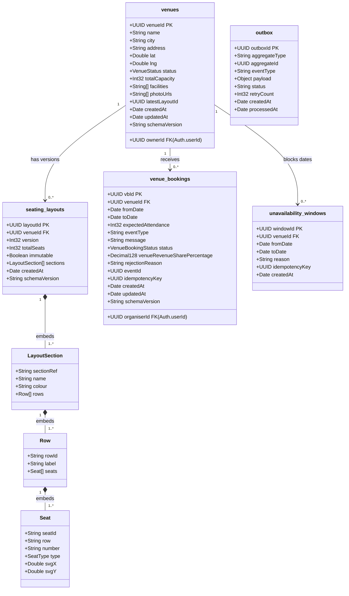

# ER Diagram — Venue Service

**File:** `stagepass-docs/docs/er-diagrams/venue.md`
**Version:** 1.0.0
**Status:** Accepted
**Phase:** 4 — Core Services
**Service:** `stagepass-venue-service` (NestJS 10 · MongoDB · T2)
**Port:** 8083 (from `venue.yaml` — authoritative)

**Traces to:**
- `venue.yaml` — OpenAPI contract (port, schemas, state machine)
- `venue_async.yaml` — Kafka topic contracts (Outbox payloads)
- `ADR-002` § Venue Service — NestJS + MongoDB framework decision
- `ADR-004` — Money type representation (Decimal128 for revenue share)
- `ADR-006` — Seat inventory concurrency (layout immutability rule)
- `NFR-REL-005` — Outbox pattern (all state-change events)
- `NFR-SEC-004` — Tenant isolation (404 on cross-tenant access)
- `STRIDE.md` — Venue domain threat controls

**Changelog:**
| Version | Date | Author | Notes |
|---------|------|--------|-------|
| 1.0.0 | 2026-05-22 | aiman | Initial — Phase 4 |

---

## 1. Database Choice

**MongoDB** (per ADR-002).

Rationale:
- Venue profiles have flexible schema: `facilities[]`, `photoUrls[]`, and the
  contact/social fields evolve per venue type without a schema migration.
- Seating layouts are hierarchical tree structures (Sections → Rows → Seats)
  that map naturally to a single embedded document rather than 3–4 relational
  join tables.
- VenueBooking is a self-contained aggregate with few cross-document
  relationships, queried primarily by `(venueId, status)` and `(organiserId, status)`.

---

## 2. Collections Overview

| Collection | Document type | Relationship strategy |
|------------|---------------|-----------------------|
| `venues` | Venue profile + metadata | Root aggregate |
| `seating_layouts` | Versioned seat map (embedded tree) | Referenced from `venues.latestLayoutId` |
| `venue_bookings` | Organiser booking request lifecycle | References `venues._id` and `seating_layouts._id` |
| `unavailability_windows` | Date-range blocks per venue | References `venues._id` |
| `outbox` | Kafka publish queue (Outbox pattern) | Independent; polled by publisher task |

---

## 3. Document Schema Diagram



---

## 4. Field Specification

### 4.1 `venues`

| Field | BSON Type | Constraints | Notes |
|-------|-----------|-------------|-------|
| `_id` | UUID (Binary) | PK, immutable | Internal MongoDB `_id`. Exposed as `venueId` in API. |
| `venueId` | String (UUID) | Unique, immutable | Duplicates `_id` for API clarity. Indexed. |
| `ownerId` | String (UUID) | Required, immutable | Auth Service `userId` of the VENUE-role account. Immutable after creation. Used for tenant isolation. |
| `name` | String | Required, maxLen 200 | Venue display name. |
| `city` | String | Required, maxLen 100 | Used for `listVenues?city=` filter. Indexed. |
| `address` | String | Required, maxLen 500 | Full street address. |
| `lat` | Double | Optional | WGS-84 latitude. |
| `lng` | Double | Optional | WGS-84 longitude. |
| `status` | String (enum) | Required | `ACTIVE` \| `SUSPENDED` \| `PENDING_KYC`. Default: `PENDING_KYC` on creation. |
| `totalCapacity` | Int32 | Required, min 1 | Denormalised from latest layout. Updated when a new layout version is created. |
| `facilities` | String[] | Optional | e.g. `["parking", "accessible_toilets"]`. No normalised enum — flexible by design. |
| `photoUrls` | String[] | Optional | MinIO-hosted URLs (Phase 9: S3). |
| `latestLayoutId` | String (UUID) | Optional | FK → `seating_layouts.layoutId`. Null until first layout is created. Updated atomically when a new layout is created. |
| `createdAt` | Date | Required, immutable | UTC timestamp. |
| `updatedAt` | Date | Required | Set on every write. |
| `schemaVersion` | String | Required | `"1.0.0"`. Enables future schema migrations. |

**Enums:**
- `VenueStatus`: `ACTIVE` | `SUSPENDED` | `PENDING_KYC`

---

### 4.2 `seating_layouts`

| Field | BSON Type | Constraints | Notes |
|-------|-----------|-------------|-------|
| `_id` | UUID (Binary) | PK | Internal `_id`. |
| `layoutId` | String (UUID) | Unique, immutable | Exposed as `layoutId` in API. |
| `venueId` | String (UUID) | Required, immutable, indexed | FK → `venues.venueId`. |
| `version` | Int32 | Required, immutable | Auto-incremented per venue. Never reused. Queried with `{ venueId, version: -1 }` to get latest. |
| `totalSeats` | Int32 | Required, immutable | Computed at creation time from `sum(sections[].rows[].seats[].length)`. Denormalised for list endpoint performance. |
| `immutable` | Boolean | Required | Default `false`. Set to `true` by the Seat Inventory Service via event (`LayoutImmuted`) after the first ticket is sold against this version. **Never set to `false` once true.** |
| `sections` | Array | Required, min 1 | Embedded array of `LayoutSection` subdocuments. |
| `createdAt` | Date | Required, immutable | UTC timestamp. |
| `schemaVersion` | String | Required | `"1.0.0"`. |

#### Embedded: `LayoutSection`

| Field | BSON Type | Notes |
|-------|-----------|-------|
| `sectionRef` | String | Stable identifier used by Event Service when creating event sections (e.g. `"NORTH-STAND"`). Must be unique within a layout. **Not a UUID — venue-defined string for human legibility.** |
| `name` | String | Display name (e.g. `"North Stand"`). |
| `colour` | String | Hex colour for SVG rendering (e.g. `"#4A90D9"`). Optional. |
| `rows` | Array | Embedded `Row[]`. |

#### Embedded: `Row`

| Field | BSON Type | Notes |
|-------|-----------|-------|
| `rowId` | String | Unique within section (e.g. `"A"`, `"B"`). |
| `label` | String | Display label. May differ from `rowId`. |
| `seats` | Array | Embedded `Seat[]`. |

#### Embedded: `Seat`

| Field | BSON Type | Notes |
|-------|-----------|-------|
| `seatId` | String | Unique within layout (e.g. `"N-A-12B"`). Format: `{sectionRef}-{rowId}-{number}`. This value is used as the seat identifier in the Seat Inventory Service — it must be stable across layout versions within the same section/row structure. |
| `row` | String | Row label. |
| `number` | String | Seat number within row. String (not Int) to support `"12A"`, `"12B"` styles. |
| `type` | String (enum) | `STANDARD` \| `PREMIUM` \| `ACCESSIBLE` |
| `svgX` | Double | X coordinate in 1000×1000 normalised SVG viewport. |
| `svgY` | Double | Y coordinate. |

**⚠️ Design Decision — Embedded Seat Tree (Option A):**

All sections, rows, and seats are embedded in the layout document. Rationale:
1. The Venue Service never needs to query individual seats — layouts are always read whole.
2. The Seat Inventory Service reads the layout once at event creation (via `GET /venues/{venueId}/layouts/{layoutId}`) to bootstrap per-seat state in its own PostgreSQL. After that, it owns seat state entirely.
3. MongoDB document limit is 16MB. At ~100 bytes/seat, a 50,000-seat stadium layout ≈ 5MB — within limit.

**Known constraint:** If seat metadata grows (accessibility tags, pricing zone hints), the 50,000-seat layout could approach the 16MB ceiling. Mitigation path: extract `seats` into a `layout_seats` collection (Option C) in a future schema migration. Track as a `PHASE 7 TODO`.

**Immutability enforcement:** Application layer only. Before any write to a layout's `sections`, the service checks `immutable === true` and throws a `409 Conflict`. There is no MongoDB-level enforcement. This check must be in a single transactional read-modify path — not split across two round trips.

---

### 4.3 `venue_bookings`

| Field | BSON Type | Constraints | Notes |
|-------|-----------|-------------|-------|
| `_id` | UUID (Binary) | PK | Internal `_id`. |
| `vbId` | String (UUID) | Unique, immutable | Exposed as `vbId` in API. |
| `venueId` | String (UUID) | Required, immutable | FK → `venues.venueId`. Indexed. |
| `organiserId` | String (UUID) | Required, immutable | Auth Service `userId` of requesting ORGANISER. Immutable after creation. |
| `fromDate` | Date | Required, immutable | Booking start (UTC datetime). |
| `toDate` | Date | Required, immutable | Booking end (UTC datetime). |
| `expectedAttendance` | Int32 | Required, min 1 | Informational for the Venue. |
| `eventType` | String | Optional, maxLen 100 | e.g. `"Concert"`, `"Comedy Show"`. |
| `message` | String | Optional, maxLen 2000 | Organiser → Venue message. |
| `status` | String (enum) | Required | State machine: `REQUESTED → ACCEPTED → CONFIRMED \| CANCELLED` or `REQUESTED → REJECTED`. Default: `REQUESTED`. |
| `venueRevenueSharePercentage` | Decimal128 | Required, immutable after ACCEPTED | Negotiated venue share. Stored as `Decimal128` (never `Double`). API wire format: `"30.0000"` (string). **Immutable once status = ACCEPTED.** ADR-004. |
| `rejectionReason` | String | Nullable | Required when transitioning to REJECTED. |
| `eventId` | String (UUID) | Nullable | Set by the Event Service via Kafka event when Organiser creates an Event against this booking. |
| `idempotencyKey` | String (UUID) | Sparse unique index | From `Idempotency-Key` request header. Prevents duplicate booking submissions. |
| `createdAt` | Date | Required, immutable | UTC. |
| `updatedAt` | Date | Required | Updated on every state transition. |
| `schemaVersion` | String | Required | `"1.0.0"`. |

**State Machine:**
```
REQUESTED ──► ACCEPTED ──► CONFIRMED
                       └──► CANCELLED
          └──► REJECTED
```

- `REQUESTED`: Organiser submitted. Venue has not yet responded.
- `ACCEPTED`: Venue accepted. `venueRevenueSharePercentage` is now **immutable**.
  Kafka: `VenueBookingAccepted` published. Organiser can now create an Event.
- `CONFIRMED`: Organiser has created an Event against this booking.
  Set by the service when the Event Service publishes an event with this `vbId`.
- `REJECTED`: Venue declined. `rejectionReason` is required.
  Kafka: `VenueBookingRejected` published.
- `CANCELLED`: Either party cancelled an ACCEPTED or CONFIRMED booking (admin action in Phase 4; self-serve in Phase 5).

**Revenue share immutability:** Once a `VenueBooking` reaches `ACCEPTED`, the `venueRevenueSharePercentage` must never be modified. Any attempt to update it must return `409 Conflict`. This value is propagated via Kafka (`VenueBookingAccepted.venueShareRate`) to the Disbursement Service, which uses it to compute all `RevenueSplit` records for the event. Recomputing revenue splits from a different rate would corrupt the ledger (ADR-004, ADR-008).

---

### 4.4 `unavailability_windows`

| Field | BSON Type | Constraints | Notes |
|-------|-----------|-------------|-------|
| `_id` | UUID (Binary) | PK | |
| `windowId` | String (UUID) | Unique, immutable | Exposed in API. |
| `venueId` | String (UUID) | Required, immutable | FK → `venues.venueId`. Indexed with dates for overlap queries. |
| `fromDate` | Date | Required | ISO-8601 date only (time part zeroed). |
| `toDate` | Date | Required | Must be ≥ `fromDate`. |
| `reason` | String | Required, maxLen 500 | e.g. `"Annual maintenance"`. |
| `idempotencyKey` | String (UUID) | Sparse unique index | Prevents duplicate window creation. |
| `createdAt` | Date | Required, immutable | |

**Overlap check:** Before accepting a VenueBooking request, the service checks:
```
unavailability_windows.find({
  venueId,
  fromDate: { $lte: toDate },
  toDate:   { $gte: fromDate }
})
```
If any window overlaps, return `409 Conflict`. This is also checked when adding a new unavailability window (windows can overlap each other — that is permitted; they only block new *booking requests*).

---

### 4.5 `outbox`

Implements the Transactional Outbox pattern (NFR-REL-005). Every Kafka event published by the Venue Service is first written to `outbox` in the same MongoDB transaction as the state change, then a background polling publisher reads and publishes the event.

| Field | BSON Type | Constraints | Notes |
|-------|-----------|-------------|-------|
| `_id` | UUID (Binary) | PK | |
| `outboxId` | String (UUID) | Unique | |
| `aggregateType` | String | Required | `"Venue"` \| `"VenueBooking"`. Identifies which document triggered this event. |
| `aggregateId` | String (UUID) | Required, indexed | The `venueId` or `vbId`. Used to look up all pending events for an aggregate. |
| `eventType` | String | Required | Kafka message type, e.g. `"VenueCreated"`, `"VenueBookingAccepted"`, `"VenueSuspended"`. |
| `payload` | Object (BSON) | Required | Full event payload, schema-compatible with `venue_async.yaml`. |
| `status` | String (enum) | Required | `PENDING` \| `PUBLISHED` \| `FAILED`. Default: `PENDING`. |
| `retryCount` | Int32 | Required | Default `0`. Incremented on each failed publish attempt. |
| `createdAt` | Date | Required, immutable | Used to order events per aggregate. |
| `processedAt` | Date | Nullable | Set when `status = PUBLISHED`. |

**Publisher behaviour:** A `@Cron`-scheduled NestJS task polls `{ status: PENDING, retryCount: { $lt: 5 } }` every 5 seconds, publishes to Kafka, and marks `status = PUBLISHED`. After 5 retries, marks `status = FAILED` and fires a Prometheus alert. All outbox documents are indexed on `{ status: 1, createdAt: 1 }`.

---

## 5. Indexes

### `venues`
| Index | Fields | Type | Purpose |
|-------|--------|------|---------|
| `venues_venueId_unique` | `{ venueId: 1 }` | Unique | API lookups by venueId |
| `venues_ownerId` | `{ ownerId: 1, status: 1 }` | Compound | Tenant-scoped list (VENUE actor sees own venues) |
| `venues_city_status` | `{ city: 1, status: 1 }` | Compound | `listVenues?city=&status=ACTIVE` discovery filter |

### `seating_layouts`
| Index | Fields | Type | Purpose |
|-------|--------|------|---------|
| `layouts_layoutId_unique` | `{ layoutId: 1 }` | Unique | API lookups |
| `layouts_venueId_version` | `{ venueId: 1, version: -1 }` | Compound | Latest layout lookup; `listLayouts` (newest first) |

### `venue_bookings`
| Index | Fields | Type | Purpose |
|-------|--------|------|---------|
| `vb_vbId_unique` | `{ vbId: 1 }` | Unique | API lookups |
| `vb_venueId_status` | `{ venueId: 1, status: 1 }` | Compound | Venue actor sees requests to their venues |
| `vb_organiserId_status` | `{ organiserId: 1, status: 1 }` | Compound | Organiser sees their own requests |
| `vb_venueId_dates` | `{ venueId: 1, fromDate: 1, toDate: 1 }` | Compound | Availability overlap check at booking request time |
| `vb_idempotencyKey` | `{ idempotencyKey: 1 }` | Sparse unique | Idempotency deduplication |
| `vb_eventId` | `{ eventId: 1 }` | Sparse | Kafka consumer updates by eventId |

### `unavailability_windows`
| Index | Fields | Type | Purpose |
|-------|--------|------|---------|
| `uw_windowId_unique` | `{ windowId: 1 }` | Unique | API lookups |
| `uw_venueId_dates` | `{ venueId: 1, fromDate: 1, toDate: 1 }` | Compound | Overlap check on booking request |
| `uw_idempotencyKey` | `{ idempotencyKey: 1 }` | Sparse unique | Idempotency deduplication |

### `outbox`
| Index | Fields | Type | Purpose |
|-------|--------|------|---------|
| `outbox_status_createdAt` | `{ status: 1, createdAt: 1 }` | Compound | Polling publisher query |
| `outbox_aggregateId` | `{ aggregateId: 1 }` | Standard | Per-aggregate event ordering |

---

## 6. Security Controls (STRIDE-aligned)

| Control | Collection | Field / Mechanism | Threat mitigated |
|---------|------------|-------------------|------------------|
| Tenant isolation | `venues` | `ownerId` checked against JWT `sub` on every write; returns **404** (not 403) on mismatch. **Note:** `venue.yaml` description says 403, but `NFR-SEC-004` and platform convention require 404. 404 is implemented; `venue.yaml` has a spec error to fix. | Information disclosure (S, I) |
| Tenant isolation | `venue_bookings` | VENUE actor: `venueId` FK must belong to their own venue. ORGANISER: `organiserId` must match JWT `sub`. 404 on mismatch. | Information disclosure |
| Revenue share immutability | `venue_bookings` | Application-layer guard: if `status === ACCEPTED`, reject any write to `venueRevenueSharePercentage` with 409. | Tampering (T) |
| Seat layout immutability | `seating_layouts` | Application-layer guard: if `immutable === true`, reject any write to `sections` with 409. | Tampering (T) |
| Idempotency | `venue_bookings`, `unavailability_windows` | Sparse unique index on `idempotencyKey`. Duplicate submission returns the stored response (409 on index violation → 200 with original response). | Tampering / Repudiation |
| Outbox atomicity | `outbox` | Outbox record written in the same MongoDB transaction as the state change (requires MongoDB replica set — single node with `--replSet rs0` in local compose). If state change commits, event is guaranteed to be published. | Repudiation (R) |
| Admin-only suspension | `venues.status` | Only ADMIN JWT role can set `status = SUSPENDED`. VENUE actor can update profile fields only. Enforced at `RolesGuard`. | Elevation of privilege (E) |
| Kafka cascade safety | `outbox.eventType = VenueSuspended` | `VenueSuspended` payload includes `venueId`, `adminId`, `reason`, and `suspendedAt`. Downstream consumers use `venueId` as idempotency key — duplicate events from outbox retry are absorbed. | Repudiation / Denial of service |

---

## 7. Kafka Events Published (venue.events topic)

All events use the Outbox pattern (NFR-REL-005). Topic: `venue.events` (6 partitions, key = `venueId`).

| Event Type | Trigger | Key fields in payload |
|------------|---------|----------------------|
| `VenueCreated` | `POST /venues` | `venueId`, `ownerId`, `name`, `city`, `totalCapacity` |
| `VenueUpdated` | `PUT /venues/{venueId}` | `venueId`, `updatedFields[]`, new values |
| `VenueSuspended` | Admin action | `venueId`, `adminId`, `reason`, `suspendedAt` — triggers Level 1 cascade |
| `VenueActivated` | Admin action | `venueId`, `adminId`, `activatedAt` |
| `VenueBookingAccepted` | `POST /venue-bookings/{vbId}/accept` | `vbId`, `venueId`, `organiserId`, `eventId`, `venueShareRate` (immutable) |
| `VenueBookingRejected` | `POST /venue-bookings/{vbId}/reject` | `vbId`, `venueId`, `organiserId`, `rejectionReason` |

---

## 8. Known Constraints and Phase 7 TODOs

| ID | Constraint | Mitigation Path |
|----|------------|-----------------|
| C-01 | Embedded seat tree max ~5MB per layout at 50k seats. If seat metadata grows, approaches 16MB MongoDB limit. | Extract `seats` to `layout_seats` collection (Option C migration) in Phase 7 if needed. |
| C-02 | Immutability of `venueRevenueSharePercentage` and layout `sections` is application-enforced, not DB-enforced. | Document as an invariant in integration tests. Mutation testing (Phase 7) will surface missing guards. |
| C-03 | Idempotency cache for `PUT /venues/{venueId}` (updateVenue) uses in-memory store in Phase 4. | Upgrade to Redis TTL-based store in Phase 7 (same upgrade path as Event Service). |
| C-04 | Outbox polling publisher uses a 5-second cron. Under very high write load, event latency could reach 5s. | Switch to MongoDB Change Streams for push-based publishing in Phase 7 if latency SLO is breached. |
